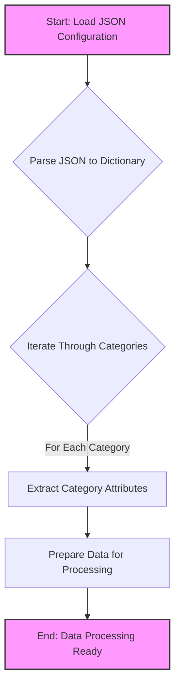

## <алгоритм>

1.  **Начало**: Загрузка JSON файла `grandadvance_categories_keyboards_logitech.json`.
    *   Пример: Файл содержит объекты, представляющие категории товаров Logitech.
2.  **Разбор JSON**: Парсинг JSON-структуры в словарь Python.
    *   Пример: Словарь, где ключи - это строковые названия категорий, а значения - это словари с информацией о них.
3.  **Итерация по категориям**: Проход по ключам (категориям) словаря.
    *   Пример: Для каждой категории (например, "LOGITECH WIRELESS KEYBOARD") выполняются действия.
4.  **Извлечение данных**: Для каждой категории извлекаются атрибуты (бренд, URL, статус активности, и т.д.).
    *   Пример: Для "LOGITECH WIRELESS KEYBOARD" извлекаются "brand": "LOGITECH", "url": "https://www.grandadvance.co.il/default.aspx?g=products&a=list&tieId=585&manId=10" и т.д.
5.  **Формирование структуры данных для дальнейшей обработки**: Данные каждой категории готовы для передачи в следующие этапы обработки (например, для парсинга страниц товаров или записи в базу данных).
    *   Пример: Данные используются для скрапинга страниц с товарами и их последующей обработки.
6.  **Завершение**: Данные по всем категориям обработаны.

## <mermaid>

### Объяснение зависимостей в `mermaid`:

1.  **`Start: Load JSON Configuration`** : Начальная точка, где загружается JSON-файл с конфигурацией категорий.
2.  **`Parse JSON to Dictionary`**: Этап, на котором JSON-данные преобразуются в структуру словаря Python для удобной работы.
3.  **`Iterate Through Categories`**: Цикл, проходящий по каждой категории (ключу) в словаре.
4.  **`Extract Category Attributes`**: Извлечение атрибутов (бренда, URL, и т.д.) для каждой категории.
5.  **`Prepare Data for Processing`**: Формирование структуры данных для дальнейших этапов обработки, например для скрапинга страниц.
6.  **`End: Data Processing Ready`**: Конечная точка, когда данные по всем категориям подготовлены для обработки.

## <объяснение>

### Импорты:
В предоставленном коде импорты отсутствуют. Этот JSON файл используется как конфигурационный и не требует импортов. Он содержит данные, структурированные для дальнейшего использования в программах на Python, которые будут считывать и обрабатывать эти данные.

### Классы:
В этом коде нет классов, так как он представляет собой JSON-файл, используемый для хранения данных. Этот файл предназначен для передачи данных между различными частями системы, например, между конфигурационным файлом и модулем скрапинга.

### Функции:
В данном файле нет функций. Он содержит только данные в формате JSON.

### Переменные:

*   **Ключи верхнего уровня (строки)**:
    *   Представляют собой названия категорий товаров (например, "LOGITECH WIRELESS KEYBOARD").
    *   Используются как ключи словаря.
    *   Тип: `str`.
*   **Значения (словари)**:
    *   Содержат данные для каждой категории.
    *   Тип: `dict`.
    *   Содержат следующие ключи:
        *   `"brand"`: Название бренда (например, "LOGITECH"). Тип: `str`.
        *   `"url"`: URL-адрес страницы категории на сайте поставщика. Тип: `str`.
        *   `"checkbox"`: Флаг, возможно, для выбора категории. Тип: `bool`.
        *   `"active"`: Флаг, указывающий на активность категории. Тип: `bool`.
        *   `"condition"`: Состояние товара (например, "new"). Тип: `str`.
        *   `"presta_categories"`: Строка с идентификаторами категорий в PrestaShop, разделенными запятыми. Тип: `str`.

### Цепочка взаимосвязей с другими частями проекта:

1.  **Сбор данных**: JSON-файл `grandadvance_categories_keyboards_logitech.json` служит входными данными для скриптов, которые извлекают информацию о продуктах с сайта поставщика `grandadvance.co.il`.
2.  **Скрапинг**: Скрипты используют значения `url` для обхода страниц и сбора необходимых данных о товарах.
3.  **Преобразование данных**: После сбора данные о товарах обрабатываются и преобразовываются в необходимый формат.
4.  **Категоризация**: Значения `presta_categories` используются для связывания товаров с соответствующими категориями в PrestaShop.
5.  **Интеграция с PrestaShop**: Подготовленные данные загружаются в PrestaShop.
6.  **Обновление каталога**: Данные используются для обновления каталога товаров в PrestaShop.

### Потенциальные ошибки или области для улучшения:
1.  **Дублирование данных**: Наличие двух одинаковых категорий `"LOGITECH USB KEYBOARD-MOUSE SET"` и `"LOGITECH WIRELESS  KEYBOARD-MOUSE SET"` с разными `presta_categories` может привести к проблемам при обновлении данных. Необходимо проверять уникальность и корректировать данные, либо создать для них разные ключи.
2.  **Жестко закодированные URL**: URL-адреса и идентификаторы (`tieId` и `manId`) встроены непосредственно в JSON-файл. Если структура сайта поставщика изменится, необходимо будет вручную редактировать файл. Лучше использовать более гибкую систему конфигурации.
3.  **Отсутствие проверок**: Нет явных проверок на корректность URL, категорий или других атрибутов. В процессе обработки нужно добавить проверки корректности данных.
4.  **Типы данных**: Значения в `"presta_categories"` представляют собой строку, но для дальнейшей обработки может потребоваться список чисел. Нужно преобразовать строку в список.
5.  **Устаревшая информация**: JSON файл может содержать устаревшие данные по категориям и нужно отслеживать актуальность.