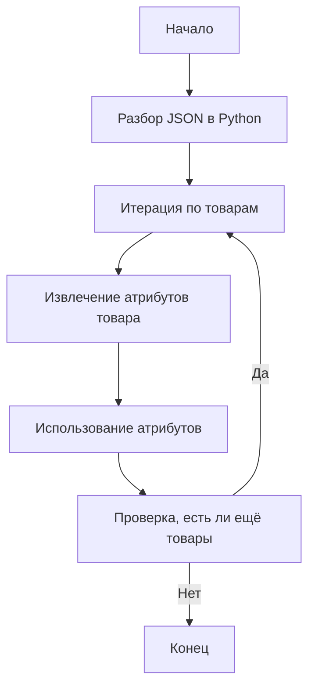

## <алгоритм>

1.  **Начало**: Исходные данные представляют собой JSON-объект, где каждый ключ - это наименование товара (например, "MICROSOFT WIRELESS KEYBOARD"), а значение - это словарь с атрибутами товара.
2.  **Разбор JSON**:  JSON-объект обрабатывается и преобразуется в структуру данных Python (например, словарь).

    ```python
    data = {
        "MICROSOFT WIRELESS KEYBOARD": {
            "brand": "MICROSOFT",
            "url": "https://www.grandadvance.co.il/default.aspx?g=products&a=list&tieId=585&manId=14",
            "checkbox": False,
            "active": True,
            "condition": "new",
            "presta_categories": "203,204,316"
        },
        "MICROSOFT USB KEYBOARD": {
            "brand": "MICROSOFT",
            "url": "https://www.grandadvance.co.il/default.aspx?g=products&a=list&tieId=589&manId=14",
            "checkbox": False,
            "active": True,
            "condition": "new",
            "presta_categories": "203,204,315"
        },
        # ... остальные товары
    }
    ```
3.  **Итерация по товарам**: Происходит итерация по ключам (названиям товаров) словаря `data`.
    *   **Пример**: На первой итерации ключ - `"MICROSOFT WIRELESS KEYBOARD"` и значение - соответствующий словарь.
4.  **Обработка атрибутов товара**: Для каждого товара извлекаются его атрибуты (brand, url, checkbox, active, condition, presta_categories).
    *   **Пример**: Для товара `"MICROSOFT WIRELESS KEYBOARD"`:
        *   `brand` = `"MICROSOFT"`
        *   `url` = `"https://www.grandadvance.co.il/default.aspx?g=products&a=list&tieId=585&manId=14"`
        *   `checkbox` = `False`
        *   `active` = `True`
        *   `condition` = `"new"`
        *    `presta_categories` = `"203,204,316"`
5.  **Использование атрибутов**: Полученные атрибуты могут быть использованы для дальнейшей обработки. Например, для формирования запросов к API, обновления базы данных или для другого преобразования.
6.  **Конец**:  После обработки всех товаров, процесс завершается.

## <mermaid>



**Зависимости:**

*   **Нет явных импортов:** Данный код представляет собой JSON, а не Python-скрипт, поэтому нет импортируемых модулей. Обычно, для работы с JSON в Python используется стандартный модуль `json`, но в данном контексте рассматривается только структура данных JSON, а не код его обработки.

## <объяснение>

**Импорты:**

*   В данном коде отсутствуют импорты, так как это JSON-файл, представляющий данные, а не исполняемый Python-код. Обычно для обработки JSON-данных в Python используется модуль `json`.
    ```python
    import json
    # Пример:
    # with open('your_file.json', 'r') as f:
    #   data = json.load(f)
    ```
**Классы:**

*   В этом файле нет определения классов. Этот JSON-объект представляет собой структуру данных, которая может использоваться классами или функциями, определенными в других файлах проекта.

**Функции:**

*   В данном файле нет функций. Этот JSON-объект представляет собой структуру данных, которая будет использоваться функциями, определенными в других файлах проекта.

**Переменные:**

*   В JSON представлены следующие переменные:
    *   `"MICROSOFT WIRELESS KEYBOARD"`: Ключ словаря, строка, представляющая название товара.
    *   `"brand"`: Ключ словаря, строка, представляющая бренд товара (например, `"MICROSOFT"`).
    *    `"url"`: Ключ словаря, строка, представляющая URL-адрес страницы товара.
    *   `"checkbox"`: Ключ словаря, логическое значение, представляющее состояние чекбокса (например, `false`).
    *   `"active"`: Ключ словаря, логическое значение, представляющее активность товара (например, `true`).
    *   `"condition"`: Ключ словаря, строка, представляющая состояние товара (например, `"new"`).
    *   `"presta_categories"`: Ключ словаря, строка, представляющая список категорий PrestaShop, к которым относится товар (например, `"203,204,316"`).
    *  Значения для каждого товара являются словарями.

**Потенциальные ошибки и области для улучшения:**

1.  **Дублирование URL**:  В примере, `"MICROSOFT USB KEYBOARD-MOUSE SET"` и `"MICROSOFT WIRELESS KEYBOARD-MOUSE SET"`  имеют одинаковые URL. Это может быть ошибкой, если для этих наборов товаров должны быть разные страницы. Следует проверить, являются ли данные URL корректными, а в случае обнаружения ошибок, их необходимо исправить.
2.  **Формат `presta_categories`**: `presta_categories` представлен в виде строки с разделителями-запятыми.  В Python-скрипте для обработки этого значения может потребоваться дополнительное преобразование в список целых чисел, что может быть источником ошибок. Лучшим решением было бы изначально представлять категории в виде списка целых чисел в JSON.

**Взаимосвязи с другими частями проекта:**

*   Этот файл, вероятно, используется как источник данных для скрипта, который:
    1.  **Загружает данные**: Считывает данные из этого JSON файла.
    2.  **Обрабатывает данные**:
        *   Итерируется по товарам.
        *   Извлекает значения атрибутов.
        *   Использует `url`, `brand` и `presta_categories` для создания или обновления товаров в базе данных или в API.
        *   Использует `active` для управления состоянием товара.
        *   Использует `condition` для указания состояния товара.
        *   Обрабатывает `presta_categories`, возможно, преобразуя строку в список целых чисел.
    3.  **Взаимодействует с API**: Для обновления или добавления данных в PrestaShop, возможно, используется REST API.
    4.  **Логирование**: Скрипт может вести журнал своей работы для отслеживания ошибок.

Таким образом, данный JSON-файл является важным элементом в процессе обработки данных о товарах, предоставляемых поставщиком `grandadvance`.