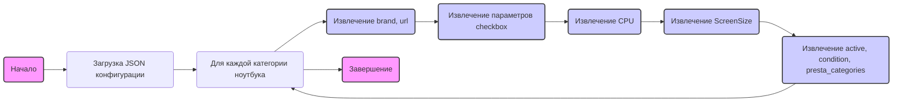

## ИНСТРУКЦИЯ:

Анализируй предоставленный код подробно и объясни его функциональность. Ответ должен включать три раздела:  

1.  **<алгоритм>**: Опиши рабочий процесс в виде пошаговой блок-схемы, включая примеры для каждого логического блока, и проиллюстрируй поток данных между функциями, классами или методами.  
2.  **<mermaid>**: Напиши код для диаграммы в формате `mermaid`, проанализируй и объясни все зависимости, 
    которые импортируются при создании диаграммы. 
    **ВАЖНО!** Убедитесь, что все имена переменных, используемые в диаграмме `mermaid`, 
    имеют осмысленные и описательные имена. Имена переменных вроде `A`, `B`, `C`, и т.д., не допускаются!  
    
    **Дополнительно**: Если в коде есть импорт `import header`, добавьте блок `mermaid` flowchart, объясняющий `header.py`:
    ```mermaid
    flowchart TD
        Start --> Header[<code>header.py</code><br> Determine Project Root]
    
        Header --> import[Import Global Settings: <br><code>from src import gs</code>] 
    ```

3.  **<объяснение>**: Предоставьте подробные объяснения:  
    - **Импорты**: Их назначение и взаимосвязь с другими пакетами `src.`.  
    - **Классы**: Их роль, атрибуты, методы и взаимодействие с другими компонентами проекта.  
    - **Функции**: Их аргументы, возвращаемые значения, назначение и примеры.  
    - **Переменные**: Их типы и использование.  
    - Выделите потенциальные ошибки или области для улучшения.  

Дополнительно, постройте цепочку взаимосвязей с другими частями проекта (если применимо).  

Это обеспечивает всесторонний и структурированный анализ кода.
## Формат ответа: `.md` (markdown)
**КОНЕЦ ИНСТРУКЦИИ**

### <алгоритм>

1.  **Начало**: Загрузка JSON-файла, содержащего конфигурацию для парсинга категорий ноутбуков Acer.

2.  **Обработка каждой категории ноутбуков**:
    *   Для каждой категории ноутбука (например, "ACER 11.6 I3", "ACER 12 i5") происходит итерация по ключам JSON.
        *   **Пример**: Начинается обработка с ключа "ACER 11.6 I3".

3.  **Извлечение данных о бренде, URL и других свойств**:
    *   Извлекаются основные атрибуты: `brand` (бренд), `url` (URL страницы с товарами) и другие параметры.
        *   **Пример**: Для "ACER 11.6 I3", `brand` равен "ACER", `url` равен "https://www.grandadvance.co.il/default.aspx?g=products&a=list&tieId=654&manId=55".

4.  **Обработка параметров `checkbox`**:
    *   Извлекаются параметры фильтрации:
        *   **`cpu`**:
            *   Определяется класс CSS (`class`) и метод поиска (`by = "css selector"`) для фильтрации по процессору.
            *   Извлекается список значений (`value`), которые соответствуют конкретным моделям процессоров (например, "CORE I3", "CORE I 3", ...).
                *   **Пример**: `value` для "ACER 11.6 I3" содержит различные варианты "CORE I3", "I3" и т.д.
        *   **`screensize`**:
            *   Определяется класс CSS (`class`) и метод поиска (`by = "css selector"`) для фильтрации по размеру экрана.
            *   Извлекается список допустимых размеров экрана.
                *   **Пример**: Для "ACER 11.6 I3" `value` содержит "10.1", "10.2" ... "11".

5.  **Извлечение параметров `active`, `condition` и `presta_categories`**:
    *   Извлекаются параметры:
        *   `active`: указывает, активна ли категория.
        *   `condition`: указывает состояние товара.
        *   `presta_categories`: строка, содержащая ID категорий PrestaShop.
            *   **Пример**: Для "ACER 11.6 I3", `active` равно `true`, `condition` равно "new", `presta_categories` равно "3,52,8,52,4,610,989".

6.  **Завершение**: После обработки всех категорий, процесс завершается.

### <mermaid>



**Объяснение зависимостей в `mermaid`:**

*   **`Start`**: Начало процесса.
*   **`LoadJSON`**: Загрузка JSON-конфигурации, содержащей данные о категориях ноутбуков Acer.
*   **`ForEachCategory`**: Итерация по каждой категории ноутбука.
*   **`ExtractBrandURL`**: Извлечение данных о бренде (`brand`) и URL (`url`) для каждой категории.
*   **`ExtractCheckbox`**: Извлечение параметров для фильтрации (`checkbox`).
*   **`ExtractCPU`**: Извлечение настроек для фильтрации по процессору (`cpu`).
*   **`ExtractScreenSize`**: Извлечение настроек для фильтрации по размеру экрана (`screensize`).
*   **`ExtractOtherParams`**: Извлечение дополнительных параметров, таких как `active`, `condition` и `presta_categories`.
*  **`End`**: Завершение процесса.

Диаграмма `mermaid` демонстрирует последовательный процесс обработки данных, начиная с загрузки конфигурации и заканчивая извлечением всех необходимых параметров для каждой категории ноутбука.

### <объяснение>

**Импорты**:
В данном коде нет явных импортов.  Представленные данные – это JSON-файл, предназначенный для использования в Python или других скриптах, которые будут парсить эти данные для настройки параметров поиска. 

**Классы**:
В данном коде нет классов. JSON-файл описывает структуру данных, которые будут использоваться для конфигурации парсинга, но сами по себе классы здесь не определены.

**Функции**:
В данном коде нет функций.  Представленные данные - это статичная конфигурация, которая может быть обработана через различные функции в Python, но функции здесь не определяются.

**Переменные**:

В данном JSON-файле все данные представлены в виде переменных (ключей и значений). 

*   **Ключи верхнего уровня**:  
    *   `"ACER 11.6 I3"`, `"ACER 11.6 i5"`, `"ACER 12 I3"` и т.д. — это названия категорий ноутбуков.
*   **Ключи внутри категорий**:
    *   `brand`: Строка, обозначающая бренд ноутбука (всегда "ACER").
    *   `url`: Строка, URL-адрес страницы списка товаров на сайте поставщика.
    *   `checkbox`: Объект, содержащий параметры фильтрации.
    *   `cpu`: Объект, содержащий параметры фильтрации по процессору.
        *   `class`: Строка, CSS-класс для элемента фильтра.
        *   `by`: Строка, определяющая метод поиска элемента (всегда "css selector").
        *   `value`: Массив строк, содержащий значения для фильтрации по процессору (различные варианты написания моделей).
    *   `screensize`: Объект, содержащий параметры фильтрации по размеру экрана.
        *   `class`: Строка, CSS-класс для элемента фильтра.
        *   `by`: Строка, определяющая метод поиска элемента (всегда "css selector").
        *   `value`: Массив строк, содержащий допустимые размеры экрана.
    *   `active`: Логическое значение (`true` или `false`), указывающее, активна ли категория.
    *   `condition`: Строка, указывающая состояние товара, всегда `new`.
    *   `presta_categories`: Строка, содержащая ID категорий PrestaShop, разделенные запятыми.

**Объяснение**:

*   **Цель**: Основное назначение этого JSON-файла - предоставить структурированные данные для скриптов, которые будут автоматически парсить веб-сайты, извлекать информацию о ноутбуках Acer и добавлять ее в базу данных или магазин.
*   **Использование**: Этот файл будет использоваться как входные данные для скрипта, который:
    1.  Проходит по всем ключам верхнего уровня (категориям).
    2.  Использует `url` для перехода на страницу списка товаров.
    3.  Использует `checkbox` (`cpu` и `screensize`) для фильтрации товаров на странице.
    4.  Извлекает необходимые данные о товарах (название, цена, описание и т.д.).
    5.  Сохраняет полученные данные, добавляя их в каталог.
    6.  Использует `presta_categories` для добавления товаров в соответствующие категории магазина PrestaShop.
*   **Связь с проектом**: Этот файл является частью конфигурации для конкретного поставщика (grandadvance), определяя, какие категории товаров и как их нужно парсить и загружать в систему.
*   **Потенциальные ошибки/области для улучшения**:
    *   **Дублирование данных**:  Значения `class` и `by` внутри `checkbox` всегда одинаковы. Их можно вынести на верхний уровень.
    *   **Жесткое кодирование**:  Значения `presta_categories` жестко закодированы. Для гибкости можно использовать таблицу соответствий или вынести в отдельный файл.
    *   **Обработка исключений**:  В скрипте, использующем этот файл, необходимо предусмотреть обработку исключений на случай, если URL не существует, CSS селекторы меняются или структура сайта изменяется.
    *  **Разнообразие экранов**: В массивах `screensize` данные представлены в нескольких форматах, как `"10.1"`, `"10,1"` и `"11"`. Рекомендуется унифицировать этот формат для более удобной обработки и избежания ошибок.
    *  **Названия категорий**: Названия категорий слишком специфичны, их можно сократить до более общего вида. Например, заменить `"ACER 11.6 I3"` на `"ACER 11.6 Core I3"`, чтобы сделать процесс более гибким.
*   **Улучшения**:
    *  Можно добавить проверку данных для `value` в `cpu` и `screensize` чтобы гарантировать, что они соответствуют заданным шаблонам.
    *  Можно вынести URL в отдельный файл или переменную, чтобы упростить их обновление или изменение.
    *  Стоит рассмотреть возможность добавления поддержки других критериев фильтрации.
    *  Добавить логику для обработки и сохранения изображений товара.
    *  Добавить поддержку для других поставщиков, с сохранением возможности модификации конфигурации.
    *  Создание промежуточного слоя для парсинга, обработки и загрузки товаров в базу данных или магазин. Это обеспечит гибкость и упростит адаптацию к изменениям.