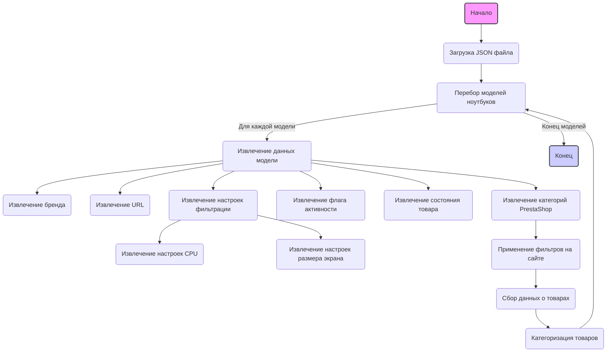

## ИНСТРУКЦИЯ:

Анализируй предоставленный код подробно и объясни его функциональность. Ответ должен включать три раздела:  

1. **<алгоритм>**: Опиши рабочий процесс в виде пошаговой блок-схемы, включая примеры для каждого логического блока, и проиллюстрируй поток данных между функциями, классами или методами.  
2. **<mermaid>**: Напиши код для диаграммы в формате `mermaid`, проанализируй и объясни все зависимости, 
    которые импортируются при создании диаграммы. 
    **ВАЖНО!** Убедитесь, что все имена переменных, используемые в диаграмме `mermaid`, 
    имеют осмысленные и описательные имена. Имена переменных вроде `A`, `B`, `C`, и т.д., не допускаются!  
    
    **Дополнительно**: Если в коде есть импорт `import header`, добавьте блок `mermaid` flowchart, объясняющий `header.py`:\
    ```mermaid
    flowchart TD
        Start --> Header[<code>header.py</code><br> Determine Project Root]
    
        Header --> import[Import Global Settings: <br><code>from src import gs</code>] 
    ```

3. **<объяснение>**: Предоставьте подробные объяснения:  
   - **Импорты**: Их назначение и взаимосвязь с другими пакетами `src.`.  
   - **Классы**: Их роль, атрибуты, методы и взаимодействие с другими компонентами проекта.  
   - **Функции**: Их аргументы, возвращаемые значения, назначение и примеры.  
   - **Переменные**: Их типы и использование.  
   - Выделите потенциальные ошибки или области для улучшения.  

Дополнительно, постройте цепочку взаимосвязей с другими частями проекта (если применимо).  

Это обеспечивает всесторонний и структурированный анализ кода.
## Формат ответа: `.md` (markdown)
**КОНЕЦ ИНСТРУКЦИИ**

## <алгоритм>
1. **Начало**: Код представляет собой JSON-файл, который определяет конфигурацию для сбора данных о ноутбуках Dell с сайта Grand Advance. Каждая запись в JSON представляет собой модель ноутбука Dell.
2. **Итерация по моделям**: Программа (скрипт, использующий этот файл) будет перебирать каждую модель ноутбука, определенную в JSON. Пример: `DELL 11.6 I3`, `DELL 11.6 i5`, и т.д.
3. **Извлечение данных модели**: Для каждой модели извлекаются следующие данные:
   - **`brand`**: Бренд ноутбука (в данном случае всегда `DELL`).
   - **`url`**: URL-адрес страницы с ноутбуками на сайте Grand Advance.
   - **`checkbox`**: Объект, содержащий настройки для фильтрации товаров на сайте.
      - **`cpu`**: Настройки для фильтрации по процессору.
          - **`class`**: CSS-класс элемента, содержащего чекбоксы для процессоров.
          - **`by`**: Метод поиска (в данном случае всегда `css selector`).
          - **`value`**: Массив строк, представляющих варианты названий процессоров, по которым нужно фильтровать. Пример: `["CORE I3", "CORE I 3", "CORE i3", ...]`.
      - **`screensize`**: Настройки для фильтрации по размеру экрана.
          - **`class`**: CSS-класс элемента, содержащего чекбоксы для размеров экрана.
          - **`by`**: Метод поиска (в данном случае всегда `css selector`).
          - **`value`**: Массив строк, представляющих варианты размеров экранов, по которым нужно фильтровать. Пример: `[ "10.1", "10.2", "10.3", ...]`.
   - **`active`**: Флаг, указывающий, активна ли данная модель (всегда `true` в этом файле).
   - **`condition`**: Состояние товара (всегда `new` в этом файле).
   - **`presta_categories`**: Строка, содержащая идентификаторы категорий PrestaShop.
4. **Применение фильтров**: На основе полученных данных, программа будет использовать  `url` и значения полей `checkbox`, чтобы имитировать действия пользователя на сайте, устанавливая соответствующие фильтры на странице ноутбуков Grand Advance.
    - Пример: Для модели `DELL 11.6 I3` будут установлены фильтры для CPU со значениями `CORE I3`, `CORE I 3` и т.д., и фильтры для размера экрана со значениями `10.1`, `10.2` и т.д.
5. **Сбор данных**: После применения фильтров, программа собирает данные о товарах, соответствующих выбранным критериям (например, названия, цены, изображения).
6. **Категоризация товаров**: Полученные данные связываются с категориями PrestaShop, указанными в поле `presta_categories`.
7. **Завершение**: Процесс повторяется для каждой модели, пока не будут обработаны все записи в JSON.

## <mermaid>


## <объяснение>

**Общее описание:**

Предоставленный код представляет собой JSON-файл, который служит конфигурацией для сбора данных о ноутбуках Dell с сайта grandadvance.co.il. Он описывает различные модели ноутбуков Dell, включая их характеристики процессора и размера экрана, а также настройки для фильтрации на сайте и категории PrestaShop.

**Импорты:**

В данном коде нет импортов. Это JSON-файл, а не Python-скрипт или модуль, поэтому импорты отсутствуют.

**Классы:**

В данном коде нет классов. Это JSON-файл, который содержит данные в структурированном формате, а не определения классов.

**Функции:**

В данном коде нет функций. JSON-файл содержит данные, а не функции.

**Переменные:**

-   **Ключи верхнего уровня JSON**: Ключи в корневом объекте JSON (`"DELL 11.6 I3"`, `"DELL 11.6 i5"`, и т. д.)  представляют собой названия моделей ноутбуков Dell.
-   **`brand`**: Строка, представляющая бренд ноутбука (всегда `"DELL"`).
-   **`url`**: Строка, содержащая URL-адрес страницы на сайте Grand Advance, где перечислены ноутбуки Dell.
-   **`checkbox`**: Объект, содержащий настройки для фильтрации товаров.
    -   **`cpu`**: Объект, содержащий настройки для фильтрации по процессору.
        -   **`class`**: Строка, представляющая CSS-класс элемента, содержащего чекбоксы для процессоров (`".fSel"`).
        -   **`by`**: Строка, определяющая метод поиска элементов (`"css selector"`).
        -   **`value`**: Массив строк, содержащий варианты названий процессоров (например, `["CORE I3", "CORE I 3", ...]`).
    -   **`screensize`**: Объект, содержащий настройки для фильтрации по размеру экрана.
        -   **`class`**: Строка, представляющая CSS-класс элемента, содержащего чекбоксы для размеров экрана (`".fSel"`).
        -  **`by`**: Строка, определяющая метод поиска элементов (`"css selector"`).
        -   **`value`**: Массив строк, содержащий варианты размеров экрана (например, `[ "10.1", "10.2", ...]`).
-   **`active`**: Булевое значение, указывающее, активна ли данная конфигурация (всегда `true`).
-   **`condition`**: Строка, указывающая на состояние товара (всегда `"new"`).
-    **`presta_categories`**: Строка, содержащая идентификаторы категорий PrestaShop, к которым нужно отнести товар.

**Взаимосвязь с другими частями проекта:**

Этот JSON-файл является частью более крупной системы, вероятно, скрипта на Python или другом языке, который выполняет следующие действия:

1.  **Загружает этот JSON-файл**.
2.  **Использует данные** из этого файла для:
    -   **Переходит по URL** `url`.
    -   **Находит на сайте элементы** с CSS-классом `checkbox.cpu.class` и `checkbox.screensize.class`.
    -   **Ищет чекбоксы** с названиями из массивов `checkbox.cpu.value` и `checkbox.screensize.value`.
    -   **Имитирует клики** на найденные чекбоксы, таким образом фильтруя товары на странице.
    -   **Собирает информацию** о товарах, соответствующих фильтрам.
    -   **Отправляет собранные данные** в PrestaShop, связывая их с категориями из `presta_categories`.

**Потенциальные ошибки и области для улучшения:**

1.  **Дублирование данных**: Многие модели используют один и тот же URL-адрес, что означает, что программа будет загружать одну и ту же страницу несколько раз. Это можно оптимизировать, загружая страницу один раз для всех моделей, у которых одинаковый URL.
2.  **Жестко заданные значения**: CSS-классы и метод поиска (`"css selector"`) жестко заданы. Если структура сайта изменится, нужно будет обновить этот файл.
3.  **Варианты написания процессоров**: В `checkbox.cpu.value`  много вариантов написания процессоров (например, `CORE I3`, `CORE I 3`, `CORE i3`). Это может привести к неполной фильтрации, если на сайте используются другие написания. Лучше использовать нормализацию текста.
4. **Размеры экрана**: Аналогично для размеров экрана, где используется "10.1", "10,1" - лучше стандартизировать формат.
5.  **Обработка ошибок**: В коде, который будет использовать этот файл, необходимо предусмотреть обработку ошибок, например, если элементы не найдены на сайте, если URL не доступен и т.д.
6.  **Динамическое определение категорий**: Сейчас `presta_categories` заданы статически. Было бы лучше динамически определять категории на основе данных о модели.

**Цепочка взаимосвязей:**

1.  **JSON-файл**: Этот файл является отправной точкой для процесса сбора данных.
2.  **Скрипт сбора данных**: Загружает JSON, анализирует его, заходит на сайт, применяет фильтры и собирает данные.
3.  **Сайт Grand Advance**: Сайт, откуда собираются данные о ноутбуках.
4.  **PrestaShop**: Платформа электронной коммерции, куда отправляются собранные данные.

В целом, этот JSON-файл является конфигурационным файлом, который настраивает сбор данных о ноутбуках Dell, с сайта Grand Advance. Он содержит подробную информацию о том, какие фильтры нужно использовать и к каким категориям отнести товары.