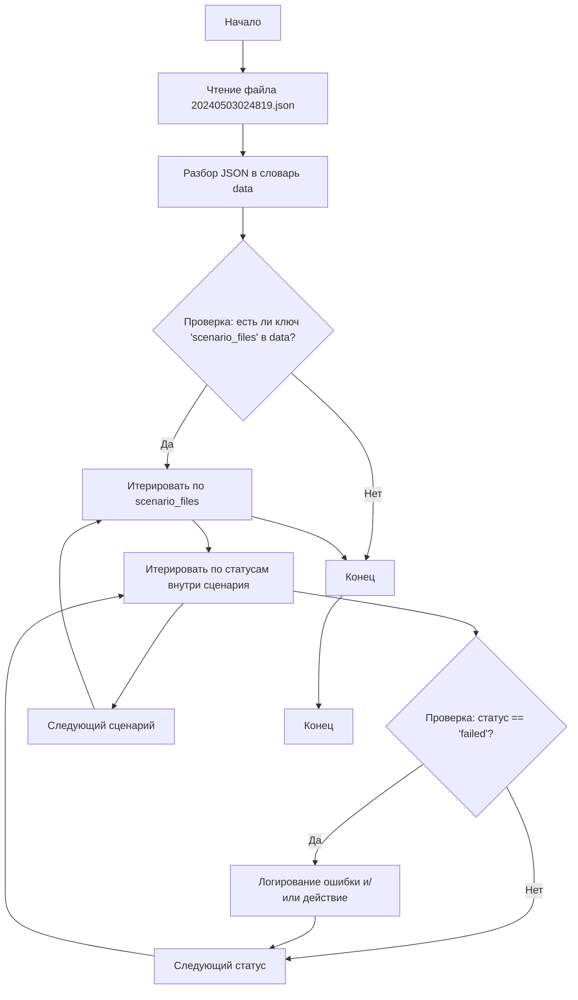

## Анализ кода `hypotez/src/suppliers/hb/_journal/20240503024819.json`

### <алгоритм>

1. **Чтение JSON файла:**
   - Программа начинает с чтения JSON файла `20240503024819.json`.
   - Этот файл представляет собой JSON-объект, который содержит данные о результатах выполнения сценариев.
   - Пример:
     ```json
     {
       "scenario_files": {
         "categories_20240503015900.json": {
           "סרומיםלפנים": "failed"
         }
       },
       "name": "20240503024819"
     }
     ```
2. **Обработка JSON данных:**
   - JSON данные преобразуются в словарь (или аналогичную структуру данных), доступную для обработки на Python.
   - Проверяется наличие ключа `scenario_files` в словаре.
   - Если ключ `scenario_files` присутствует, программа итерируется по его значениям (другой вложенный словарь).
   - Внутри этого словаря итерируется по значениям (статус).
     - Если статус любого сценария `failed` (строка), то данный факт может использоваться для вывода отчета, или других целей.
   - Также есть ключ `name`, который содержит имя файла.
   - Пример:
     -  `scenario_files`: {"categories_20240503015900.json": {"סרומיםלפנים": "failed"}}
     -  `name`: 20240503024819
3. **Результат:**
  - Программа анализирует статус выполнения различных сценариев и формирует отчет об ошибках.

### <mermaid>



**Описание `mermaid` диаграммы:**

1. `Start`: Начало процесса.
2. `ReadFile`: Чтение JSON файла `20240503024819.json`.
3. `ParseJson`: Разбор JSON содержимого файла в структуру данных (словарь `data`).
4. `CheckScenarioFiles`: Проверка наличия ключа `'scenario_files'` в словаре `data`.
5. `IterateScenarioFiles`: Если ключ присутствует, то начинается итерация по файлам сценариев.
6. `IterateStatus`: Внутри каждого файла сценария итерируются статусы.
7. `CheckStatus`: Проверка, является ли текущий статус `failed`.
8. `LogError`: Если статус равен `failed`, то происходит логирование ошибки или какие-либо действия.
9. `NextStatus`: Переход к следующему статусу.
10. `NextScenarioFile`: Переход к следующему файлу сценария.
11. `End`: Конец обработки всех сценариев.
12. `Stop`: Конец программы.

### <объяснение>

**Импорты:**

В данном коде нет импортов. Код работает с данными, которые уже находятся в файле JSON. В реальном приложении могут быть импорты для работы с файловой системой (например, `os` или `json`).

**Классы:**

В данном коде нет классов. Он представляет собой простой скрипт для обработки данных.

**Функции:**

В данном коде нет функций. Это простая программа, которая не нуждается в функциях для обработки данных. В реальном приложении для обработки подобных файлов могли бы быть функции для разбора JSON, проверки статусов и логирования ошибок.

**Переменные:**

-   `scenario_files` (вложенный словарь): содержит информацию о файлах сценариев и их статусе. Ключи — это имена файлов (например, `categories_20240503015900.json`), значения — словари со статусами.
-   `status` (строка): статус выполнения конкретного сценария (например, `"failed"`).
-   `name` (строка): имя файла `20240503024819`.

**Цепочка взаимосвязей с другими частями проекта:**

Этот файл, вероятно, является частью системы автоматического тестирования или мониторинга.
-   Файлы с именами типа `categories_20240503015900.json` — это, вероятно, результаты прохождения каких-то тестов.
-   `_journal` — возможно, это директория, где хранятся логи выполнения.
-   Файл `20240503024819.json` содержит результаты выполнения тестов, собранные в определенный момент времени.
-   Статус `"failed"` может использоваться для выявления проблем в системе, оповещения о сбоях или для повторного запуска тестов.

**Потенциальные ошибки и области для улучшения:**

1.  **Обработка ошибок**: Код не обрабатывает ошибки, которые могут возникнуть при чтении файла или разборе JSON. Необходимо добавить блоки `try-except` для обработки этих случаев.
2.  **Логирование**: Код не логирует информацию о неудачных сценариях. Рекомендуется добавить систему логирования для отслеживания ошибок и их контекста.
3.  **Обобщение**: Код работает только с конкретной структурой JSON. Если структура JSON изменится, код нужно будет переписывать. Следует сделать код более гибким.
4.  **Действие при ошибке**: В данный момент код просто проверяет, есть ли ошибка. Необходимо определить действия, которые нужно выполнять при обнаружении ошибки (например, отправка уведомлений, перезапуск теста).

В целом, код является простым, но эффективным для анализа конкретного формата JSON-данных. В реальном приложении он потребует доработок, связанных с обработкой ошибок, логированием и гибкостью.