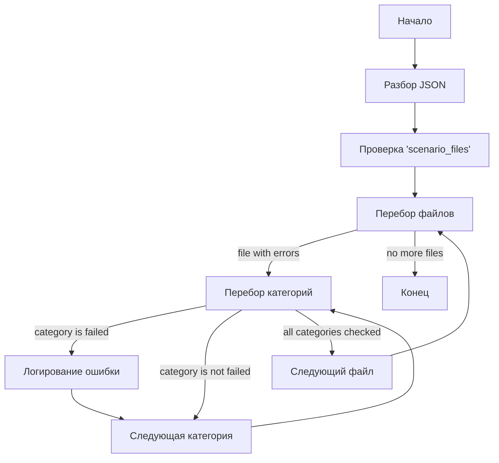

## АНАЛИЗ КОДА

### <алгоритм>
1. **Начало:** Получение JSON-объекта.
2. **Разбор JSON:** JSON-объект содержит следующие ключи:
    - `"scenario_files"`: Вложенный объект, ключи которого являются именами файлов, а значения - это объекты, где ключи - это категории товаров, а значения - результаты обработки ("failed" или другие).
    - `"name"`: Строка, представляющая имя файла.
3. **Обработка `scenario_files`**:
    - Проход по всем ключам объекта `scenario_files` (имена файлов).
    - Для каждого имени файла, просмотр всех ключей вложенного объекта (категории).
    - Если значение для какой-либо категории  равно `"failed"`, то это регистрируется как "ошибка" в данном файле.
4. **Конец:** Результатом выполнения является понимание, какие файлы содержат ошибки (категории, для которых обработка завершилась с ошибкой).

**Примеры:**

- **Исходный JSON:**
  ```json
  {
      "scenario_files": {
        "categories_20240503015900.json": {
          "סרומיםלפנים": "failed"
        },
         "categories_20240503015901.json": {
          "קוסמטיקה": "success"
         }
      },
    "name": "20240503025433"
  }
  ```
- **Результат:** файл `categories_20240503015900.json` содержит ошибку в категории `"סרומיםלפנים"`. файл `categories_20240503015901.json` не содержит ошибок.

### <mermaid>



**Объяснение зависимостей `mermaid`:**

- `flowchart TD`: определяет тип диаграммы - блок-схема сверху вниз.
- `Start`: Начальный узел, обозначающий начало процесса.
- `ParseJSON`: узел, представляющий этап разбора JSON-объекта.
- `CheckScenarioFiles`: узел, представляющий проверку наличия ключа `scenario_files` в JSON-объекте.
- `LoopFiles`: узел, представляющий цикл перебора файлов внутри `scenario_files`.
- `LoopCategories`: узел, представляющий цикл перебора категорий внутри каждого файла.
- `LogError`: узел, представляющий логирование ошибки, если категория имеет значение `"failed"`.
- `NextCategory`: узел, обозначающий переход к следующей категории внутри файла.
- `NextFile`: узел, обозначающий переход к следующему файлу.
- `End`: Конечный узел, обозначающий завершение процесса.
- `-->`: стрелка, обозначающая поток управления.

### <объяснение>

**Импорты:**

В предоставленном JSON-файле нет никаких импортов. JSON-файл используется для хранения данных, а не для выполнения кода, поэтому импорты не требуются.

**Классы:**
В данном примере нет классов. JSON-файл – это формат данных, а не код, содержащий классы.

**Функции:**

В данном примере также нет функций, так как это файл данных в формате JSON, а не программный код. Функции потребуются для обработки этого JSON-файла, но сами они здесь не представлены.

**Переменные:**

- **`scenario_files`**: Это ключ в JSON-объекте, который является вложенным объектом. Ключи этого объекта - это имена файлов, а значения - это объекты с категориями и их статусами (например, `"failed"`). Тип -  `dict`.
- **`name`**: Это ключ JSON-объекта, значение которого является строкой, представляющей имя файла. Тип - `str`.
- **Ключи файлов:** Строки, представляющие имена файлов (например, "categories_20240503015900.json").
- **Ключи категорий:** Строки, представляющие имена категорий (например, `"סרומיםלפנים"`).
- **Значения категорий:** Строки, представляющие результат обработки для категории (например, `"failed"`, `"success"`).

**Потенциальные ошибки и области для улучшения:**

- **Отсутствие обработки ошибок**: Сам JSON-файл не содержит кода для обработки ошибок. Программа, которая его обрабатывает, должна быть написана так, чтобы она могла корректно обработать случаи, когда значение категории не равно `"failed"`, может быть `"success"` или другое значение.
- **Отсутствие стандартизации значений статусов:** Используется только `"failed"`. Можно добавить другие статусы (например, `"success"`, `"pending"`), что позволит более точно отражать результаты обработки.
- **Ошибки данных**: JSON может содержать невалидные данные, которые вызовут ошибку при разборе.

**Взаимосвязи с другими частями проекта:**

Этот JSON-файл, вероятно, является частью системы управления задачами или отслеживания результатов, где:

1.  **Генерация файла**: Файл `20240503025433.json` генерируется после завершения некоторого процесса обработки данных. Он содержит информацию о том, какие файлы (`categories_20240503015900.json` и т.д.) были обработаны, и с каким результатом.
2.  **Чтение файла**: Этот файл затем считывается другим компонентом проекта, например, для мониторинга статусов или построения отчетов. Программа должна будет проанализировать JSON, чтобы выявить ошибки.
3.  **Сообщения об ошибках:** Программа, обрабатывающая этот файл, должна регистрировать ошибки.  `LogError` в диаграмме `mermaid` указывает на этот процесс.
4.  **Дальнейшая обработка:** На основе этих ошибок, система может принимать решения о том, какие действия нужно предпринять (например, переобработка).
5. **Именование файлов**: Имя файла `"20240503025433.json"` указывает на дату и время создания файла, что может быть использовано для организации истории выполнения задач.