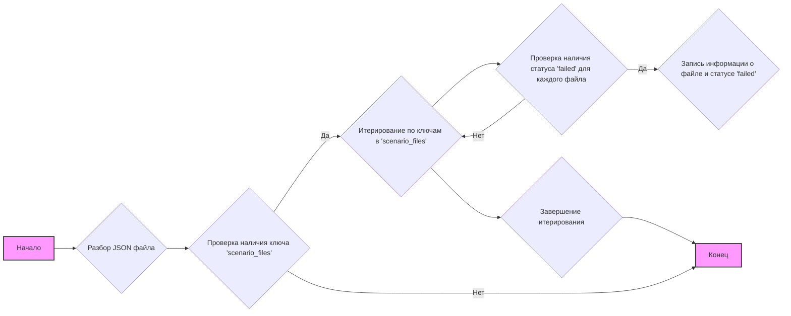

## Анализ кода: `hypotez/src/suppliers/hb/_journal/20240503030455.json`

### 1. <алгоритм>

**Описание:**
Данный JSON файл представляет собой журнал (лог) выполнения операций. Он содержит информацию о результатах обработки определенных файлов сценариев.

**Блок-схема:**



**Примеры:**

*   **Разбор JSON файла:** JSON парсер считывает JSON строку и преобразует ее в структуру данных Python (словарь).
    Пример: `{  "scenario_files": {"categories_20240503015900.json": {"מוצריניקויפנים": "failed"}},  "name": "20240503030455" }`
    Преобразуется в словарь: `{"scenario_files": {"categories_20240503015900.json": {"מוצריניקויפנים": "failed"}}, "name": "20240503030455"}`
*   **Проверка наличия ключа 'scenario_files':** Проверяется, существует ли ключ `"scenario_files"` в корневом словаре. В данном случае он существует.
*   **Итерирование по ключам в 'scenario_files':** Происходит обход всех ключей во вложенном словаре, `"categories_20240503015900.json"`.
*   **Проверка наличия статуса 'failed':** В каждой записи проверяется, имеет ли хотя бы один из ключей статус `"failed"`. В примере ключ `"מוצריניקויפנים"` имеет статус `failed`.
*  **Запись информации о файле и статусе 'failed':** Если статус `failed`, то информация сохраняется (например, для дальнейшей обработки).
*   **Завершение итерирования:** После обработки всех ключей итерирование заканчивается.

### 2. <mermaid>

```mermaid
graph TD
    A[JSON File: 20240503030455.json] --> B{Root Dictionary};
    B --> C[scenario_files Dictionary];
    C --> D[categories_20240503015900.json Entry];
     D --> E[מוצריניקויפנים Status: "failed"];
     B --> F[name: "20240503030455"];
    style A fill:#f9f,stroke:#333,stroke-width:2px
```

**Объяснение:**

*   `JSON File: 20240503030455.json`: Представляет исходный JSON файл, который будет проанализирован.
*   `Root Dictionary`: Представляет корневой словарь, полученный после парсинга JSON.
*   `scenario_files Dictionary`: Представляет словарь, хранящий информацию о файлах сценариев.
*   `categories_20240503015900.json Entry`: Представляет запись для конкретного файла сценария, например, `"categories_20240503015900.json"`.
*   `מוצריניקויפנים Status: "failed"`: Представляет статус обработки файла с ключом `מוצריניקויפנים` и значением `failed`.
*   `name: "20240503030455"`: Представляет имя журнала, используемого для идентификации файла.

### 3. <объяснение>

**Импорты:**
В данном коде отсутствуют явные `import` инструкции. Этот JSON файл сам по себе является представлением данных, а не исполняемым кодом. Он может быть использован как входные данные для Python программ, которые будут его анализировать.

**Классы:**
В данном файле нет определений классов.

**Функции:**
В самом файле функций нет. Функции (например, парсинг JSON, обход словарей) будут вызываться из внешнего Python кода, который будет использовать этот файл в качестве данных.

**Переменные:**
В данном файле содержатся следующие переменные (ключи и значения словаря):
*  `scenario_files`: ключ словаря, содержащий вложенный словарь с информацией о файлах сценариев.
*  `categories_20240503015900.json`: ключ словаря, представляющий имя файла сценария.
*  `מוצריניקויפנים`: ключ словаря, представляющий категорию (или продукт) из файла сценария.
*  `failed`: значение словаря, показывающее, что обработка сценария для данной категории не удалась.
* `name`: Ключ словаря, представляющий имя файла журнала.
* `20240503030455`: Значение ключа `name`, представляющее имя файла журнала.

**Взаимодействие с другими частями проекта:**
Файл журнала может быть частью системы логирования или контроля выполнения задач. Он может быть использован для отслеживания ошибок при обработке файлов сценариев, а также для сбора статистики о том, какие сценарии завершились успешно, а какие нет.

**Потенциальные ошибки и улучшения:**

*   **Отсутствие подробностей об ошибках:** Статус `failed` не дает конкретики об ошибке. Можно добавить подробные сообщения об ошибках в качестве значений.
*   **Отсутствие временных меток:** Было бы полезно добавлять временные метки для каждой записи, чтобы знать, когда произошла ошибка.
*   **Формат:** Можно было бы использовать более универсальные ключи и значения, чтобы их было легче обрабатывать программно.

**Цепочка взаимосвязей:**

1.  Файл `20240503030455.json` генерируется после выполнения задач по обработке сценариев.
2.  Он является частью системы логгирования, используемой для мониторинга состояния выполнения задач.
3.  Другие части проекта, например, модули аналитики или отчетов, могут считывать и использовать данные из этого файла.
4.  В случае ошибок, информация из журнала может быть использована для отладки проблем.