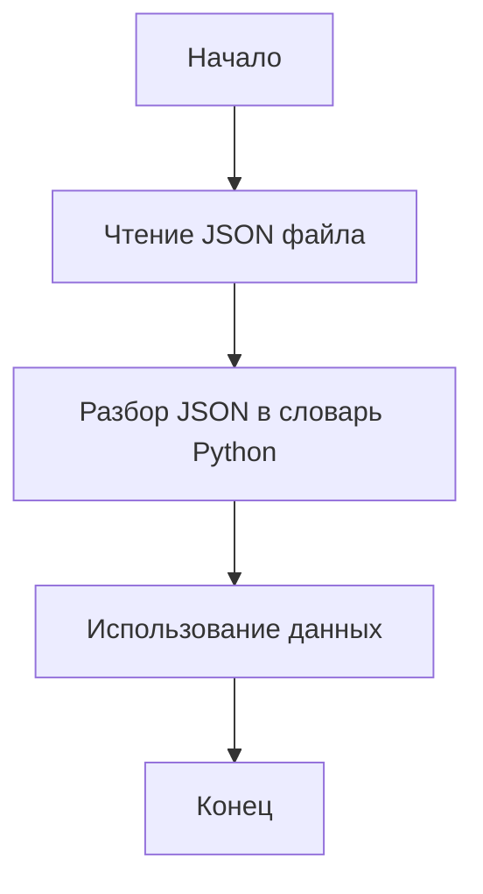

## Анализ кода

### <алгоритм>
1.  **Чтение JSON**: Код читает JSON файл, который содержит данные о файле сценария.
    Пример:
    ```json
    {"scenario_files": {}, "name": "20240505123605"}
    ```
2.  **Разбор JSON**: JSON преобразуется в словарь Python.
    Пример:
    ```python
    data = {"scenario_files": {}, "name": "20240505123605"}
    ```
3. **Вывод**: Код может  вывести данные или использовать их в дальнейших операциях.
    
   Пример:
    ```python
    print(data) 
    ```

### <mermaid>

### <объяснение>
- **Импорты**:
    - В данном коде нет явных импортов, но предполагается работа с JSON данными. Обычно для обработки JSON используется модуль `json` из стандартной библиотеки Python,  что обычно требует `import json`.
- **Структура данных**:
    - `scenario_files`: Словарь, предназначенный для хранения файлов сценария (в данном случае пустой).
        -  Тип: `dict`
    - `name`: Имя файла журнала или сценария, имеет формат `YYYYMMDDHHMMSS`.
       - Тип: `str`
- **Функциональность**:
    - Основная функция кода заключается в чтении, парсинге и подготовке данных, представленных в JSON формате.
- **Переменные**:
    - Переменная `data` (представлена как {"scenario_files": {}, "name": "20240505123605"}) - это  словарь, созданный из  JSON файла.  Хранит данные о файлах сценариев и имени.
- **Возможные улучшения:**
    - Добавить обработку ошибок, например, если JSON файл не найден или неверно отформатирован.
    - Добавить логирование для отслеживания процесса обработки.
    - Добавить проверку типов для элементов данных.
- **Взаимосвязи с другими частями проекта:**
    - Этот файл является частью журнала, где сохраняются различные сценарии. Его содержимое может быть использовано для воспроизведения или анализа выполненных действий.
- **Цепочка взаимосвязей:**
    - Данный код является частью более крупной системы обработки данных, где JSON файлы используются для представления и хранения информации. Он может взаимодействовать с другими частями проекта, которые отвечают за:
        1. **Генерацию JSON файлов**:  Код, который создает этот JSON с необходимыми данными.
        2. **Использование JSON данных**: Код, использующий прочитанные данные для выполнения операций.