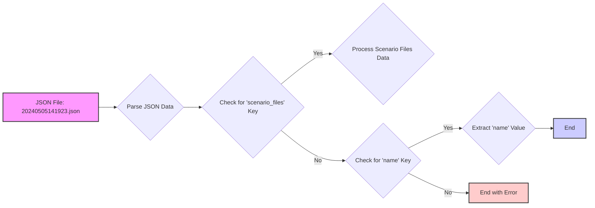

## Анализ кода `hypotez/src/suppliers/hb/_journal/20240505141923.json`

### 1. <алгоритм>

**Описание:**

Представленный JSON-файл содержит данные о файле сценария, который предположительно используется в рамках проекта `hypotez` для работы с поставщиками (в частности, с HB). Структура данных указывает на то, что файл является частью журнала (возможно, операций или изменений) и имеет имя `20240505141923`.

**Блок-схема:**

```mermaid
graph LR
    A[Начало] --> B{Чтение JSON файла};
    B --> C{Проверка наличия ключа "scenario_files"};
    C -- Да --> D{Обработка данных в "scenario_files" (если есть)};
    D --> E[Завершение];
    C -- Нет --> F{Проверка наличия ключа "name"};
    F -- Да --> G{Получение значения "name"};
    G --> E;
    F -- Нет --> H[Завершение с ошибкой];
    H --> E
    style A fill:#f9f,stroke:#333,stroke-width:2px
    style E fill:#ccf,stroke:#333,stroke-width:2px
```

**Примеры:**

- **Чтение JSON:** JSON-файл `20240505141923.json` загружается в память (например, Python с помощью модуля `json`).
- **Проверка "scenario_files":** Проверяется наличие ключа `scenario_files`. В данном случае, он есть и его значение пусто `{}`.
- **Обработка "scenario_files":** В данном примере ключ присутствует, но значение пусто, поэтому обработка будет тривиальной. Если бы были значения, то в зависимости от контекста, могла бы произойти итерация по файлам сценария.
- **Проверка "name":** Проверяется наличие ключа `name`, который есть.
- **Получение значения "name":** Получается значение `20240505141923`.

### 2. <mermaid>



**Анализ `mermaid`:**

- **JSON File: 20240505141923.json:** Указывает на начало процесса, представляя входные данные в виде JSON-файла.
- **Parse JSON Data:** Представляет этап разбора JSON-данных из файла.
- **Check for 'scenario_files' Key:** Блок проверки наличия ключа `scenario_files` в разобранных данных.
- **Process Scenario Files Data:** Блок обработки данных, связанных с `scenario_files`, если они присутствуют.
- **Check for 'name' Key:**  Блок проверки наличия ключа `name` если `scenario_files` отсутствуют.
- **Extract 'name' Value:** Блок извлечения значения из ключа `name`.
- **End:** Конец процесса в случае успешного извлечения `name` или обработки `scenario_files`.
- **End with Error:** Конец процесса в случае отсутствия ключей `scenario_files` и `name`.

### 3. <объяснение>

**Импорты:**

- В данном JSON-файле нет импортов, так как он представляет собой структуру данных, а не код на Python.

**Классы:**

- В JSON-файле не определены классы.

**Функции:**

- В JSON-файле не определены функции.

**Переменные:**

- `"scenario_files"`: Ключ, значение которого является словарем (в данном случае пустым `{}`). Это может указывать на файлы сценариев, которые должны быть обработаны.
- `"name"`: Ключ, значение которого является строкой `"20240505141923"`. Это имя файла журнала, которое может использоваться для идентификации или фильтрации.

**Цепочка взаимосвязей:**

Этот файл, вероятнее всего, является частью системы журналирования или управления сценариями в рамках проекта `hypotez`. Он может использоваться:

1.  **Для логирования действий:** При выполнении различных операций, связанных с поставщиками, может создаваться запись в журнале, представленная JSON-файлом.
2.  **Для управления сценариями:** В случае, если  `scenario_files` не пусто, данные могли бы указывать на файлы сценариев, которые должны быть выполнены или проверены в рамках процессов, связанных с поставщиками.

**Потенциальные ошибки и области для улучшения:**

1.  **Отсутствие информации о назначении:** JSON-файл содержит лишь данные, но не предоставляет контекста для их интерпретации.
2.  **Пустой `scenario_files`:** Отсутствие фактических файлов в `scenario_files` может говорить о том, что логика с обработкой не используется или не доработана.
3.  **Отсутствие обработки ошибок:** Если нет ни `scenario_files` ни `name` то это говорит о проблеме.
4.  **Отсутствие схемы:** Было бы хорошо использовать JSON схему для валидации формата этого файла.

**Дополнительные замечания:**

- В контексте проекта `hypotez`, этот файл, скорее всего, будет считываться и обрабатываться Python-скриптами.
- Извлеченные данные могут использоваться для отслеживания изменений, поиска необходимых файлов сценариев или для других операций, связанных с поставщиками.
- Без контекста остального кода невозможно полностью оценить роль данного JSON-файла.