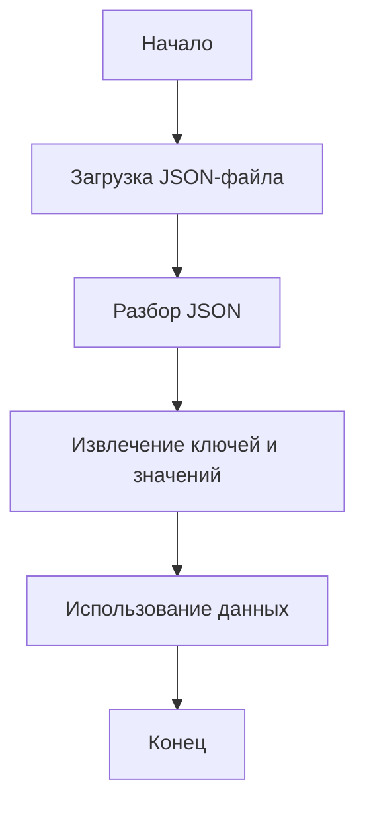

## АНАЛИЗ КОДА

### 1. <алгоритм>

Код представляет собой JSON-файл, который, по всей видимости, используется для хранения данных о каком-либо сценарии.

**Пошаговая блок-схема:**

1. **Начало:** JSON-файл загружается или анализируется.
2. **Разбор JSON:** JSON-файл парсится, что приводит к созданию словаря Python.
    - Пример: `{ "scenario_files": {}, "name": "20240505153035" }`  преобразуется в `dict`.
3.  **Извлечение данных:** Из полученного словаря извлекаются ключи и значения.
    - Пример: извлекается ключ `"scenario_files"` со значением `{}` и ключ `"name"` со значением `"20240505153035"`.
4. **Использование данных:** Полученные данные могут использоваться в других частях системы.  
5. **Конец:** Обработка данных завершена.

**Поток данных:**

JSON-файл -> Разбор JSON (словарь Python) -> Извлечение данных (ключи и значения) -> Использование данных в программе

### 2. <mermaid>

**Описание `mermaid` диаграммы:**

*   `Start`: Начало процесса обработки данных JSON.
*   `LoadJSON`: Обозначает загрузку JSON файла из указанного расположения.
*   `ParseJSON`: Представляет операцию парсинга JSON-файла в словарь (dict) Python.
*   `ExtractData`: Отвечает за извлечение ключей и их значений из полученного словаря.
*   `UseData`: Описывает использование извлечённых данных в других частях системы или приложения.
*   `End`: Конец процесса обработки данных JSON.

### 3. <объяснение>

**Импорты:**

В представленном коде импорты отсутствуют, так как это всего лишь JSON-файл, а не программный код Python. JSON-файл является форматом данных, а не исполняемым кодом.

**Классы:**

Классы в данном коде отсутствуют по той же причине, что и импорты.

**Функции:**

Функции в данном коде отсутствуют.

**Переменные:**

В JSON-файле есть два ключа, которые можно рассматривать как переменные:

*   `"scenario_files"`:  Словарь (в данном случае пустой), который, предположительно, должен хранить информацию о файлах сценария.
*   `"name"`: Строка, которая является именем файла или идентификатором сценария (`"20240505153035"`).

**Объяснение:**

Данный JSON-файл служит для хранения данных.
*   `"scenario_files"` (пустой словарь) указывает на то, что в данный момент нет связанных файлов сценариев.
*   `"name"` (`"20240505153035"`) является идентификатором, который может использоваться для поиска соответствующего сценария в системе.

**Потенциальные ошибки или области для улучшения:**

1.  **Отсутствие структуры:** В текущем виде `scenario_files` - пустой словарь. Если требуется хранить информацию о файлах, то нужно добавить структуру данных в этот словарь (например, массив словарей, где каждый словарь представляет собой описание файла).
2.  **Отсутствие документации:** Необходимо документировать структуру JSON-файла и его назначение, чтобы разработчики понимали, как использовать эти данные.
3. **Обработка ошибок:** Если используется автоматическая обработка файла, то важно обеспечить обработку ошибок, связанных с его открытием и парсингом.
4.  **Проверка данных**: При использовании данных нужно предусмотреть проверки на типы, наличие ключей и корректность данных.

**Цепочка взаимосвязей:**

Этот JSON-файл, скорее всего, является частью системы управления сценариями. Предположительно, в других частях системы есть код, который считывает этот JSON-файл, извлекает данные и использует их для управления выполнением сценариев или для отображения информации о них. Данный файл, возможно, связан с системой управления процессами, которая позволяет запускать и отслеживать выполнение различных сценариев. В свою очередь, данные из этого файла могут быть использованы для создания отчетов и анализа результатов.

Таким образом, JSON-файл представляет собой важный компонент в системе, который обеспечивает хранение и обмен данными.