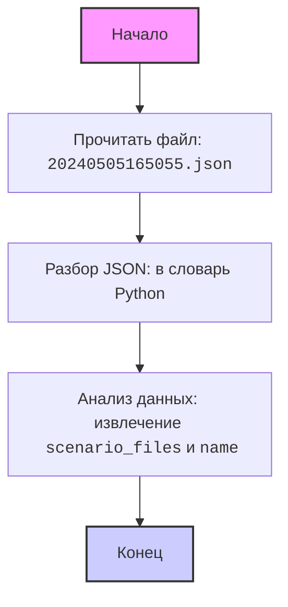

## АНАЛИЗ КОДА: `hypotez/src/suppliers/hb/_journal/20240505165055.json`

### <алгоритм>
1. **Чтение JSON-файла:** 
    - Файл `20240505165055.json` представляет собой JSON-объект. 
    - Содержимое объекта читается из файла.
    - Пример:
        ```json
        {
          "scenario_files": {},
          "name": "20240505165055"
        }
        ```
2. **Разбор JSON:** 
   - JSON-строка преобразуется в структуру данных Python (словарь).
   -  Пример:
     ```python
     data = json.loads(json_string) # Преобразование в dict
     ```
3. **Анализ данных (основная логика):** 
    -  Данные словаря (в данном случае, `data`) анализируются для дальнейшей обработки.
    -  В данном случае, файл содержит два ключа: `scenario_files` (пустой словарь) и `name` (строка, представляющая имя файла).
    - Данные используются для дальнейших операций, например:
       -  Проверка наличия файлов сценария.
       - Логгирование. 
       - Генерации отчётов.
       - Использования для формирования дальнейшей логики. 
    -  В текущем контексте, логика сводится к чтению данных, дальнейшие действия будут зависеть от контекста использования этого файла.

### <mermaid>

**Объяснение `mermaid`:**
- **`Start`**: Начальная точка процесса.
- **`ReadFile`**:  Чтение содержимого из файла `20240505165055.json`.
- **`ParseJSON`**:  Преобразование JSON-строки в словарь Python.
- **`AnalyzeData`**: Анализ полученных данных, извлечение значений ключей `scenario_files` и `name`.
- **`End`**: Конечная точка процесса.

### <объяснение>

**Общее описание:**
Файл `20240505165055.json` представляет собой файл конфигурации, содержащий информацию о сценариях и именах. В данном случае, он содержит пустой словарь `scenario_files` и имя файла `20240505165055`. Этот файл является частью структуры данных, используемой для управления и организации данных в рамках проекта `hypotez`.

**Разбор JSON:**
- JSON (JavaScript Object Notation) – текстовый формат обмена данными, основанный на подмножестве JavaScript. Он используется для представления структурированных данных в удобочитаемом формате.
- В Python для работы с JSON используется модуль `json`, который позволяет преобразовывать JSON-строку в объект Python (словарь, список и т.д.) и наоборот.
- В данном случае, JSON-файл представляет словарь, где ключами являются `scenario_files` и `name`.

**`scenario_files`**: 
-   **Тип**: Словарь (dict).
-   **Назначение**: Представляет собой коллекцию файлов сценариев, которые могут использоваться в рамках проекта. В текущем файле он пуст.
-   **Использование**: Этот словарь предназначен для хранения информации о файлах сценариев. Каждый ключ словаря будет представлять имя файла сценария, а значение - его атрибуты или путь.

**`name`**: 
-   **Тип**: Строка (str).
-   **Назначение**: Представляет собой имя файла (в данном случае, `20240505165055`).
-   **Использование**:  Имя файла может использоваться для идентификации, логгирования, создания отчётов, а также для связи с другими файлами в системе.

**Импорты:**
- В данном файле кода импорты не используются, так как это простой JSON файл. Если бы в коде был использован импорт, то он был бы описан тут. 

**Потенциальные ошибки и улучшения:**
- **Отсутствие данных**: В данном случае, `scenario_files` пуст. В будущем, предполагается что  `scenario_files` будет содержать данные о файлах сценария.
- **Обработка ошибок**: В коде, который будет использовать этот файл, необходима обработка ошибок, например, в случае некорректного формата JSON или отсутствия необходимых ключей.
- **Использование**: Необходим контекст использования этого файла для более детального анализа.

**Взаимосвязь с другими частями проекта:**
- Файл находится в `hypotez/src/suppliers/hb/_journal`. Вероятно, он связан с обработкой данных от поставщика `hb`, что является частью более широкого процесса управления поставщиками.
-  Этот файл вероятно является частью системы управления журналами, которая хранит данные о времени создания и может быть использована для отслеживания изменения данных.
-  Конкретное назначение файла может зависеть от общей архитектуры `hypotez`, однако из названия файла и данных можно сделать вывод, что этот файл является своего рода "слепком" состояния системы на момент `20240505165055`.