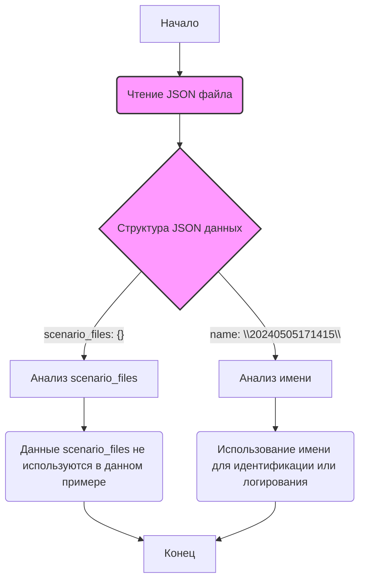

## АНАЛИЗ JSON ФАЙЛА: `hypotez/src/suppliers/hb/_journal/20240505171415.json`

### <алгоритм>

1.  **Чтение файла**: Файл `20240505171415.json` представляет собой JSON-файл, который необходимо прочитать.
    *   Пример: JSON парсер читает файл и преобразует его в структуру данных Python.

2.  **Структура данных**: После прочтения файл превращается в словарь (dict) Python.
    *   Пример: `data = {"scenario_files": {}, "name": "20240505171415"}`.
     
3.  **Анализ данных**:  Словарь анализируется. В данном случае у нас есть два ключа:
    *   `"scenario_files"`: Значение - пустой словарь.
    *   `"name"`: Значение - строковое представление имени файла (`"20240505171415"`).
    
4.  **Использование данных**: Данные из словаря могут быть использованы в других частях программы. Например, имя файла может быть использовано для логирования или идентификации. В данном конкретном примере, `scenario_files` не используется, но может быть использован в других сценариях.

### <mermaid>



### <объяснение>

**Импорты**:

*   В данном файле нет явных импортов. Однако, чтобы прочитать и обработать JSON файл, будут использованы стандартные библиотеки Python, такие как `json`, которые импортируются в соответствующем коде (скрипте), читающем данный файл.

**Классы**:

*   В данном файле нет классов. Это просто данные в формате JSON.

**Функции**:

*   Сам JSON файл не содержит функций. Однако, для обработки этих данных потребуется функция (или несколько), которые будут отвечать за:
    1.  **Чтение JSON файла**: Например, `json.load(file)` в Python. Эта функция преобразует JSON-текст в структуру данных Python.
        *   Аргумент: файловый объект, содержащий JSON.
        *   Возвращаемое значение: словарь (dict), если JSON представляет собой объект.
        *   Пример:
            ```python
            import json

            with open("20240505171415.json", 'r') as f:
                data = json.load(f)
            ```
    2.  **Анализ данных**: Функции, которые будут анализировать и использовать эти данные в соответствии с логикой приложения.

**Переменные**:

*   `scenario_files`: Это ключ словаря. В данном случае значение - пустой словарь `{}`. Это может обозначать, что в данном контексте нет дополнительных сценариев или файлов, связанных с данным журналом.
*   `name`: Это ключ словаря. Значение - строка `"20240505171415"`. Это, вероятно, имя журнала или идентификатор, которое может быть использовано для поиска информации в других частях системы.

**Цепочка взаимосвязей**:

Этот JSON-файл, скорее всего, используется в системе, которая обрабатывает журнал действий, связанных с поставщиками (hb в пути к файлу указывает на поставщика "Honeybadger"). Наличие поля `scenario_files` подразумевает потенциальную возможность работы с различными сценариями.

1.  **Чтение**: Файл считывается программой, которая парсит JSON в структуру данных Python.
2.  **Использование**: Имя журнала (значение ключа `name`) может использоваться для:
    *   **Идентификация**: Уникальной идентификации журнала.
    *   **Логирование**: Записи в журнал о текущей операции.
    *   **Поиск**: Запроса информации о конкретном журнале из базы данных или другой системы хранения.

**Потенциальные ошибки и улучшения**:

*   **Отсутствие проверки типа данных**: Хотя в данном случае типы данных ожидаемы, в более общем случае необходимо добавлять проверки типов, чтобы обрабатывать некорректные JSON-данные, например, если `name` не строка.
*   **Обработка отсутствующих ключей**: Необходимо обрабатывать ситуацию, когда ключи `scenario_files` или `name` могут отсутствовать.
*   **Документация**: Отсутствует контекст и описание значений. Документирование структуры JSON в коде и в документации проекта поможет в будущем понять назначения значений.
*   **Использование `scenario_files`**: В данном случае, значение `scenario_files` пустое. Необходимо уточнить, как это поле будет использоваться в дальнейшем. Возможно, требуется добавить примеры значений для будущих сценариев.
*   **Обработка ошибок чтения файла**: Стоит добавить обработку ошибок при попытке прочитать JSON файл, например, `FileNotFoundError` или `json.JSONDecodeError`.

**Заключение:**

Этот JSON-файл представляет собой простую запись журнала, содержащую имя и пустой словарь для возможных сценариев. Для обработки этого файла необходимо использовать функции из стандартных библиотек Python.  Дальнейшие действия будут зависеть от логики приложения, которое использует этот файл. Потенциальные улучшения включают добавление проверок типов, обработку отсутствующих данных и уточнение назначения полей.