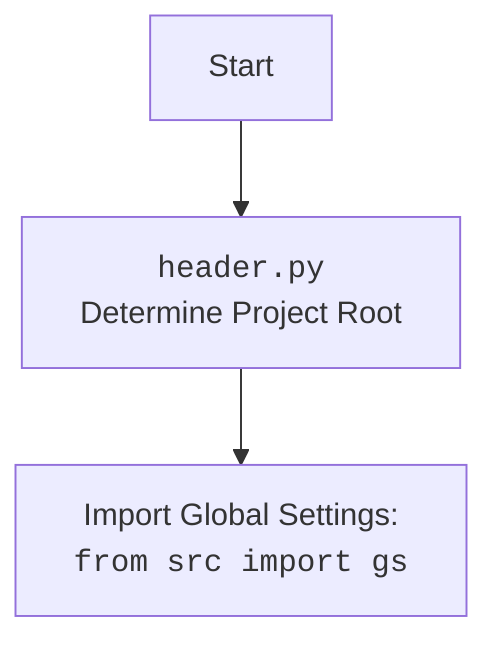

## АЛГОРИТМ

1. **Инициализация:**
   - Создается экземпляр класса `Graber`, при этом передается объект `Driver` в качестве аргумента.
   - В конструкторе устанавливается префикс поставщика (`supplier_prefix`) в значение `hb`.
   - Вызывается конструктор родительского класса `Graber` (из `src.suppliers.graber`), передавая префикс поставщика и объект `Driver`.
   - Устанавливается значение `Context.locator_for_decorator` в `None`. 
2. **Выполнение операции с полями товара**:
   - Для получения значения полей товара используются методы родительского класса (`src.suppliers.graber.Graber`).
   - Методы родительского класса могут быть перегружены в классе `Graber` для нестандартной обработки.
3. **Декораторы**:
   - Перед выполнением запроса к вебдрайверу можно выполнить предварительные действия (например, закрытие всплывающего окна) с помощью декоратора `@close_pop_up`.
   - Декоратор по умолчанию (закомментированный код) находится в родительском классе.
   - Декоратор срабатывает, если установлено значение в `Context.locator`.
   -  В данном коде `Context.locator_for_decorator` установлено в `None`, что означает, что декоратор в данном случае не будет вызван.

## MERMAID

```mermaid
flowchart TD
    Start[Start] --> Init[<code>Graber.__init__</code><br>Initialize with Driver and set supplier_prefix='hb']
    Init --> SuperInit[<code>super().__init__</code><br>Call parent's init with supplier_prefix and driver]
    SuperInit --> SetContext[Set <code>Context.locator_for_decorator = None</code>]
    SetContext --> GrabFields[Call methods from parent class for grab data fields]
    GrabFields --> DecoratorCheck{Is <code>Context.locator</code> set?}
    DecoratorCheck -- No --> End[End]
    DecoratorCheck -- Yes --> ExecuteDecorator[Execute decorator <br><code>@close_pop_up</code>]
    ExecuteDecorator -->  End
  
    classDef default fill:#f9f,stroke:#333,stroke-width:2px
    class Start,Init,SuperInit,SetContext,GrabFields,DecoratorCheck,ExecuteDecorator,End default
    
```



## ОБЪЯСНЕНИЕ

**Импорты:**

- `from typing import Any`: Импортируется `Any` для обозначения типа переменной, которая может принимать любое значение.
- `import header`: Импортируется модуль `header`, который, вероятно, отвечает за определение корневой директории проекта и загрузку глобальных настроек.
- `from src.suppliers.graber import Graber as Grbr, Context, close_pop_up`:
    - `Graber as Grbr`: Импортируется класс `Graber` из модуля `src.suppliers.graber` и переименовывается в `Grbr` для краткости. Этот класс, вероятно, является базовым классом для сбора данных с веб-страниц.
    - `Context`: Импортируется класс `Context`, который, вероятно, используется для хранения глобального контекста выполнения (например, объект вебдрайвера, настройки).
    - `close_pop_up`: Импортируется функция `close_pop_up`, которая, вероятно, используется как декоратор для закрытия всплывающих окон.
- `from src.webdriver.driver import Driver`: Импортируется класс `Driver` из `src.webdriver.driver`. Вероятно, это класс для управления веб-драйвером.
- `from src.logger.logger import logger`: Импортируется объект `logger` из модуля `src.logger.logger`, который используется для логирования событий.

**Классы:**

- `class Graber(Grbr)`:
    - Наследуется от класса `Grbr` (базовый класс для сбора данных).
    - `supplier_prefix`: Атрибут класса, строка, хранит префикс поставщика ('hb' в данном случае). Используется для идентификации поставщика.
    - `__init__(self, driver: Driver)`:
        - Конструктор класса, принимает объект `Driver` в качестве аргумента.
        - Устанавливает `self.supplier_prefix` в 'hb'.
        - Вызывает конструктор родительского класса `Grbr` с переданными аргументами.
        - Устанавливает значение `Context.locator_for_decorator` в `None`. Это отключает выполнение декоратора, так как он выполняется только если значение установлено.

**Функции:**

- Закомментированный код декоратора `close_pop_up(value: Any = None)`:
    - Этот код является примером декоратора, который можно использовать для выполнения каких-либо действий перед выполнением основной функции (например, закрытие всплывающего окна).
    - Декоратор принимает необязательный аргумент `value`.
    - Внутренняя функция `decorator` принимает функцию `func` в качестве аргумента.
    - Внутренняя функция `wrapper` вызывает переданную функцию `func`, предварительно попытавшись выполнить действие `Context.driver.execute_locator(Context.locator.close_pop_up)` для закрытия всплывающего окна.
    -  Если происходит ошибка `ExecuteLocatorException` при выполнении локатора, то она отлавливается, и выводится сообщение в лог.
    -  `wrapper` возвращает результат выполнения `func`.
    - Декоратор возвращает обернутую функцию `wrapper`.
    - Обратите внимание: в данном примере, вызов локатора закомментирован, что означает, что никакого действия не будет выполнено до вызова целевой функции.

**Переменные:**

- `supplier_prefix`: Строка, содержащая префикс поставщика.
- `Context.locator_for_decorator`:  Переменная в классе `Context` используется для передачи локатора, который должен использоваться в декораторе `@close_pop_up`. В данном коде устанавливается в `None`, что отключает выполнение декоратора.

**Потенциальные ошибки и улучшения:**

- **Обработка ошибок:** В закомментированном декораторе есть обработка `ExecuteLocatorException`, но в реальном использовании может понадобиться более общая обработка ошибок.
- **Настройка декоратора:** В текущем виде, декоратор не используется, так как `Context.locator_for_decorator` установлен в `None`. Для использования декоратора, `Context.locator_for_decorator`  должен быть установлен в значение, которое будет обработано декоратором.
- **Логика декоратора:** Логика декоратора (`Context.driver.execute_locator(Context.locator.close_pop_up)`) закомментирована, необходимо раскомментировать и реализовать реальное действие.
- **Гибкость:** Можно было бы сделать класс более гибким, например, передавая `supplier_prefix` в конструктор.

**Взаимосвязи с другими частями проекта:**

- **`src.suppliers.graber`:** Этот класс наследует от `src.suppliers.graber.Graber`, предполагается что основной функционал сбора данных реализован в родительском классе.
- **`src.webdriver.driver`:** Для работы с вебдрайвером используется класс `src.webdriver.driver.Driver`.
- **`src.logger.logger`:** Для логирования событий используется объект `src.logger.logger.logger`.
- **`src.header`**: `header.py` - Определяет корень проекта и импортирует глобальные настройки из `src.gs`.
- **`src.context`**: `Context` -  хранит глобальный контекст выполнения, такие как объект веб-драйвера, настройки и локаторы.