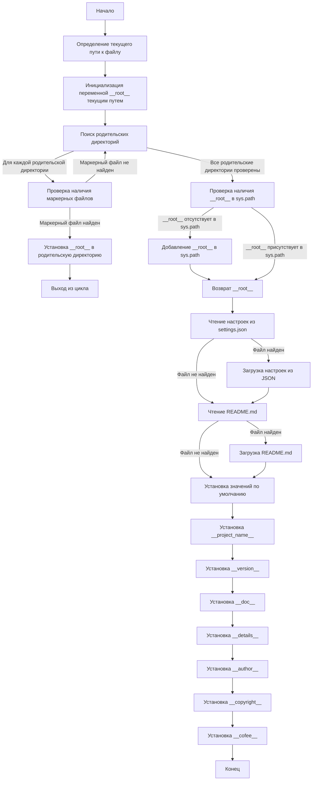

## АНАЛИЗ КОДА: `src/suppliers/hb/header.py`

### 1. <алгоритм>

**Блок-схема:**



**Примеры для каждого логического блока:**

1.  **SetCurrentPath**:
    *   `__file__` =  `/home/user/projects/hypotez/src/suppliers/hb/header.py`
    *   `current_path` = `/home/user/projects/hypotez/src/suppliers/hb`
2.  **InitializeRoot**:
    *   `__root__` = `/home/user/projects/hypotez/src/suppliers/hb`
3.  **SearchParents**:
    *   Перебор: `/home/user/projects/hypotez/src/suppliers/hb`, `/home/user/projects/hypotez/src/suppliers`, `/home/user/projects/hypotez/src`, `/home/user/projects/hypotez`, `/home/user/projects`, `/home/user`, `/home`, `/`
4. **CheckMarkerFiles**:
    *   Для `/home/user/projects/hypotez` проверяется существование `/home/user/projects/hypotez/__root__` или `/home/user/projects/hypotez/.git`. Если `/home/user/projects/hypotez/.git` существует, то условие выполняется.
5.  **SetRoot**:
    *   `__root__` =  `/home/user/projects/hypotez`
6.  **BreakLoop**:
    *   Цикл завершается.
7.  **CheckRootInPath**:
    *   Проверка, есть ли `/home/user/projects/hypotez` в `sys.path`.
8. **InsertRootToPath**:
    *  `/home/user/projects/hypotez` добавляется в начало `sys.path`.
9. **ReturnRoot**:
    *   Функция возвращает `/home/user/projects/hypotez`.
10. **ReadSettings**:
    *   Пытаемся открыть `/home/user/projects/hypotez/src/settings.json`.
11. **LoadSettings**:
    *   Загружаем JSON данные в словарь `settings`.
12. **ReadReadme**:
    * Пытаемся открыть `/home/user/projects/hypotez/src/README.MD`
13. **LoadReadme**:
    *  Читаем содержимое README в строку `doc_str`
14. **SetDefaultValues**:
    * Если `settings` или `doc_str` не загружены, устанавливаем дефолтные значения.
15. **SetProjectName**:
    * `__project_name__` = `"hypotez"` или значение из `settings["project_name"]`.
16. **SetVersion**:
    * `__version__` = `""` или значение из `settings["version"]`.
17. **SetDoc**:
    * `__doc__` = `""` или значение из `doc_str`.
18. **SetDetails**:
    * `__details__` = `""`.
19. **SetAuthor**:
    * `__author__` = `""` или значение из `settings["author"]`.
20. **SetCopyright**:
    * `__copyright__` = `""` или значение из `settings["copyrihgnt"]`.
21. **SetCofee**:
    * `__cofee__` = `"Treat the developer to a cup of coffee for boosting enthusiasm in development: https://boosty.to/hypo69"` или значение из `settings["cofee"]`.

### 2. <mermaid>

```mermaid
flowchart TD
    Start[<code>header.py</code><br> Determine Project Root] --> SetCurrentPath[Set Current Path:<br> <code>Path(__file__).resolve().parent</code>]
    SetCurrentPath --> InitializeRoot[Initialize Root:<br><code>__root__ = current_path</code>]
    InitializeRoot --> SearchParents[Search Parent Directories]
    SearchParents -- For each parent directory --> CheckMarkerFiles[Check Marker Files:<br><code>(parent / marker).exists()</code>]
    CheckMarkerFiles -- Marker File Found --> SetRoot[Set Root:<br><code>__root__ = parent</code>]
    SetRoot --> BreakLoop[Break Loop]
    CheckMarkerFiles -- Marker File Not Found --> SearchParents
    SearchParents -- All parent directories checked --> CheckRootInPath[Check if root in sys.path:<br><code>__root__ not in sys.path</code>]
    CheckRootInPath -- Root Not In Path --> InsertRootToPath[Insert Root to sys.path:<br><code>sys.path.insert(0, str(__root__))</code>]
    InsertRootToPath --> ReturnRoot[Return Project Root:<br><code>return __root__</code>]
     CheckRootInPath -- Root In Path --> ReturnRoot
    ReturnRoot --> ImportGlobalSettings[Import Global Settings:<br><code>from src import gs</code>]
    ImportGlobalSettings --> ReadSettings[Read Settings:<br><code>open(gs.path.root / 'src' / 'settings.json')</code>]
    ReadSettings -- File Found --> LoadSettings[Load Settings from JSON:<br><code>json.load(settings_file)</code>]
    ReadSettings -- File Not Found --> ReadReadme[Read README:<br><code>open(gs.path.root / 'src' / 'README.MD')</code>]
    LoadSettings --> ReadReadme
    ReadReadme -- File Found --> LoadReadme[Load README:<br><code>settings_file.read()</code>]
    ReadReadme -- File Not Found --> SetDefaultValues[Set Default Values]
     LoadReadme --> SetDefaultValues
    SetDefaultValues --> SetProjectName[Set __project_name__:<br><code>settings.get("project_name", 'hypotez')</code>]
    SetProjectName --> SetVersion[Set __version__:<br><code>settings.get("version", '')</code>]
    SetVersion --> SetDoc[Set __doc__:<br><code>doc_str</code>]
    SetDoc --> SetDetails[Set __details__:<br><code>''</code>]
    SetDetails --> SetAuthor[Set __author__:<br><code>settings.get("author", '')</code>]
    SetAuthor --> SetCopyright[Set __copyright__:<br><code>settings.get("copyrihgnt", '')</code>]
    SetCopyright --> SetCofee[Set __cofee__:<br><code>settings.get("cofee", "...")</code>]
     SetCofee --> End[End]

```

**Анализ зависимостей:**

*   **`sys`**: Используется для работы с системными параметрами, такими как путь поиска модулей (`sys.path`).
*   **`json`**: Используется для работы с JSON-данными (чтение файла настроек `settings.json`).
*   **`packaging.version.Version`**: Импортируется для работы с версиями, но в представленном коде не используется. Возможно, он нужен для расширения функционала в будущем.
*   **`pathlib.Path`**: Используется для работы с путями к файлам и директориям, что делает код более кроссплатформенным.
*  **`src.gs`**:  Импортируется для доступа к глобальным настройкам проекта. Это подразумевает наличие модуля `gs` в пакете `src`, который должен содержать информацию о корневом каталоге проекта (`gs.path.root`), а также другие глобальные переменные.

### 3. <объяснение>

#### Импорты:

*   `import sys`: Модуль `sys` используется для доступа к системным переменным и функциям, в данном случае для работы с путями поиска модулей (`sys.path`).
*   `import json`: Модуль `json` используется для работы с JSON-данными, в частности для загрузки настроек из файла `settings.json`.
*   `from packaging.version import Version`:  Импортирует класс `Version` для сравнения версий, но он не используется в этом коде. Возможно, этот импорт запланирован для будущей функциональности.
*   `from pathlib import Path`: Импортирует класс `Path` из модуля `pathlib`, который используется для работы с путями к файлам и директориям в кросс-платформенном формате.
*   `from src import gs`: Импортирует модуль `gs` (global settings) из пакета `src`. Этот модуль, предположительно, содержит глобальные настройки проекта, включая путь к корню проекта.

#### Классы:

*   **`Path`** (из `pathlib`):
    *   **Роль**: Представляет пути к файлам и директориям.
    *   **Атрибуты**:  Непосредственно не используются.
    *   **Методы**: `resolve()`, `parent`, `exists()`: `resolve()` возвращает абсолютный путь,  `parent` возвращает родительскую директорию, `exists()` проверяет существование файла или директории.
    *   **Взаимодействие**: Используется для работы с файловой системой и для поиска корня проекта.

#### Функции:

*   **`set_project_root(marker_files=('__root__', '.git')) -> Path`**:
    *   **Аргументы**:
        *   `marker_files`: кортеж строк, содержащий имена файлов или директорий, которые указывают на корень проекта. Значение по умолчанию `('__root__', '.git')`.
    *   **Возвращаемое значение**:  `Path` – путь к корневой директории проекта, либо путь к директории текущего файла, если корень не найден.
    *   **Назначение**: Находит корневую директорию проекта, начиная с текущего файла, и добавляет ее в `sys.path`.
    *   **Пример**:
        Если `__file__` равен `/home/user/projects/hypotez/src/suppliers/hb/header.py`, а в `/home/user/projects/hypotez/.git` существует, функция вернёт `Path("/home/user/projects/hypotez")`.

#### Переменные:

*   `__root__`: `Path` -  путь к корневой директории проекта, вычисляется функцией `set_project_root`.
*   `settings`: `dict` - словарь, содержащий настройки проекта, загруженные из `settings.json`. Если файл не найден, значение `None`.
*   `doc_str`: `str` - строка, содержащая содержимое файла `README.MD`.  Если файл не найден, значение `None`.
*    `__project_name__`: `str` - название проекта, взятое из `settings` или значение по умолчанию `hypotez`.
*   `__version__`: `str` - версия проекта, взятая из `settings` или пустая строка.
*   `__doc__`: `str` -  содержимое `README.MD`  или пустая строка.
*   `__details__`: `str` -  пустая строка.
*    `__author__`: `str` -  имя автора проекта, взятое из `settings` или пустая строка.
*    `__copyright__`: `str` - копирайт проекта, взятое из `settings` или пустая строка.
*   `__cofee__`: `str` - сообщение для поддержки автора, взятое из `settings` или сообщение по умолчанию.

#### Потенциальные ошибки и области для улучшения:

*   **Обработка ошибок**:
    *   Код использует пустые блоки `except` для обработки `FileNotFoundError` и `json.JSONDecodeError`. Желательно добавить логирование ошибок или вывод предупреждений в консоль.
*   **Неиспользуемый импорт `Version`**:  Удалить неиспользуемый импорт `packaging.version`.
*   **Глобальные переменные**: Использование глобальных переменных (начинающихся с `__`) может быть нежелательным. Можно рассмотреть возможность использования классов или других механизмов для управления глобальным состоянием.
*   **Зависимость от `gs`**: Зависимость от `src.gs` создает неявную связь с другими частями проекта. Необходимо удостовериться, что структура модуля `gs` не меняется.

#### Взаимосвязи с другими частями проекта:

*   **`src.gs`**: Этот модуль предоставляет глобальные настройки проекта, включая путь к корню проекта (`gs.path.root`), который используется для поиска файлов `settings.json` и `README.MD`.
*   **`settings.json`**: Файл конфигурации проекта, откуда берутся общие настройки.
*   **`README.MD`**: Файл документации проекта, откуда берется основное описание.

Этот модуль `header.py` играет ключевую роль в инициализации проекта: находит корневую директорию, добавляет ее в путь поиска модулей и загружает настройки и документацию. Он является центральным компонентом для работы с глобальными настройками и должен быть импортирован в другие модули проекта.