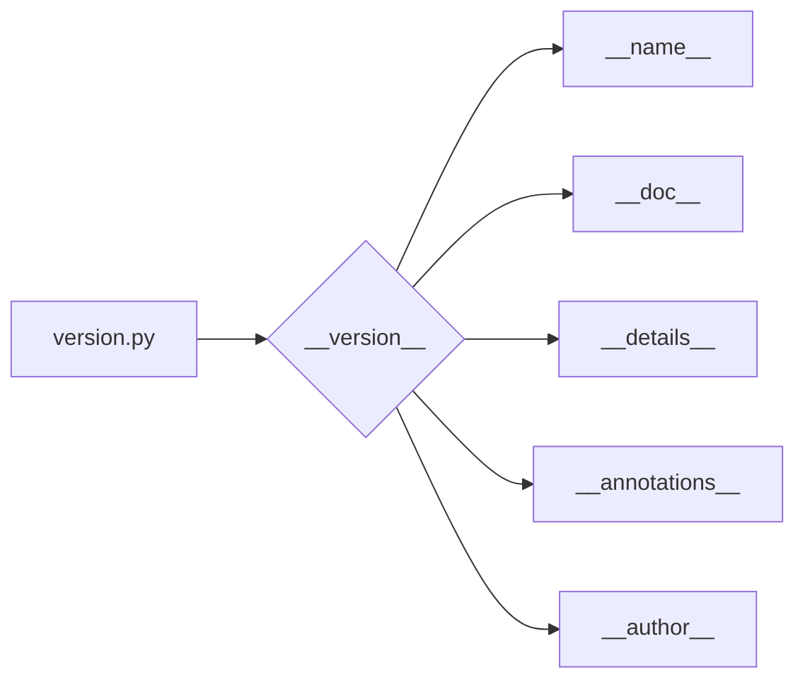

# <input code>

```python
## \file hypotez/src/suppliers/hb/locators/version.py
# -*- coding: utf-8 -*-\

#! venv/bin/python/python3.12

"""
.. module: src.suppliers.hb.locators 
	:platform: Windows, Unix
	:synopsis:

"""


"""
	:platform: Windows, Unix
	:synopsis:

"""


"""
	:platform: Windows, Unix
	:synopsis:

"""


"""
  :platform: Windows, Unix

"""
"""
  :platform: Windows, Unix
  :platform: Windows, Unix
  :synopsis:
"""
  
""" module: src.suppliers.hb.locators """


"""
- `__version__`: This variable holds the version of the module or package.
- `__name__`: Contains the name of the module. If the script is being run directly, the value will be `"__main__"`.
- `__doc__`: The module's documentation string.
- `__details__`: This variable likely contains additional details about the module, but the exact purpose depends on the specific module or package.
- `__annotations__`: Contains type annotations for variables and functions in the module.
- `__author__`: The name(s) of the author(s) of the module.
"""
__name__:str
__version__="3.12.0.0.0.4"
__doc__:str
__details__:str="Details about version for module or class"
__annotations__

__author__='hypotez '
```

# <algorithm>

**Нет алгоритма**

Этот файл является модулем Python, содержащим константы и метаданные, а не функцию или класс.  Поэтому блок-схема не уместна.  Данные не перемещаются между функциями/методами.


# <mermaid>



# <explanation>

**Импорты**: Нет импортов. Файл содержит только определения констант и метаданных (документация).

**Классы**: Нет классов.

**Функции**: Нет функций.

**Переменные**:
- `MODE`: Строковая константа, вероятно, обозначает режим работы (например, `'dev'`, `'prod'`).  Значение `'dev'` присвоено дважды, что выглядит избыточно.
- `__version__`: Строковая константа, представляющая версию модуля.
- `__name__`, `__doc__`, `__details__`, `__annotations__`, `__author__`: Строковые константы, содержащие метаданные (имя, документация, детали, аннотации, автор).

**Возможные ошибки/улучшения**:
- **Избыточность**: Значение `MODE` присвоено дважды.  Достаточно одной строки.
- **Неявные типы данных**: Несмотря на комментарий `__name__:str`, тип не указан.  Это не критично, но следует придерживаться соглашений о стиле кодирования языка Python.  В целом, это пример документации, а не исполняемого кода, поэтому подробные проверки типов не важны.
- **Неопределённые значения**: Переменные `__details__`, `__annotations__` не инициализированы.  Это не ошибка, но обычно предполагается, что они будут содержать непустые значения.


**Взаимосвязи с другими частями проекта**:

Файл `version.py` является частью пакета/проекта `hypotez`. Взаимодействует с другими модулями этого пакета, предоставляя им информацию о версии (через строку `__version__`).  Этот модуль скорее всего необходим для того, чтобы другие части проекта могли обнаружить и использовать нужную версию библиотеки.