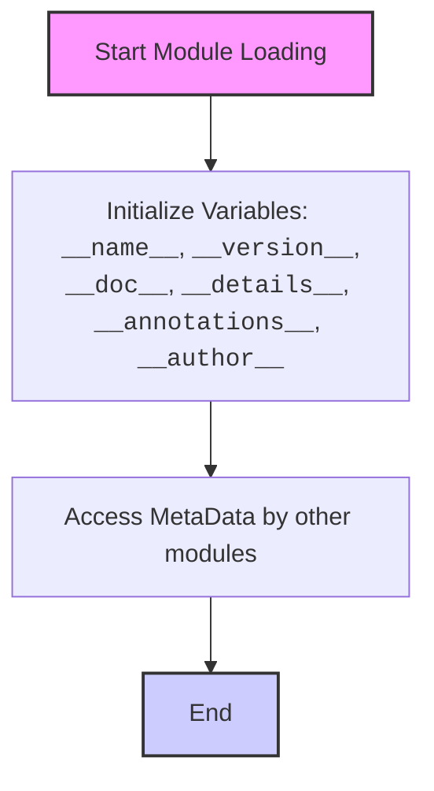

## Анализ кода `src/suppliers/hb/locators/version.py`

### 1. <алгоритм>
Файл `version.py` в основном предназначен для хранения метаданных о версии модуля, его имени, документации, дополнительной информации и авторе. Алгоритм работы с этим файлом довольно прост:

1.  **Инициализация**: При импорте модуля Python интерпретатор считывает файл `version.py`.
2.  **Присваивание значений**: Интерпретатор присваивает значения объявленным переменным:
    *   `__name__` (тип `str`): Имя модуля (например, `src.suppliers.hb.locators`).
    *   `__version__` (тип `str`): Версия модуля (пример: `"3.12.0.0.0.4"`).
    *   `__doc__` (тип `str`): Документационная строка модуля (в коде она не присваивается, поэтому будет пустой).
    *   `__details__` (тип `str`): Детали о модуле (пример: `"Details about version for module or class"`).
    *   `__annotations__`:  Словарь аннотаций типов (не инициализирован).
    *   `__author__` (тип `str`): Имя автора (пример: `"hypotez"`).
3.  **Использование**: Другие модули могут импортировать `version.py` и получать доступ к этим метаданным через переменные.

**Пример использования:**
```python
# В другом модуле
from src.suppliers.hb.locators import version

print(f"Module: {version.__name__}")
print(f"Version: {version.__version__}")
print(f"Author: {version.__author__}")
print(f"Details: {version.__details__}")
```
**Поток данных:**
Инициализация переменных  -->  Импорт модуля `version.py` в другом модуле  -->  Доступ к переменным метаданных.

### 2. <mermaid>

**Объяснение `mermaid` диаграммы:**
1.  `Start`: Начало загрузки модуля.
2.  `InitializeVars`: Инициализируются переменные метаданных модуля, такие как `__name__`, `__version__`, `__doc__`, `__details__`, `__annotations__`, и `__author__`.
3.  `AccessVariables`: Другие модули могут импортировать данный модуль и получать доступ к его переменным для использования метаданных.
4.  `End`: Завершение работы с модулем `version.py`.

### 3. <объяснение>

**Импорты:**
В данном коде нет явных импортов других модулей.

**Классы:**
В этом файле нет классов.

**Функции:**
В этом файле нет функций.

**Переменные:**

*   `__name__` (тип `str`):
    *   Хранит имя модуля, которое определяется Python при импорте.
    *   Используется для определения, был ли файл запущен напрямую или импортирован.
*   `__version__` (тип `str`):
    *   Хранит строку, представляющую версию модуля.
    *   Используется для отслеживания версий кода.
    *   В данном случае, значение - `"3.12.0.0.0.4"`.
*   `__doc__` (тип `str`):
    *   Предназначена для хранения строки документации для модуля.
    *   В текущем коде не присвоено значение, поэтому будет пустой.
*   `__details__` (тип `str`):
    *   Хранит дополнительную информацию о модуле.
    *   В данном случае, значение - `"Details about version for module or class"`.
*   `__annotations__`:
    *   Предназначена для хранения аннотаций типов для переменных и функций.
    *  В коде не инициализирована, то есть не содержит аннотаций.
*    `__author__` (тип `str`):
     *   Хранит имя автора модуля.
     *   В данном случае, значение -  `"hypotez"`.

**Потенциальные ошибки и области для улучшения:**

*   `__doc__`: Рекомендуется добавлять документационную строку для модуля, чтобы улучшить понимание его назначения.
*   `__annotations__`:  Инициализация аннотаций может помочь при статической проверке типов и сделать код более читаемым.
*   Использование семантического версионирования:  Версия `"3.12.0.0.0.4"` выглядит нестандартно. Рекомендуется использовать семантическое версионирование, например, `X.Y.Z`, где:
    *   `X` - основная версия
    *   `Y` - дополнительная версия
    *   `Z` - номер патча.
*   Присваивание типа  `__name__:str` не влияет на исполнение кода, так как имя модуля определяется во время исполнения.
*   Избыточность комментариев: Код содержит множество пустых комментариев вида `""" ... """`, которые не несут смысловой нагрузки и могут быть удалены.

**Взаимосвязи с другими частями проекта:**

*   Этот модуль предназначен для предоставления метаданных о версии, которые могут использоваться другими модулями в проекте для отслеживания версий, документирования или целей отладки.
*   В данном случае модуль `version.py`  не импортирует другие модули, а предоставляет свои метаданные.