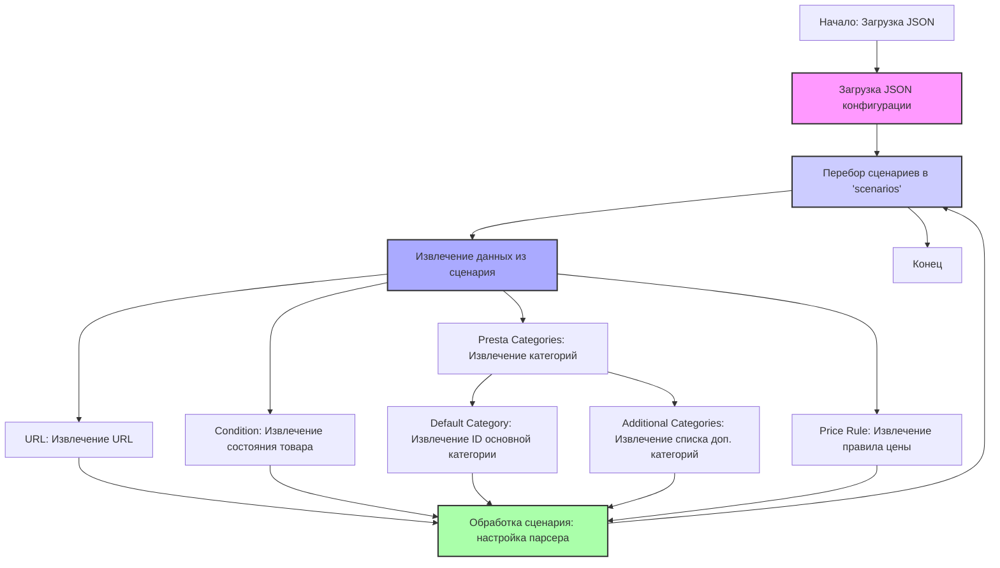

## ИНСТРУКЦИЯ:

Анализируй предоставленный код подробно и объясни его функциональность. Ответ должен включать три раздела:

1. **<алгоритм>**: Опиши рабочий процесс в виде пошаговой блок-схемы, включая примеры для каждого логического блока, и проиллюстрируй поток данных между функциями, классами или методами.
2. **<mermaid>**: Напиши код для диаграммы в формате `mermaid`, проанализируй и объясни все зависимости,
    которые импортируются при создании диаграммы.
    **ВАЖНО!** Убедитесь, что все имена переменных, используемые в диаграмме `mermaid`,
    имеют осмысленные и описательные имена. Имена переменных вроде `A`, `B`, `C`, и т.д., не допускаются!

    **Дополнительно**: Если в коде есть импорт `import header`, добавьте блок `mermaid` flowchart, объясняющий `header.py`:
    ```mermaid
    flowchart TD
        Start --> Header[<code>header.py</code><br> Determine Project Root]

        Header --> import[Import Global Settings: <br><code>from src import gs</code>]
    ```

3. **<объяснение>**: Предоставьте подробные объяснения:
   - **Импорты**: Их назначение и взаимосвязь с другими пакетами `src.`.
   - **Классы**: Их роль, атрибуты, методы и взаимодействие с другими компонентами проекта.
   - **Функции**: Их аргументы, возвращаемые значения, назначение и примеры.
   - **Переменные**: Их типы и использование.
   - Выделите потенциальные ошибки или области для улучшения.

Дополнительно, постройте цепочку взаимосвязей с другими частями проекта (если применимо).

Это обеспечивает всесторонний и структурированный анализ кода.
## Формат ответа: `.md` (markdown)
**КОНЕЦ ИНСТРУКЦИИ**

## <алгоритм>
1.  **Начало**: Загрузка JSON-конфигурации, представляющей собой словарь, где ключом является `scenarios`.
2.  **Обход сценариев**: Перебор ключей внутри `scenarios`, каждый из которых представляет собой конкретный сценарий парсинга, например, `moisture-face`, `serums` и т.д.
3.  **Извлечение данных**: Для каждого сценария извлекаются следующие данные:
    *   `url`: URL-адрес страницы категории товаров для парсинга.
        *   *Пример:* `"https://hbdeadsea.co.il/product-category/facial/moisture-face//"`
    *   `condition`: Состояние товаров (`new`).
        *   *Пример:* `"new"`
    *   `presta_categories`: Информация о категориях PrestaShop, к которым относятся товары:
        *   `default_category`: ID категории по умолчанию.
            *   *Пример:* `11253`
        *   `additional_categories`: Список дополнительных категорий (в данном случае всегда пустой).
            *   *Пример:* `[""]`
    *   `price_rule`: Правило ценообразования (в данном случае всегда `1`).
        *   *Пример:* `1`
4.  **Обработка сценария**: Извлеченные данные используются для настройки парсера, который будет собирать информацию о товарах с указанного URL-адреса и присваивать им соответствующие категории и правило цены.
5.  **Конец**: Цикл обработки сценариев завершается.

## <mermaid>



**Объяснение `mermaid` диаграммы:**

Диаграмма отображает поток управления и данных в процессе обработки JSON-конфигурации.

*   **`Start`**: Начальная точка процесса.
*   **`LoadConfig`**: Загрузка JSON-файла.
*   **`LoopScenarios`**: Цикл, который проходит по всем сценариям парсинга, определённым в JSON.
*   **`Scenario`**: Извлечение данных для текущего сценария.
*   **`URL`, `Condition`, `PrestaCategories`, `PriceRule`**: Извлечение соответствующих полей данных из текущего сценария.
*   **`DefaultCategory`, `AdditionalCategories`**: Извлечение информации о категориях PrestaShop.
*   **`ProcessScenario`**: Обработка извлечённых данных и настройка парсера.
*   **`End`**: Конечная точка процесса.

## <объяснение>

**Общее описание:**

Предоставленный JSON-код представляет собой конфигурационный файл для системы парсинга товаров с сайта `hbdeadsea.co.il`. Он содержит настройки для нескольких категорий товаров, таких как увлажняющие средства для лица, сыворотки, маски для лица и т.д. Каждая категория имеет свой URL, ID категории в PrestaShop, состояние товара (`new`) и правило ценообразования.

**Импорты:**
В представленном коде нет импортов. Этот файл является статическим JSON-файлом, содержащим конфигурацию, и не требует импортов для своей работы. Этот файл используется внешними скриптами или программами для настройки и управления парсингом.

**Классы:**
В данном коде классы не используются, так как это JSON файл.

**Функции:**
В данном коде функции не используются.

**Переменные:**
*   `scenarios`: Основной словарь, содержащий все сценарии парсинга.
    *   Тип: `dict`.
    *   Использование: Содержит ключи, представляющие собой названия сценариев (например, `moisture-face`).
*   `url`: URL-адрес страницы с товарами.
    *   Тип: `str`.
    *   Использование: URL, с которого парсер будет собирать информацию о товарах.
*   `condition`: Состояние товара (обычно `"new"`).
    *   Тип: `str`.
    *   Использование: Определяет состояние товара при добавлении в базу данных.
*   `presta_categories`: Словарь, содержащий информацию о категориях PrestaShop.
    *   Тип: `dict`.
    *   Использование: Определяет, к каким категориям PrestaShop будут отнесены спарсенные товары.
*   `default_category`: ID основной категории в PrestaShop.
    *   Тип: `int`.
    *   Использование: ID категории, к которой будет отнесен товар по умолчанию.
*   `additional_categories`: Список дополнительных категорий PrestaShop.
    *   Тип: `list` из `str`.
    *   Использование: Список дополнительных категорий, к которым может быть отнесен товар (в данном случае всегда пустой `[""]`).
*   `price_rule`: Правило ценообразования.
    *   Тип: `int`.
    *   Использование: Идентификатор правила ценообразования, которое будет применяться к товарам.

**Потенциальные ошибки и области для улучшения:**

1.  **Пустые дополнительные категории**: В текущей конфигурации `additional_categories` всегда содержит `[""]`, что, вероятно, не является оптимальным решением. Это может быть как намеренное поведение, так и ошибка в конфигурации. Возможно, следует позволить задавать здесь дополнительные категории для более точной классификации товаров.
2.  **Жестко закодированное правило ценообразования**: Все сценарии используют `price_rule: 1`. Возможно, следует сделать правило ценообразования настраиваемым для каждого сценария.
3.  **Отсутствие обработки ошибок**: В коде не предусмотрена обработка ошибок, например, если URL-адрес недействителен или если категория PrestaShop не существует. Необходимо добавить обработку ошибок при использовании этих данных в реальном парсере.
4.  **Отсутствие валидации**: Нет валидации данных. В идеале необходимо добавить проверку типов данных и их значений для избежания ошибок при парсинге.

**Взаимосвязь с другими частями проекта:**

Этот JSON-файл является частью конфигурации и используется в качестве входных данных для парсера. Парсер, вероятно, будет работать на основе этой конфигурации, используя `url` для получения данных о товарах, а `presta_categories` и `price_rule` для их классификации и ценообразования.

Таким образом, данный JSON-файл определяет набор сценариев парсинга для разных категорий товаров, предоставляя необходимую информацию для их обработки и интеграции в систему PrestaShop.