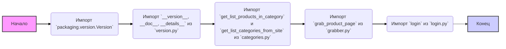
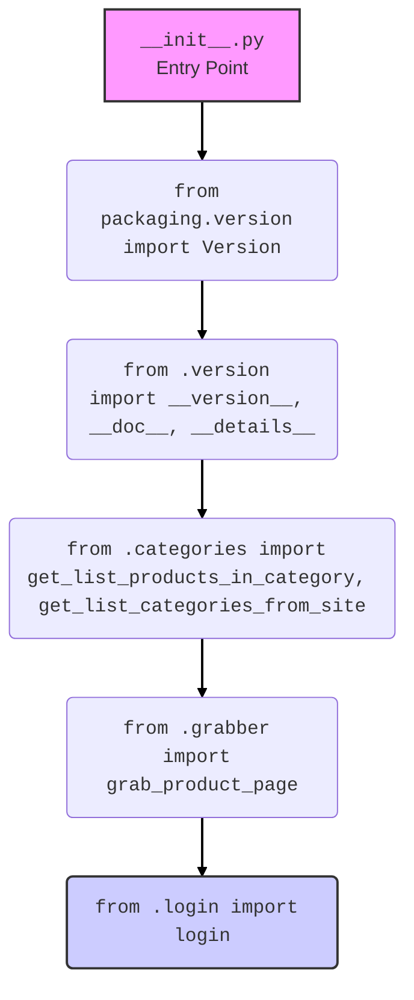

## Анализ кода `src/suppliers/hb/scenarios/__init__.py`

### 1. `<алгоритм>`

**Блок-схема:**

**Примеры:**

*   **Импорт `packaging.version.Version`**: Используется для работы с версиями, например, для сравнения версий библиотек или модулей.
*   **Импорт `__version__, __doc__, __details__`**: Эти переменные содержат информацию о версии модуля, его документации и дополнительных деталях соответственно.
*   **Импорт `get_list_products_in_category` и `get_list_categories_from_site`**: Функции для получения списка товаров в категории и списка категорий с сайта поставщика.
*   **Импорт `grab_product_page`**: Функция для получения HTML-содержимого страницы товара.
*   **Импорт `login`**: Функция для авторизации на сайте поставщика.

**Поток данных:**

1.  Модуль начинается с импорта необходимых модулей и переменных.
2.  Импортируются данные о версии из файла `version.py`.
3.  Импортируются функции для работы с категориями, товарами и авторизацией.

### 2. `<mermaid>`

**Объяснение зависимостей:**

*   **`__init__.py`**: Это основной файл, который делает директорию `scenarios` пакетом. Он импортирует функционал из других модулей внутри этого пакета.
*   **`packaging.version.Version`**: Импортируется класс `Version` из библиотеки `packaging`, предназначенной для работы с версиями программного обеспечения.
*   **`from .version import __version__, __doc__, __details__`**: Импортируются переменные `__version__`, `__doc__` и `__details__` из файла `version.py`, который находится в той же директории. Эти переменные, как правило, содержат метаданные о текущей версии модуля, его документацию и дополнительные сведения.
*   **`from .categories import get_list_products_in_category, get_list_categories_from_site`**: Импортируются функции `get_list_products_in_category` и `get_list_categories_from_site` из файла `categories.py`. Эти функции предназначены для извлечения информации о категориях и товарах с сайта поставщика.
*   **`from .grabber import grab_product_page`**: Импортируется функция `grab_product_page` из файла `grabber.py`. Эта функция используется для загрузки содержимого HTML-страницы товара.
*   **`from .login import login`**: Импортируется функция `login` из файла `login.py`. Эта функция обеспечивает авторизацию пользователя на сайте поставщика.

### 3. `<объяснение>`

**Импорты:**

*   **`from packaging.version import Version`**: Импортирует класс `Version` из библиотеки `packaging`. Это нужно для работы с версиями, например, для сравнения.
*   **`from .version import __version__, __doc__, __details__`**: Импортирует переменные `__version__`, `__doc__`, `__details__` из файла `version.py` в текущей директории. Они используются для хранения метаданных о версии, документации и деталях модуля.
*   **`from .categories import get_list_products_in_category, get_list_categories_from_site`**: Импортирует функции для работы с категориями из модуля `categories.py`. Эти функции, вероятно, используются для сбора данных о категориях и продуктах с сайта поставщика.
*   **`from .grabber import grab_product_page`**: Импортирует функцию `grab_product_page` из модуля `grabber.py`. Эта функция, вероятно, используется для загрузки HTML-контента страницы товара.
*   **`from .login import login`**: Импортирует функцию `login` из модуля `login.py`. Эта функция, вероятно, реализует логику авторизации пользователя на сайте поставщика.

**Классы:**

В данном файле нет классов.

**Функции:**

*   **`get_list_products_in_category()`**: Функция из модуля `categories.py` для получения списка товаров в определенной категории. Она, скорее всего, принимает в качестве аргумента идентификатор категории и возвращает список товаров.
*   **`get_list_categories_from_site()`**: Функция из модуля `categories.py` для получения списка категорий с сайта поставщика. Она, скорее всего, не принимает аргументов и возвращает список категорий.
*   **`grab_product_page()`**: Функция из модуля `grabber.py` для получения HTML-кода страницы товара. Она, скорее всего, принимает в качестве аргумента URL-адрес товара и возвращает HTML-контент.
*   **`login()`**: Функция из модуля `login.py` для авторизации на сайте поставщика. Она, скорее всего, принимает логин и пароль в качестве аргументов и возвращает результат авторизации (например, токен или сессионный идентификатор).

**Переменные:**

*   `__version__`: Строка, представляющая версию модуля.
*   `__doc__`: Строка, содержащая документацию модуля.
*   `__details__`: Строка, содержащая дополнительные детали о модуле.

**Потенциальные ошибки и области для улучшения:**

*   Отсутствуют явные проверки на успешность выполнения импортированных функций (например, обработка ошибок при загрузке страницы или авторизации).
*   Отсутствует явное документирование функций и их аргументов.
*   Необходимо добавить логирование для отслеживания работы функций и диагностики ошибок.
*   Следует добавить явные типы данных и аннотации типов для повышения читаемости кода и облегчения отладки.

**Взаимосвязи с другими частями проекта:**

*   Этот модуль является частью пакета `src.suppliers.hb`, который, вероятно, отвечает за работу с поставщиком `hb.co.il`.
*   Функции, импортированные из `categories.py`, `grabber.py` и `login.py`, зависят от конкретных деталей реализации взаимодействия с сайтом поставщика.
*   Логика, реализованная в этом пакете, вероятно, используется в более высоком уровне проекта для сбора, обработки и хранения данных о товарах поставщика.

**Дополнительно**

В данном коде нет импорта `header`, поэтому блок `mermaid` для `header.py` не требуется.