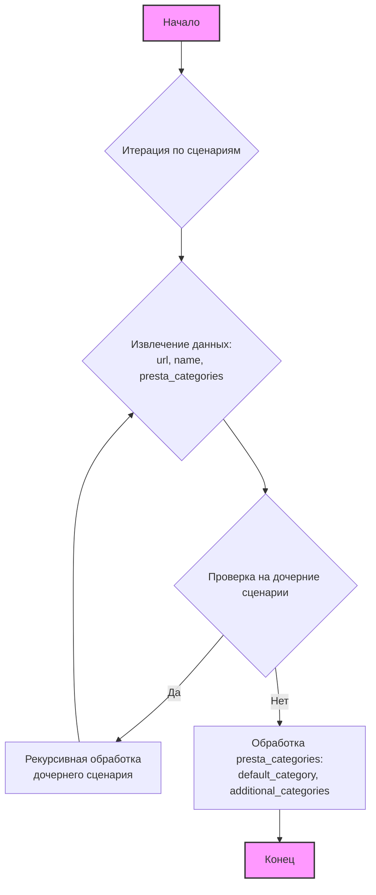

## АНАЛИЗ КОДА

### 1. <алгоритм>

**Описание:**

Данный JSON файл представляет собой структуру данных, описывающую сценарии для категорий товаров на сайте `hbdeadsea.co.il`. Каждый сценарий представляет собой набор правил, связывающих URL-адрес категории, ее название, идентификаторы категорий в PrestaShop и, в некоторых случаях, дочерние сценарии.

**Пошаговая блок-схема:**

1.  **Начало:** Загрузка JSON файла.
    *   Пример: `{"scenarios": { ... }}`
2.  **Итерация по сценариям:** Проход по всем ключам (названиям категорий) в словаре `scenarios`.
    *   Пример: `"מינרל+לחויותלפניםמינרליםותמציותצמחים"`, `"סרומיםלפנים"`, `"מסכותפנים"` и т.д.
3.  **Извлечение данных о сценарии:** Для каждого ключа (названия категории) извлекаются данные: `url`, `name` и `presta_categories`.
    *   Пример:
        ```json
        {
            "url": "https://hbdeadsea.co.il/product-category/facial/moisture-face/",
            "name": "מינרל+לחויותלפניםמינרליםותמציותצמחים",
            "presta_categories": {
                "default_category": 11245,
                "additional_categories": [11288]
            }
         }
        ```
4.  **Обработка дочерних сценариев:** Если сценарий содержит вложенные сценарии (например, "טיפוחהפנים"  внутри "מינרל+לחויותלפניםמינרליםותמציותצמחים"), рекурсивно возвращаемся к шагу 3, для обработки каждого вложенного сценария.
    *  Пример: "טיפוחהפנים" внутри "מינרל+לחויותלפניםמינרליםותמציותצמחים".
5.  **Обработка `presta_categories`**: Для каждой категории извлекаются `default_category` и `additional_categories`.
    *   Пример:
        ```json
         {
             "default_category": 11245,
              "additional_categories": [11288]
         }
         ```
6.  **Конец:** Обработаны все сценарии и их дочерние сценарии.

### 2. <mermaid>



**Объяснение `mermaid` диаграммы:**

*   `A[Начало]`: Обозначает начало процесса обработки JSON файла.
*   `B{Итерация по сценариям}`: Представляет цикл, который проходит по каждому сценарию в корневом словаре `scenarios`.
*   `C{Извлечение данных: url, name, presta_categories}`: Обозначает шаг, на котором извлекаются URL, имя и категории PrestaShop для текущего сценария.
*   `D{Проверка на дочерние сценарии}`: Условный блок, проверяющий, есть ли у текущего сценария дочерние сценарии.
*   `E[Рекурсивная обработка дочернего сценария]`:  Означает рекурсивный переход к шагу `C` для обработки вложенных сценариев.
*   `F[Обработка presta_categories: default_category, additional_categories]`: Означает обработку и извлечение `default_category` и `additional_categories` из `presta_categories`.
*   `G[Конец]`: Обозначает завершение обработки всех сценариев.

### 3. <объяснение>

**Общее описание:**

JSON файл представляет собой конфигурационные данные для импорта категорий в CMS PrestaShop. Он определяет соответствие между URL-адресами категорий на сайте `hbdeadsea.co.il` и идентификаторами категорий в PrestaShop. Структура файла состоит из словаря `scenarios`, где ключи — это названия категорий, а значения — словари с информацией о каждой категории (URL, название, идентификаторы PrestaShop) и, в некоторых случаях, вложенные сценарии.

**Импорты:**

В данном файле нет импортов. Это файл данных (JSON), а не программный код, который бы использовал `import`.

**Классы:**

В данном файле нет классов. Это файл данных, описывающий структуру конфигурации.

**Функции:**

В данном файле нет функций. Это файл данных, описывающий структуру конфигурации.

**Переменные:**

*   `scenarios`: Словарь, содержащий все сценарии категорий.
    *   Тип: `dict`
    *   Использование: Ключи словаря являются названиями категорий, значения — информацией о каждой категории, включая вложенные категории.
*  Ключи словаря `scenarios`:
     * Тип: `str`
     * Использование: Представляют собой названия категорий (например, `"מינרל+לחויותלפניםמינרליםותמציותצמחים"`, `"סרומיםלפנים"`).
*   `url`: URL-адрес категории на сайте `hbdeadsea.co.il`.
    *   Тип: `str`
    *   Использование: Используется для определения веб-адреса категории.
*   `name`: Название категории.
    *   Тип: `str`
    *   Использование: Используется для обозначения названия категории.
*   `presta_categories`: Словарь, содержащий идентификаторы категорий PrestaShop.
    *   Тип: `dict`
    *   Использование: Содержит ключи `default_category` и `additional_categories`.
*   `default_category`: Идентификатор категории PrestaShop по умолчанию.
    *   Тип: `int`
    *   Использование: Используется для привязки категории к PrestaShop.
*   `additional_categories`: Список дополнительных идентификаторов категорий PrestaShop.
    *   Тип: `list`
    *   Использование: Используется для привязки категории к дополнительным PrestaShop категориям.

**Цепочка взаимосвязей:**

Этот файл используется в процессе импорта категорий товаров с сайта `hbdeadsea.co.il` в базу данных PrestaShop. Он предоставляет данные для сопоставления категорий сайта с категориями в PrestaShop. Он, вероятно, взаимодействует с другим кодом (например, скриптами импорта), который читает этот файл и использует его для создания или обновления категорий в PrestaShop.

**Потенциальные ошибки и области для улучшения:**

1.  **Дублирование `presta_categories`:**  В каждом сценарии `presta_categories` дублируется, что может быть избыточно. Можно перенести эти данные на более высокий уровень, если это возможно, для экономии места и упрощения изменений.

2.  **Вложенные сценарии:** Не все сценарии имеют вложенные сценарии, и структура может быть упрощена для повышения читаемости.

3.  **Использование "magic numbers":** Желательно вынести числовые значения ID категорий PrestaShop в конфигурацию или базу данных, чтобы упростить их изменение.

**Дополнительные замечания:**

Файл `categories_20240503015900.json` является файлом конфигурации, содержащим данные о категориях товаров для сайта `hbdeadsea.co.il` и их соответствие категориям в системе PrestaShop. Данные включают в себя URL-адрес, название категории, идентификаторы PrestaShop и, в некоторых случаях, вложенные подкатегории. Структура данных позволяет автоматизировать процесс импорта и обновления категорий между сайтом и PrestaShop.