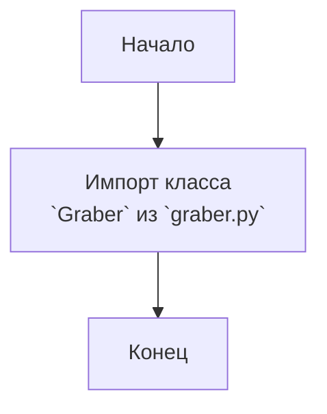

## Анализ кода `hypotez/src/suppliers/ivory/__init__.py`

### 1. <алгоритм>

1.  **Начало:** Исполнение файла `__init__.py` начинается.
2.  **Импорт:** Импортируется класс `Graber` из модуля `graber.py`, расположенного в той же директории (`src/suppliers/ivory/`).
3.  **Конец:** Файл заканчивает свое выполнение.

Пример:

```
Начало --> Импорт Graber --> Конец
```

### 2. <mermaid>



**Объяснение зависимостей `mermaid`:**

*   `Start`: Начало выполнения файла.
*   `ImportGraber`: Импорт класса `Graber`. Означает, что модуль `ivory` зависит от модуля `graber.py`.
*   `End`: Конец выполнения файла.

### 3. <объяснение>

**Импорты:**

*   `from .graber import Graber`: Этот импорт указывает, что из модуля `graber.py`, находящегося в текущей директории (`src/suppliers/ivory`), импортируется класс `Graber`. Точка (`.`) в начале пути импорта означает, что `graber.py` находится в той же директории, что и файл `__init__.py`. `Graber` предположительно отвечает за сбор данных с некоторого источника, это становится понятно из названия.

**Классы:**

*   В данном файле `__init__.py` классы не определяются. Однако, он импортирует класс `Graber`. Этот класс, скорее всего, определен в файле `graber.py` и отвечает за логику сбора данных (например, парсинг веб-страниц или работа с API).  `__init__.py` делает этот класс доступным для использования в других модулях пакета `ivory`.

**Функции:**

*   В файле `__init__.py` нет явно определенных функций. Однако, после импорта, класс `Graber` может содержать методы, которые выполняют определенные функции, например, `grab_data()`.

**Переменные:**

*   В файле нет явно определенных переменных. `__init__.py` в основном используется для импорта и инициализации пакета.

**Дополнительные сведения и взаимосвязи с другими частями проекта:**

1.  **Цепочка зависимостей:**
    *   Файл `__init__.py` служит для определения содержимого пакета `src.suppliers.ivory`. Он делает класс `Graber` доступным для использования в других частях проекта, которые импортируют этот пакет. Это указывает на то, что проект имеет модульную структуру, где каждый модуль (например, `ivory`) отвечает за свою часть функциональности.
    *   Основываясь на структуре директорий, можно предположить, что есть другие пакеты в `src.suppliers`, такие как, например, `src.suppliers.supplier1` или `src.suppliers.supplier2`, каждый из которых, может иметь похожую структуру с собственным `__init__.py` и другими модулями для обработки данных от различных поставщиков.
2.  **Предполагаемое использование:**
    *   Пакет `src.suppliers.ivory`, вероятно, отвечает за получение данных от поставщика с именем "Ivory". Класс `Graber` отвечает за реализацию логики сбора данных. В других частях проекта, после импорта пакета `ivory`, можно будет использовать класс `Graber` для получения и обработки данных от "Ivory".

**Потенциальные ошибки и области для улучшения:**

*   **Отсутствие документации:** Файл содержит только строковое описание (`"""..."""`), но не имеет подробной документации. Это затрудняет понимание цели и использования модуля. Было бы полезно добавить docstring для самого пакета, а также docstring для класса `Graber` в `graber.py`
*   **Зависимость от внешних факторов:** Если класс `Graber` зависит от внешних ресурсов, таких как веб-сайты или API, следует рассмотреть обработку ошибок и устойчивость к изменениям этих ресурсов.
*   **Отсутствие тестов:** Было бы полезно добавить тесты для модуля и класса `Graber`.

**Резюме:**

Файл `__init__.py` для пакета `src.suppliers.ivory` в основном служит для инициализации пакета и импорта класса `Graber`, что позволяет использовать этот класс в других модулях проекта. Файл подчеркивает модульность проекта, где каждый пакет отвечает за свою часть функциональности.