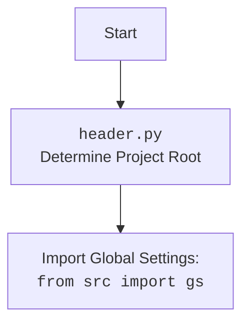

## ИНСТРУКЦИЯ:

Анализируй предоставленный код подробно и объясни его функциональность. Ответ должен включать три раздела:  

1. **<алгоритм>**: Опиши рабочий процесс в виде пошаговой блок-схемы, включая примеры для каждого логического блока, и проиллюстрируй поток данных между функциями, классами или методами.  
2. **<mermaid>**: Напиши код для диаграммы в формате `mermaid`, проанализируй и объясни все зависимости, 
    которые импортируются при создании диаграммы. 
    **ВАЖНО!** Убедитесь, что все имена переменных, используемые в диаграмме `mermaid`, 
    имеют осмысленные и описательные имена. Имена переменных вроде `A`, `B`, `C`, и т.д., не допускаются!  
    
    **Дополнительно**: Если в коде есть импорт `import header`, добавьте блок `mermaid` flowchart, объясняющий `header.py`:\
    ```mermaid
    flowchart TD
        Start --> Header[<code>header.py</code><br> Determine Project Root]
    
        Header --> import[Import Global Settings: <br><code>from src import gs</code>] 
    ```

3. **<объяснение>**: Предоставьте подробные объяснения:  
   - **Импорты**: Их назначение и взаимосвязь с другими пакетами `src.`.  
   - **Классы**: Их роль, атрибуты, методы и взаимодействие с другими компонентами проекта.  
   - **Функции**: Их аргументы, возвращаемые значения, назначение и примеры.  
   - **Переменные**: Их типы и использование.  
   - Выделите потенциальные ошибки или области для улучшения.  

Дополнительно, постройте цепочку взаимосвязей с другими частями проекта (если применимо).  

Это обеспечивает всесторонний и структурированный анализ кода.
## Формат ответа: `.md` (markdown)
**КОНЕЦ ИНСТРУКЦИИ**

## <алгоритм>

```mermaid
graph TD
    A[Начало] --> B{Импорт модулей};
    B --> C[Импорт `header`];
    C --> D[Импорт `Graber` и `Context` из `src.suppliers.graber`];
    D --> E[Импорт `Driver` из `src.webdriver.driver`];
    E --> F[Импорт `logger` из `src.logger.logger`];
    F --> G{Определение класса `Graber`};
    G --> H[Инициализация `Graber` (__init__): Установка `supplier_prefix` и вызов `super().__init__`];
    H --> I[Установка `Context.locator_for_decorator = None`];
    I --> J[Конец];
   
    style A fill:#f9f,stroke:#333,stroke-width:2px
    style J fill:#ccf,stroke:#333,stroke-width:2px
    
```

**Примеры для логических блоков:**

*   **B (Импорт модулей):**
    *   `import header`: импортирует модуль для определения корневой директории проекта.
    *   `from src.suppliers.graber import Graber as Grbr, Context, close_pop_up`: импортирует родительский класс `Graber`, `Context` и декоратор `close_pop_up`.
    *   `from src.webdriver.driver import Driver`: импортирует класс для управления веб-драйвером.
    *   `from src.logger.logger import logger`: импортирует объект для логирования.
*  **G (Определение класса `Graber`):**
    *   Определение класса `Graber`, который наследуется от `Grbr` (родительский класс Graber).
*   **H (Инициализация `Graber`):**
    *   `self.supplier_prefix = 'ivory'` устанавливает префикс поставщика.
    *   `super().__init__(supplier_prefix=self.supplier_prefix, driver=driver)`: вызывает конструктор родительского класса, передавая ему префикс поставщика и экземпляр веб-драйвера.
*   **I (Установка `Context.locator_for_decorator = None`):**
    *   Установка `Context.locator_for_decorator = None`: отключает выполнение декоратора по умолчанию, если не установлено иное значение.

## <mermaid>

```mermaid
flowchart TD
    Start --> ImportHeader[Import <br><code>header</code>]
    ImportHeader --> ImportGraber[Import <br><code>Graber, Context, close_pop_up</code> <br>from <code>src.suppliers.graber</code>]
    ImportGraber --> ImportDriver[Import <br><code>Driver</code> <br> from <code>src.webdriver.driver</code>]
    ImportDriver --> ImportLogger[Import <br><code>logger</code><br> from <code>src.logger.logger</code>]
    ImportLogger --> DefineGraberClass[Define class <code>Graber</code> <br> Inherits from <code>Grbr</code>]
    DefineGraberClass --> GraberInit[<code>__init__(self, driver)</code><br>Set <code>supplier_prefix</code> <br> Call <code>super().__init__()</code>]
    GraberInit --> SetContextLocator[Set <code>Context.locator_for_decorator = None</code>]
    SetContextLocator --> End
    
     style Start fill:#f9f,stroke:#333,stroke-width:2px
    style End fill:#ccf,stroke:#333,stroke-width:2px

```



**Анализ зависимостей:**

*   **`header`**: Этот модуль, вероятно, отвечает за определение корневой директории проекта, что может быть важно для определения путей к файлам и другим ресурсам внутри проекта. Импортируется для определения начальных установок проекта.
*   **`src.suppliers.graber`**: Из этого модуля импортируются:
    *   `Graber as Grbr`: Родительский класс для текущего класса `Graber`. Предоставляет общую логику для сбора данных.
    *   `Context`: Класс, содержащий контекст выполнения, например, экземпляр веб-драйвера и настройки.
    *   `close_pop_up`: Декоратор, предназначенный для закрытия всплывающих окон.
*   **`src.webdriver.driver`**: Из этого модуля импортируется класс `Driver`, который отвечает за взаимодействие с веб-драйвером (например, Selenium).
*   **`src.logger.logger`**: Из этого модуля импортируется объект `logger`, который используется для логирования событий и ошибок внутри программы.

## <объяснение>

**Импорты:**

*   `header`: Используется для определения корневой директории проекта, чтобы правильно настроить пути к ресурсам и конфигурациям.
*   `from src.suppliers.graber import Graber as Grbr, Context, close_pop_up`:
    *   `Graber as Grbr`: Импортирует родительский класс `Graber` как `Grbr`. Это позволяет использовать общую функциональность сбора данных, предоставляемую родительским классом, избегая дублирования кода.
    *   `Context`: Импортирует класс, который вероятно хранит глобальный контекст выполнения, включая настройки и экземпляр веб-драйвера.
    *  `close_pop_up`: Импортируется декоратор для обработки всплывающих окон перед выполнением основных функций.
*   `from src.webdriver.driver import Driver`: Импортирует класс `Driver`, который предоставляет интерфейс для управления веб-драйвером, например, для навигации по страницам и взаимодействия с элементами.
*   `from src.logger.logger import logger`: Импортирует объект `logger` для логирования событий, что позволяет отслеживать работу программы и выявлять ошибки.

**Классы:**

*   **`class Graber(Grbr)`**:
    *   Роль: Класс `Graber` отвечает за сбор данных со страниц товаров `ivory.co.il`. Он наследуется от `Grbr`, что позволяет использовать общую логику сбора данных.
    *   Атрибуты:
        *   `supplier_prefix`: Устанавливается как `'ivory'`, что позволяет идентифицировать поставщика для дальнейшей обработки данных.
    *   Методы:
        *   `__init__(self, driver: Driver)`: Конструктор класса, который устанавливает префикс поставщика и вызывает конструктор родительского класса (`super().__init__`), передавая ему префикс и экземпляр веб-драйвера. Также устанавливает `Context.locator_for_decorator = None` для отключения декоратора по умолчанию.
    *   Взаимодействие: Взаимодействует с родительским классом `Grbr` через наследование и с классом `Driver` для управления веб-драйвером.
    *   Цепочка взаимосвязей: `Graber` -> `Grbr` -> `Driver`.

**Функции:**

*   `__init__(self, driver: Driver)`:
    *   Аргументы: `self` (экземпляр класса) и `driver` (экземпляр класса `Driver`).
    *   Возвращаемое значение: Нет.
    *   Назначение: Инициализирует объект класса `Graber`, устанавливая префикс поставщика и вызывая конструктор родительского класса. Также устанавливает `Context.locator_for_decorator = None`, отключая декоратор.

**Переменные:**

*   `supplier_prefix`: Строка, определяющая префикс поставщика (`'ivory'`).
*   `Context.locator_for_decorator`: Переменная, которая контролирует применение декоратора. Если она установлена в значение `None` (как в этом коде), то декоратор не будет применен.

**Потенциальные ошибки и области для улучшения:**

*   **Закомментированный код декоратора:** Код декоратора `close_pop_up` закомментирован, что может указывать на временное отключение этой функциональности. Возможно, его следует доработать или удалить, если он не нужен.
*   **Отсутствие обработки ошибок:** В закомментированном коде декоратора есть блок `try-except` для обработки `ExecuteLocatorException`, но реального кода для обработки исключения нет (`...`). Это может привести к молчаливому пропуску ошибок.
*   **Управление декоратором:** Использование `Context.locator_for_decorator = None` для управления декоратором может быть неудобным. Лучше использовать более явный механизм, например, передачу флага в конструкторе или через метод.
*   **Жестко закодированный префикс:** Значение `supplier_prefix` жестко закодировано как `'ivory'`. Может быть полезно сделать его более гибким (например, передавать через аргумент конструктора).

**Дополнительно:**

*   Класс `Graber` спроектирован для расширения через наследование от `Grbr`. Это позволяет использовать общие методы сбора данных и при необходимости переопределять их.
*   Взаимодействие с `Driver` позволяет управлять веб-браузером для извлечения данных.
*   `Context` используется как централизованный механизм для доступа к глобальным параметрам и настройкам.

Этот анализ обеспечивает полное понимание структуры и функциональности предоставленного кода.