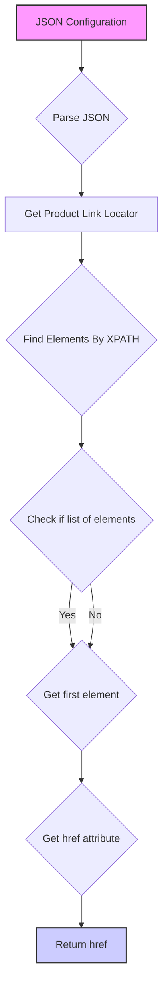

## АНАЛИЗ КОДА

### <алгоритм>
1. **Чтение JSON:** Код представляет собой JSON-объект, который описывает структуру для извлечения ссылок на товары с веб-страницы.
2. **Описание Локатора:** Объект `product_links` содержит параметры для локатора, используемого для поиска элементов на веб-странице.
   - `"attribute": "href"` указывает, что нужно извлечь значение атрибута `href` найденного элемента.
   - `"by": "XPATH"` указывает, что для поиска будет использоваться XPath.
   - `"selector": "//span[@data-component-type ='s-product-image']//a"` - это XPath выражение для поиска нужного элемента, то есть ссылки `<a>` внутри элемента `<span>` с атрибутом `data-component-type` равным `s-product-image`.
   - `"if_list":"first"` указывает, что если найдено несколько элементов, будет использован только первый из них.
   - `"use_mouse": false` указывает, что не требуется использовать мышь для взаимодействия с элементом.
   - `"mandatory": true` указывает, что наличие элемента обязательно для успешного выполнения.
   - `"timeout":0` - таймаут для ожидания появления элемента на странице (в секундах) равен 0.
   - `"timeout_for_event":"presence_of_element_located"` - указывает, что элемент должен присутствовать на странице.
   - `"event": null` указывает, что нет дополнительных событий, которые нужно отслеживать.
3. **Пример:**
    - Если на странице есть HTML код:
    ```html
    <div class="some-class">
      <span data-component-type='s-product-image'>
        <a href="https://example.com/product1">Product 1</a>
      </span>
      <span data-component-type='s-product-image'>
        <a href="https://example.com/product2">Product 2</a>
      </span>
    </div>
    ```
    - Тогда локатор `"//span[@data-component-type ='s-product-image']//a"` выберет два элемента `<a>`
    - Параметр `"if_list":"first"` указывает, что будет извлечен только атрибут `href` первого элемента `https://example.com/product1`.
4. **Использование:** Этот JSON используется как конфигурационный файл для инструмента, который автоматически собирает данные с веб-сайтов. Например, Selenium или Scrapy могут использовать этот JSON, чтобы найти элементы на странице и извлечь их атрибуты.

### <mermaid>



### <объяснение>

**Импорты:**
   - В предоставленном коде нет явных импортов, поскольку это JSON, а не Python код. JSON это формат для хранения данных. Но  если этот JSON используется в Python коде то скорее всего будет использоваться библиотека `json`.

**Классы:**
   - В данном JSON файле нет классов.

**Функции:**
   - В данном JSON файле нет функций.

**Переменные:**
   - `"product_links"`:  Это ключевой объект, содержащий параметры локатора для поиска ссылок на товары.
        - `"attribute"`:  Строка, указывающая какой атрибут нужно извлечь.
        - `"by"`:  Строка, указывающая какой метод поиска нужно использовать.
        - `"selector"`: Строка, представляющая XPath запрос для поиска нужных элементов.
        - `"if_list"`: Строка, определяющая, что делать если найдено несколько элементов.
        - `"use_mouse"`: Булево значение, определяющее нужно ли использовать мышь.
        - `"mandatory"`:  Булево значение, определяющее, обязательно ли наличие элемента.
        - `"timeout"`: Целое число, таймаут для ожидания появления элемента на странице.
        - `"timeout_for_event"`: Строка, определяющая событие для таймута.
        - `"event"`: значение события (в данном случае не используется).

**Объяснение**

Этот JSON файл представляет собой конфигурацию для парсинга веб-страниц. Он указывает, как именно нужно найти ссылки на продукты на определенной веб-странице с помощью XPath запроса. Структура  JSON-файла позволяет легко настраивать и переиспользовать этот код для различных веб-сайтов, где структура элементов может различаться, но принцип поиска остается тем же.

**Потенциальные ошибки и области для улучшения:**
1. **Жестко заданный XPATH**:  XPATH выражение `//span[@data-component-type ='s-product-image']//a`  жестко задано и может сломаться, если структура сайта изменится. Для улучшения можно добавить несколько вариантов XPATH-ов.
2. **Отсутствие обработки ошибок**: В коде не предусмотрена обработка ошибок, если элемент не найден, что может привести к сбою программы. Нужно предусмотреть обработку такого случая, например, через проверку наличия элемента перед его парсингом.

**Взаимосвязь с другими частями проекта:**

Этот JSON файл, скорее всего, используется модулем парсинга, который читает этот файл, интерпретирует параметры и использует их для навигации по веб-странице.

**Пример цепочки:**

1.  `main.py` вызывает `crawler.py` передавая ему путь к `category.json`.
2. `crawler.py` читает `category.json` с помощью `json.load()`.
3.  `crawler.py`  использует библиотеку `Selenium` для поиска элемента по `XPATH` используя параметры из JSON файла.
4.  `crawler.py` извлекает атрибут `href` из найденного элемента.
5.  `crawler.py` возвращает результат в `main.py`.