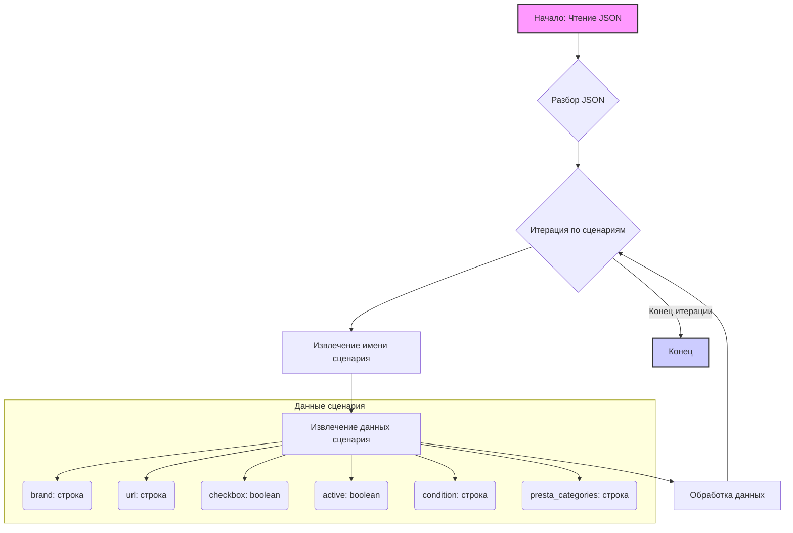

## Анализ кода `morlevi_categories_keyboards_hp.json`

### <алгоритм>

Этот JSON-файл представляет собой конфигурацию сценариев для категорий товаров, связанных с клавиатурами и мышами бренда HP.  Каждый сценарий представляет собой набор настроек для определенного типа продукта.

**Пошаговая блок-схема:**

1.  **Начало:** Чтение JSON-файла.
2.  **Разбор JSON:** JSON-данные парсятся в структуру данных (например, словарь).
3.  **Итерация по сценариям:**
    *   Для каждого ключа в объекте `scenarios`:
        *   Извлекаем имя сценария (например, "HP WIRELESS KEYBOARD").
        *   Извлекаем данные для сценария:
            *   `brand` (строка) - бренд продукта. Пример: "HP".
            *   `url` (строка) - URL или идентификатор для сценария.
            *   `checkbox` (логическое значение) - флаг, обычно используемый в интерфейсе для выбора. Пример: `false`.
            *   `active` (логическое значение) - флаг, определяющий, активен ли сценарий. Пример: `true`.
             * `condition` (строка) -  состояние товара. Пример:"new".
            *   `presta_categories` (строка) - строка, представляющая ID категорий, разделенных запятыми. Пример: "203,204,316".
        *   Используем эти данные для настройки процесса обработки товара.
4.  **Конец:** Обработка всех сценариев завершена.

**Примеры:**

*   Для сценария `"HP WIRELESS KEYBOARD"`:
    *   `brand`: `"HP"`
    *   `url`: `"-----------------------------------------------HP WIRELESS KEYBOARD----------------------------------------------"`
    *   `checkbox`: `false`
    *   `active`: `true`
    *   `condition`: `"new"`
    *    `presta_categories`: `"203,204,316"`
*   Для сценария `"HP USB MOUSE"`:
    *   `brand`: `"HP"`
    *   `url`: `"------------------------------------------------------HP USB MOUSE------------------------------------------------"`
    *   `checkbox`: `false`
    *   `active`: `true`
    *   `condition`: `"new"`
    *    `presta_categories`: `"203,206,317"`

### <mermaid>

**Объяснение:**

1.  **Начало: Чтение JSON** - это начало процесса. Файл JSON читается, обычно с использованием стандартных методов чтения файлов.
2.  **Разбор JSON** - JSON-данные преобразуются в структуру данных Python (словарь) с использованием метода `json.load` или `json.loads`.
3.  **Итерация по сценариям** - начинается цикл, который проходит по каждому ключу (имени сценария) в структуре данных `scenarios`.
4.  **Извлечение имени сценария** - извлекается текущее имя сценария (ключ).
5.  **Извлечение данных сценария** - извлекаются значения, связанные с этим сценарием (бренд, url, checkbox, active и т.д.)
6.   **Обработка данных** - полученные данные используются для настройки процесса обработки, например, при парсинге веб-страниц или добавлении товаров в базу данных.
7.  **Конец итерации** - цикл заканчивается после обработки всех сценариев.
8.  **Конец** - процесс завершается.

В диаграмме `mermaid` используются осмысленные имена переменных:

*   `A`: **Начало: Чтение JSON** - начало процесса.
*   `B`: **Разбор JSON** - парсинг JSON-данных.
*   `C`: **Итерация по сценариям** - цикл по всем сценариям.
*   `D`: **Извлечение имени сценария** - получение имени текущего сценария.
*   `E`: **Извлечение данных сценария** - получение всех данных текущего сценария.
*  `F`: **Обработка данных** - использование данных для настройки процесса.
*   `G`: **Конец** - конец обработки.

В подграфе `Данные сценария`  показаны переменные с их типами:

*   `brand` - строка с брендом.
*   `url` - строка с URL или идентификатором.
*   `checkbox` - логическое значение.
*   `active` - логическое значение.
*  `condition` - строка со  состоянием товара.
*   `presta_categories` - строка с категориями.

### <объяснение>

**Импорты:**

В данном JSON-файле нет импортов. Это файл конфигурации, а не исполняемый код Python.

**Классы:**

В данном файле нет классов, так как это JSON-файл, который является структурой данных, а не кодом.

**Функции:**

В данном файле нет функций, так как это JSON-файл, а не исполняемый код Python.

**Переменные:**

*   `scenarios` (словарь): Основной объект, содержащий все сценарии.
*   Каждый ключ в `scenarios` (например, `"HP WIRELESS KEYBOARD"`) является именем сценария.
*   Значениями для каждого имени сценария являются словари со следующими ключами:
    *   `brand` (строка): Название бренда (например, "HP").
    *   `url` (строка): URL или текстовый идентификатор для сценария.
    *   `checkbox` (логическое значение): Флаг для интерфейсных элементов (например, checkbox).
    *   `active` (логическое значение): Флаг, указывающий, активен ли сценарий.
    *  `condition`(строка): состояние товара.
    *   `presta_categories` (строка): Строка с идентификаторами категорий, разделенными запятыми.

**Объяснение:**

Этот JSON-файл представляет собой конфигурацию для системы, которая обрабатывает товары бренда HP. Каждый сценарий описывает настройки для определённого типа продукта, такого как беспроводная клавиатура, USB-мышь и т.д.  Данные из этого файла используются для автоматической настройки процессов, например, при парсинге данных о товарах с веб-сайтов поставщиков и при загрузке товаров на платформу PrestaShop.

*   `brand`: Позволяет идентифицировать товары конкретного бренда.
*   `url`: Может использоваться как уникальный идентификатор или URL-адрес страницы с описанием товара.
*   `checkbox`: Используется, чтобы определить, выбран ли сценарий в пользовательском интерфейсе.
*   `active`: Определяет, следует ли обрабатывать этот сценарий. Если `active` равно `false`, то сценарий пропускается.
*   `condition`: Обозначает состояние товара - в данном случае "новый".
*   `presta_categories`: Указывает, к каким категориям PrestaShop должен быть отнесён товар.

**Пример использования:**

Система может читать этот JSON-файл,  итерироваться по каждому сценарию и:

1.  Извлекать данные о товарах HP.
2.  Определять, какие категории PrestaShop нужно использовать для импорта товара.
3.  Выполнять обработку только активных сценариев, основываясь на значении `active`.
4.   Фильтровать товары по состоянию "новый".

**Потенциальные ошибки и улучшения:**

*   **Отсутствие валидации**: Нет проверки типов данных в JSON-файле. Можно добавить валидацию в коде, который использует этот файл, чтобы предотвратить ошибки из-за неверных типов данных.
*   **Жёсткая привязка к PrestaShop:** `presta_categories` предполагает использование PrestaShop. Можно сделать конфигурацию более гибкой, добавив возможность использовать другие системы.
*   **URL**: URL может быть неактивным, невалидным, неинформативным. Желательно проверять URL на соответствие требованиям системы.

**Взаимосвязи с другими частями проекта:**

Этот JSON-файл, вероятно, используется в сочетании с кодом Python, который обрабатывает данные о товарах, парсит страницы и взаимодействует с PrestaShop.  Конфигурационные данные из этого файла могут быть переданы как параметры в функции, классы и методы. Например, может существовать функция `parse_product(url, brand, categories)`, которая принимает данные из файла JSON и обрабатывает их.

Цепочка взаимосвязей может выглядеть так:

1.  JSON-файл `morlevi_categories_keyboards_hp.json` содержит конфигурацию.
2.  Python скрипт читает данные из файла.
3.  На основании данных из файла, скрипт парсит страницы веб-сайтов, собирает информацию о товарах.
4.  Скрипт взаимодействует с API PrestaShop для добавления/обновления товаров, используя категории, указанные в файле.