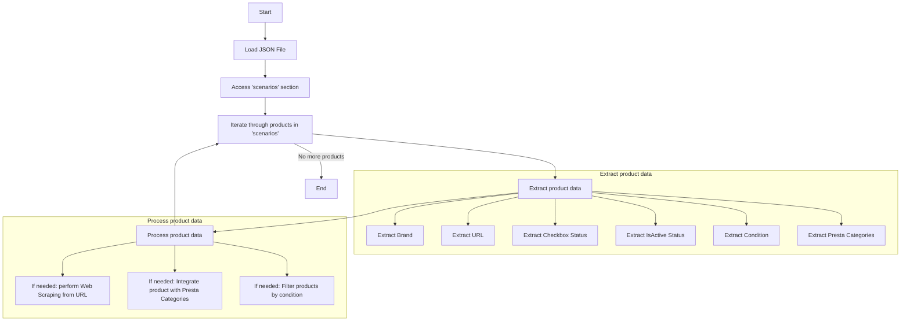

## Анализ кода `morlevi_categories_keyboards_microsoft.json`

### 1. <алгоритм>

Данный JSON-файл представляет собой конфигурацию для обработки категорий товаров бренда Microsoft, предположительно, для веб-скрейпинга или интеграции с интернет-магазином.

**Пошаговая блок-схема:**

1.  **Начало:** Загрузка JSON-файла.
    
    *   _Пример_: `{ "scenarios": { ... } }`
2.  **Доступ к секции "scenarios":** Файл содержит единственный корневой объект с ключом `"scenarios"`, значение которого - объект с ключами-названиями продуктов.
    
    *   _Пример_: `scenarios = file["scenarios"]`
3.  **Итерация по ключам внутри "scenarios":** Проход по каждому ключу, который соответствует названию продукта (например, "MICROSOFT WIRELESS KEYBOARD").
    
    *   _Пример_: `for product_name, product_data in scenarios.items():`
4.  **Извлечение данных продукта:** Для каждого продукта извлекаются его данные (бренд, URL, состояние чекбокса, активность и категории PrestaShop).
    
    *   _Пример_:
        *   `brand = product_data["brand"]`
        *   `url = product_data["url"]`
        *   `checkbox = product_data["checkbox"]`
        *   `active = product_data["active"]`
        *   `condition = product_data["condition"]`
        *   `presta_categories = product_data["presta_categories"]`
5.  **Обработка данных:** (Подразумевается, но не описано в JSON) Данные могут быть использованы для:
    *   Веб-скрейпинга: извлечения информации о продукте с указанного URL.
    *   Интеграции: связывания товара с категориями в PrestaShop.
    *   Фильтрации: отбора товаров по заданным критериям.
    
    *   _Пример_: `if product_data["active"] and product_data["condition"]=="new":  ...`
6.  **Конец:** Завершение обработки данных.

### 2. <mermaid>

**Объяснение диаграммы `mermaid`:**

*   **Start**: Начало процесса.
*   **LoadJSON**: Загрузка JSON-файла с конфигурацией.
*   **AccessScenarios**: Доступ к объекту `scenarios`, содержащему данные о продуктах.
*   **LoopProducts**: Итерация по каждому продукту (ключу) в `scenarios`.
*   **ExtractData**: Извлечение данных о продукте, таких как бренд, URL, чекбокс, активность, состояние и категории PrestaShop.
    *   **Brand**: Извлекается бренд продукта (например, "MICROSOFT").
    *   **Url**: Извлекается URL продукта, используемый для веб-скрейпинга или других целей.
    *   **CheckboxStatus**: Извлекается состояние чекбокса.
    *   **IsActive**: Извлекается статус активности продукта.
    *    **Condition**: Извлекается состояние продукта (например, "new").
     *    **PrestaCategories**: Извлекаются категории PrestaShop, связанные с продуктом.
*   **ProcessData**: Обработка извлеченных данных:
    *   **WebScraping**: (Если необходимо) извлечение данных со страницы продукта по URL.
    *   **IntegratePresta**: (Если необходимо) интеграция продукта с категориями PrestaShop.
     *  **FilterItems**: (Если необходимо) фильтрация товаров по критериям (состояние "new" и статус "active").
*   **End**: Завершение процесса.

### 3. <объяснение>

**Импорты:**

В данном JSON файле нет импортов. Он представляет собой структуру данных, а не исполняемый код. Предполагается, что данный файл будет использован в других частях проекта (`src`), где будет производиться его парсинг и обработка.

**Структура данных (JSON):**

Файл JSON описывает конфигурации товаров для бренда Microsoft. Он содержит объект `scenarios`, внутри которого находятся объекты, представляющие каждый продукт:

*   **Ключи:** Названия продуктов (например, "MICROSOFT WIRELESS KEYBOARD").
*   **Значения:** Объекты с данными о продукте:
    *   `brand`: Строка, представляющая бренд продукта (например, "MICROSOFT").
    *   `url`: Строка, URL страницы продукта (может быть как URL, так и описание продукта).
    *   `checkbox`: Логическое значение, представляющее состояние чекбокса (вероятно, для выбора товара).
    *   `active`: Логическое значение, определяющее, активен ли товар для обработки.
    *   `condition`: Строка, представляющая состояние товара (например, "new").
    *   `presta_categories`: Строка, содержащая идентификаторы категорий PrestaShop, разделенные запятыми.

**Примеры значений:**

*   `"MICROSOFT WIRELESS KEYBOARD"`:
    *   `brand`: `"MICROSOFT"`
    *   `url`: `"-----------------------------------------------MICROSOFT WIRELESS KEYBOARD----------------------------------------------"`
    *   `checkbox`: `false`
    *   `active`: `true`
     *  `condition`: `"new"`
    *   `presta_categories`: `"203,204,316"`
*   `"MICROSOFT USB KEYBOARD"`:
    *   `brand`: `"MICROSOFT"`
    *   `url`: `"https://www.morlevi.co.il/Cat/155?p_315=42&sort=datafloat2%2Cprice&keyword="`
    *   `checkbox`: `false`
    *   `active`: `true`
      *  `condition`: `"new"`
    *   `presta_categories`: `"203,204,315"`

**Цепочка взаимосвязей с другими частями проекта:**

Этот файл, вероятно, используется в модуле для веб-скрейпинга или интеграции с PrestaShop. Предполагаемая цепочка взаимосвязей:

1.  **Загрузка конфигурации:** Скрипт в `src.suppliers.ivory` загружает JSON-файл.
2.  **Парсинг JSON:** Данные из JSON-файла парсятся, например, с помощью библиотеки `json` в Python.
3.  **Веб-скрейпинг (если URL имеется):** Для продуктов с URL производится скрейпинг информации с веб-страниц.
4.  **Интеграция с PrestaShop:** Данные о продукте (включая категории `presta_categories`) используются для интеграции с платформой PrestaShop (возможно, через API).
5.  **Фильтрация:** Товары могут быть отфильтрованы, например, по признаку активности (`active`) или состоянию (`condition`).

**Потенциальные ошибки и области для улучшения:**

*   **Отсутствие обработки ошибок:** В JSON-файле нет проверки на наличие обязательных полей, что может привести к ошибкам при парсинге.
*   **Неоднородность URL:** Некоторые URL являются заглушками (например, `"-----------------------------------------------MICROSOFT WIRELESS KEYBOARD----------------------------------------------"`), что предполагает, что не для всех товаров требуется веб-скрейпинг или они обрабатываются как-то иначе.
*  **Состояния товара:** В файле имеется только один вариант состояние товара ("new").
*   **Отсутствие валидации категорий:** Нет валидации `presta_categories` для проверки их корректности.
*   **Зависимость от Morlevi:**  URL-ы указывают на конкретный сайт (`morlevi.co.il`), что ограничивает гибкость использования файла.

**Улучшения:**

1.  **Добавление валидации:** Добавить проверку обязательных полей при чтении JSON-файла.
2.  **Унификация URL:** Убедиться, что все продукты имеют корректные URL-ы или описание.
3.  **Валидация категорий:** Проверить наличие и формат категорий `presta_categories`.
4.  **Обработка состояний:** Включить различные состояния товара.
5.  **Абстракция URL:** Использовать более гибкую структуру для описания URL, например, отдельное поле для URL и параметров.

Данный анализ предоставляет детальное понимание структуры и функциональности данного JSON файла, а также выявляет потенциальные проблемы и возможности для улучшения.