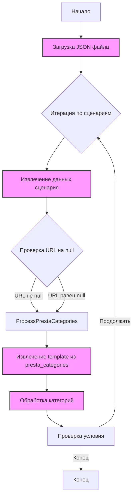

## <алгоритм>

1.  **Начало**: Процесс начинается с загрузки JSON файла, содержащего сценарии для категорий ноутбуков Lenovo.
2.  **Обход сценариев**: Программа итерируется по каждому сценарию в объекте `scenarios`. Каждый сценарий представляет собой конфигурацию для определенной модели ноутбука Lenovo (например, "LENOVO 11.6 I3").

    *   Пример: Рассматривается сценарий `"LENOVO 11.6 I3"`
3.  **Извлечение данных**: Для каждого сценария извлекаются следующие данные:
    *   `brand`: Бренд ноутбука (всегда "LENOVO" в данном файле).
        *   Пример: `"brand": "LENOVO"`
    *   `url`: URL-адрес для веб-страницы, связанной с моделью (может быть `null`).
        *   Пример: `"url": null` или `"url": "https://www.morlevi.co.il/Cat/71?p_238=1144&p_387=3413&sort=datafloat2%2Cprice&keyword="`
    *   `checkbox`: Флаг, определяющий, отмечен ли чекбокс для этого сценария (всегда `false`).
        *   Пример: `"checkbox": false`
    *   `active`: Флаг, определяющий, активен ли сценарий (всегда `true`).
        *   Пример: `"active": true`
    *   `condition`: Состояние товара (всегда "new").
        *   Пример: `"condition": "new"`
    *   `presta_categories`: Объект, содержащий информацию о категориях PrestaShop.
        *   Пример: `"presta_categories": {"template": {"LENOVO": ["LAPTOPS INTEL I3", "11"]}}`
4.  **Обработка категорий**: Внутри `presta_categories` есть ключ `template`, который содержит словарь, где ключ - бренд (например, "LENOVO"), а значение - массив из двух элементов:
    *   Первый элемент: Категория ноутбука (например, "LAPTOPS INTEL I3").
    *   Второй элемент: Размер экрана (например, "11").
        *   Пример: `"LENOVO": [ "LAPTOPS INTEL I3", "11" ]`
5.  **Итерация по размерам экрана**:  Данные о размерах экрана (11, 13, 14, 15, 17) используются для категоризации.
6.  **Конец**: Процесс завершается после обработки всех сценариев.

## <mermaid>



**Объяснение зависимостей Mermaid:**

*   `Start`: Начальная точка процесса.
*   `LoadJSON`: Этап загрузки JSON-файла, содержащего данные о сценариях.
*   `IterateScenarios`: Цикл, который проходит по каждому сценарию, определенному в JSON.
*   `ExtractData`:  Извлечение всех данных (brand, url, checkbox, active, condition, presta\_categories) из текущего сценария.
*   `CheckURL`: Проверяет, является ли URL-адрес `null`. В зависимости от этого будет дальнейшая обработка.
*   `ProcessPrestaCategories`: Этап обработки данных из `presta_categories`.
*   `ExtractTemplate`: Извлекает объект `template` из `presta_categories`.
*  `ProcessCategory`: Обрабатывает категории в `template`.
*   `ConditionCheck`: Проверяет условие для продолжения цикла обработки сценариев. Если есть еще сценарии, цикл продолжается, иначе завершается.
*   `End`: Конечная точка процесса.

## <объяснение>

**Импорты:**

В данном коде отсутствуют импорты, поскольку это JSON-файл, а не Python-скрипт.  Однако, этот файл используется в контексте приложения, где данные из него загружаются и обрабатываются.

**Классы:**

В данном коде нет классов, так как это JSON-файл, представляющий собой структуру данных.  В Python-коде, который будет использовать эти данные, вероятно, будут созданы классы для представления этих сценариев и их обработки.

**Функции:**

В этом файле нет функций, но в коде, который будет обрабатывать эти данные, будут функции для итерации по сценариям, извлечения данных, определения категорий, и т.д.
Примеры таких функций могут быть:

```python
import json

def load_scenarios(filepath):
    with open(filepath, 'r') as f:
        return json.load(f)

def process_scenario(scenario):
        brand = scenario.get('brand')
        url = scenario.get('url')
        categories = scenario.get('presta_categories', {}).get('template', {}).get(brand, [])
        return brand, url, categories
```

**Переменные:**

*   `scenarios`: Это основной объект JSON, который содержит словарь, где ключами являются названия сценариев (например, "LENOVO 11.6 I3"), а значениями - объекты, описывающие эти сценарии. Тип - словарь (dictionary).
*   `brand`: Строка (string), представляющая бренд ноутбука (в данном случае, всегда "LENOVO").
*   `url`: Строка (string) или `null`, представляющая URL-адрес для веб-страницы, связанной с моделью.
*   `checkbox`: Булево значение (boolean), определяющее, отмечен ли чекбокс для этого сценария.
*   `active`: Булево значение (boolean), определяющее, активен ли сценарий.
*   `condition`: Строка (string), представляющая состояние товара (в данном случае, всегда "new").
*   `presta_categories`: Словарь (dictionary), содержащий информацию о категориях PrestaShop.
    *   `template`: Вложенный словарь (dictionary), где ключами являются бренды, а значениями - массивы (lists) из двух элементов: категория и размер экрана.

**Цепочка взаимосвязей с другими частями проекта:**

1.  **Загрузка данных:** Этот JSON-файл служит источником данных для системы, вероятно, связанной с e-commerce платформой PrestaShop.
2.  **Категоризация товаров:** Данные используются для автоматической категоризации товаров Lenovo в PrestaShop на основе процессора и размера экрана.
3.  **Веб-страницы:** `url` используется для связывания конкретных сценариев с соответствующими страницами на сайте поставщика.
4.  **Система управления:** Скорее всего, есть управляющий скрипт на Python, который загружает эти данные, обрабатывает их и использует для управления категориями в PrestaShop.

**Потенциальные ошибки и области для улучшения:**

*   **Жестко закодированные значения:** Значения `checkbox` и `condition` всегда одинаковы, что может указывать на избыточность. Возможно, их можно убрать, если они всегда будут устанавливаться программно.
*   **Отсутствие обработки ошибок:** Если какой-то из ключей отсутствует в файле, программа должна корректно обрабатывать такие ситуации.
*   **Зависимость от структуры:** Код, обрабатывающий этот файл, должен быть гибким и не зависеть от точной структуры словаря `template`, так как добавление новых поставщиков или категорий может привести к изменениям в структуре.
*   **Разные размеры экрана для одного процессора:** Есть дублирование размеров экрана по разным процессорам и может возникнуть путаница, необходимо унифицировать.
*   **Несоответствие названий:** Название "LENOVO 14 AMD RYZEN 7" имеет категорию "LAPTOPS INTEL I7", что является ошибкой, этот момент нужно проверить.
*  **Бренд Gigabyte:** Есть категория для "gigabyte", хотя все остальное для LENOVO, необходимо проверить, нужно ли это и исправить.

**Пример использования в Python:**
```python
import json

def load_scenarios(filepath):
    with open(filepath, 'r') as f:
        return json.load(f)

def process_scenarios(scenarios_data):
    for scenario_name, scenario in scenarios_data['scenarios'].items():
        brand = scenario.get('brand')
        url = scenario.get('url')
        categories_data = scenario.get('presta_categories', {}).get('template')

        if categories_data:
            for brand_template, categories in categories_data.items():
                print(f"Scenario: {scenario_name}")
                print(f"  Brand: {brand}")
                print(f"  URL: {url}")
                print(f"  Categories: {categories}")
        else:
           print(f"Scenario: {scenario_name} , no category defined")


if __name__ == "__main__":
    file_path = 'hypotez/src/suppliers/ivory/scenarios/morlevi_categories_laptops_lenovo.json'
    scenarios = load_scenarios(file_path)
    process_scenarios(scenarios)
```
Этот скрипт загружает данные из JSON файла и итерируется по каждому сценарию, выводит основную информацию и категории.