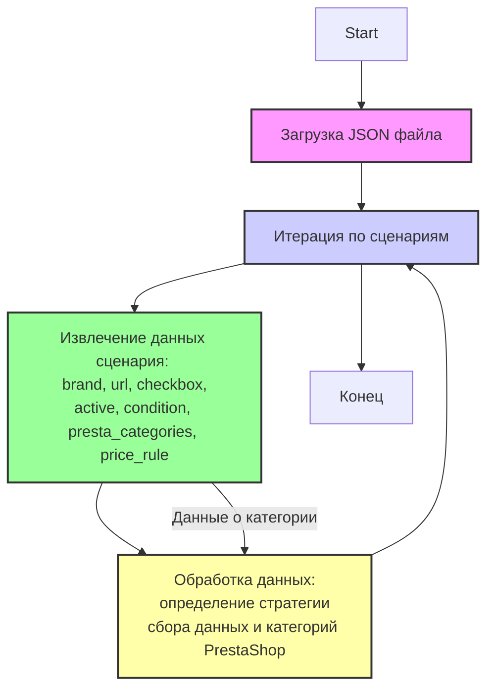

## <алгоритм>

Этот JSON-файл содержит конфигурацию для скрапинга категорий материнских плат Gigabyte с сайта Morlevi. Каждый элемент в словаре `scenarios` представляет собой отдельный сценарий для конкретной категории материнских плат.

**Блок-схема:**

1.  **Начало:** Загрузка JSON-файла.
2.  **Итерация по сценариям:** Перебор ключей в словаре `scenarios`.
    *   Для каждого ключа (например, "GIGABYTE INTEL LGA1700 12 Gen Z690") извлекается словарь, содержащий данные о сценарии.
3.  **Извлечение данных:** Внутри каждого сценария извлекаются следующие поля:
    *   `brand`: Строка, представляющая бренд материнской платы (например, "GIGABYTE").
    *   `url`: Строка, содержащая URL-адрес категории на сайте Morlevi (например, "https://www.morlevi.co.il/Cat/378").
    *   `checkbox`: Логическое значение, указывающее на наличие чекбокса (здесь всегда `false`).
    *   `active`: Логическое значение, указывающее, активен ли сценарий (здесь всегда `true`).
    *   `condition`: строка,  указывающая на состояние товара (здесь всегда `new`).
    *   `presta_categories`: Словарь, содержащий информацию о категориях PrestaShop:
        *   `template`: Словарь, где ключ "gigabyte" соотносится со значением, определяющим тип чипсета (например, "Intel Z690").
    *   `price_rule`: Целое число, указывающее правило ценообразования (только в первом сценарии, обычно 1 или 0).
4.  **Обработка данных:**
    *   Данные о каждой категории используются для определения стратегии сбора и категоризации данных. Например, URL используется для запроса страницы, а значение `presta_categories.template.gigabyte` используется для определения, к какой категории PrestaShop относится продукт.
5.  **Конец:** После обработки всех сценариев процесс завершается.

**Примеры:**

*   Для сценария `"GIGABYTE INTEL LGA1700 12 Gen Z690"`:
    *   `brand` = "GIGABYTE"
    *   `url` = "https://www.morlevi.co.il/Cat/378"
    *   `presta_categories.template.gigabyte` = "Intel Z690"
*   Для сценария `"GIGABYTE AMD AM4+ B550"`:
    *   `brand` = "GIGABYTE"
    *   `url` = "https://www.morlevi.co.il/Cat/340"
    *   `presta_categories.template.gigabyte` = "AMD B550"

## <mermaid>

**Объяснение:**

*   **Start:** Начало процесса загрузки и обработки файла JSON.
*   **LoadJSON:** Загрузка JSON файла с настройками категорий.
*   **LoopScenarios:** Цикл перебора сценариев, содержащихся в файле JSON. Каждый сценарий описывает определенную категорию материнских плат.
*   **ExtractData:** Извлечение данных, таких как бренд, URL, статус активности, условие и настройки категорий PrestaShop для текущего сценария.
*   **ProcessData:** Обработка извлеченных данных, для определения дальнейшей стратегии сбора информации и сопоставления категорий.
*   **End:** Завершение процесса после обработки всех сценариев.
*   Стрелка с подписью "Данные о категории" показывает поток данных от извлечения до обработки.
*   Стили `fill` и `stroke` применяются для визуализации блоков диаграммы.

## <объяснение>

**Импорты:**

В предоставленном коде нет явных импортов. Это файл JSON, содержащий конфигурационные данные, а не код на Python. Однако, этот файл используется в контексте проекта, где могут присутствовать импорты, и он, вероятно, обрабатывается кодом, который может импортировать библиотеки.

**Классы:**

В этом JSON файле нет классов. Это структура данных. Но в системе, где используется этот файл, могут быть классы, которые будут обрабатывать и использовать эти данные.

**Функции:**

В этом JSON файле нет функций. Это статические данные. Но, в Python коде, который будет использовать эти данные, будут использоваться функции для обработки этих данных.

**Переменные:**

*   `scenarios`: Это основной словарь, где ключи - названия категорий материнских плат, а значения - словари с настройками для каждой категории.
    *   `brand`: Строка (str). Указывает на бренд материнской платы, например, "GIGABYTE".
    *   `url`: Строка (str). URL-адрес страницы категории на сайте Morlevi.
    *   `checkbox`: Логическое значение (bool). Указывает на наличие чекбокса (в данном случае всегда `false`).
    *   `active`: Логическое значение (bool). Указывает, активен ли данный сценарий (в данном случае всегда `true`).
    *   `condition`: Строка (str). Указывает на состояние товара (в данном случае всегда `new`).
    *   `presta_categories`: Словарь (dict). Содержит настройки для категорий PrestaShop.
        *   `template`: Словарь (dict). Содержит соответствие между брендом и категорией PrestaShop, например, `"gigabyte": "Intel Z690"`.
    *   `price_rule`: Целое число (int). Указывает на правило ценообразования (есть только в одном сценарии).

**Потенциальные ошибки и области для улучшения:**

1.  **Отсутствие валидации**: Нет проверки наличия необходимых полей в каждом сценарии. Желательно добавить валидацию, чтобы убедиться в наличии необходимых полей (`brand`, `url`, `presta_categories.template.gigabyte` и т.д.).
2.  **Дублирование URL**: URL для "GIGABYTE INTEL LGA1200 H470 GEN10"  и  "GIGABYTE INTEL LGA1200 H410 GEN10" совпадают, что может быть ошибкой. Нужно проверить корректность URL.
3.  **Неоднородность значений `presta_categories.template`**: Некоторые значения в `presta_categories.template` могут быть не совсем точными (например, "Intel B560" для Z590). Это может привести к неверной категоризации. Следует провести сверку и исправить неточности.
4. **Повторение значений в категориях**: в файле есть дублирование категорий `"Intel H610"` для  `"GIGABYTE INTEL LGA1700 12 H610"` и `"GIGABYTE INTEL LGA1200 H510"`. Возможно, что это некорректные данные и стоит их проверить.
5.  **Ценаобразование**: `price_rule` присутствует только в одном сценарии. Необходима проверка, должно ли оно быть в каждом сценарии, а если нет, необходимо продумать механизм обработки.

**Цепочка взаимосвязей с другими частями проекта:**

Этот JSON-файл, вероятно, используется в модуле скрапинга, который отвечает за извлечение данных с сайта Morlevi и загрузку их в систему (например, PrestaShop).

1.  **Скрапер:** Python-скрипт или класс, который читает этот JSON-файл и использует данные для настройки процесса сбора данных. Он использует `url` для доступа к веб-странице, а значения `presta_categories.template.gigabyte` - для определения категории продукта при загрузке в PrestaShop.
2.  **Модуль PrestaShop:** Модуль, который взаимодействует с PrestaShop API и отвечает за создание или обновление категорий и продуктов.
3.  **Файлы конфигурации**: Возможно этот файл является одним из нескольких, где прописаны различные варианты скраппинга.