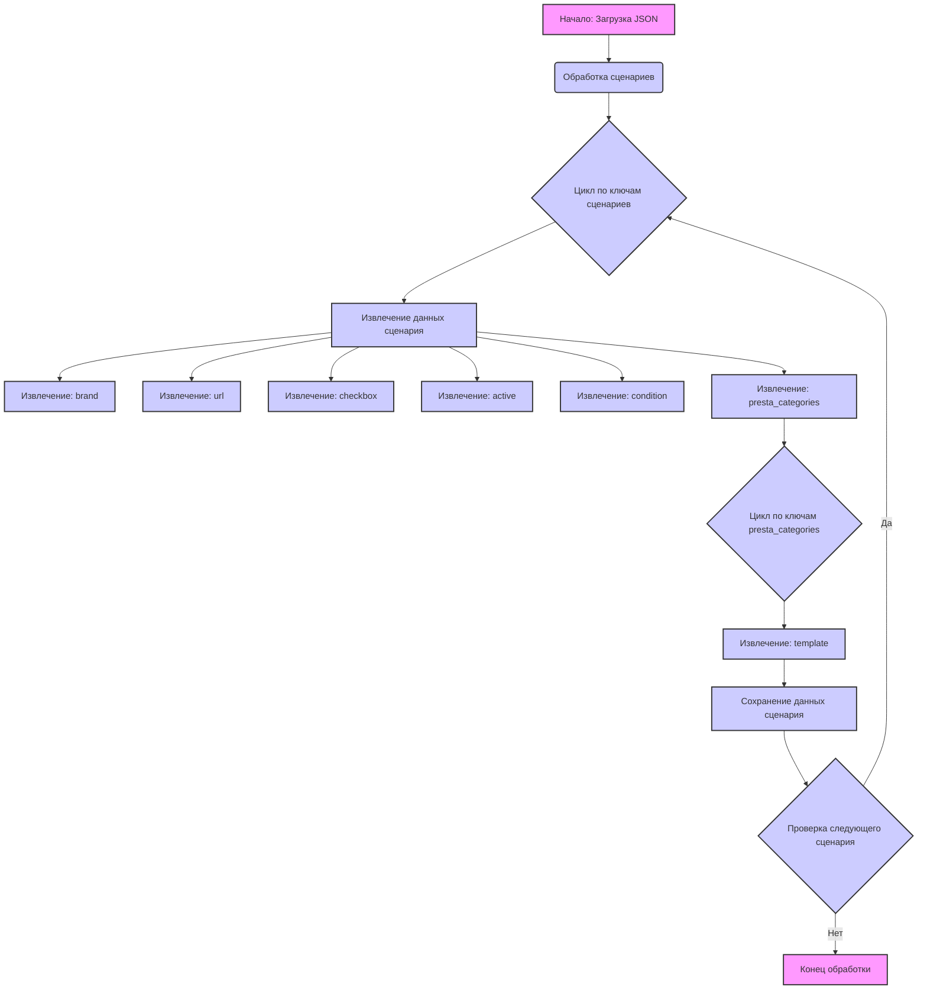

## АНАЛИЗ КОДА:

### 1. <алгоритм>

**Блок-схема:**

```mermaid
flowchart TD
    A[Начало: Загрузка JSON] --> B{Обработка сценариев};
    B --> C[Цикл по ключам сценариев];
    C --> D{Извлечение данных сценария};
    D --> E{Извлечение бренда};
    E --> F{Извлечение URL};
    F --> G{Извлечение чекбокс (логическое значение)};
    G --> H{Извлечение статуса (логическое значение)};
    H --> I{Извлечение состояния товара (строка)};
    I --> J{Извлечение категорий presta};
    J --> K[Цикл по ключам prest_categories]
    K --> L{Извлечение шаблона категории};
    L --> M{Сохранение данных в структуру};
    M --> N{Проверка следующего сценария};
    N -- Да --> C;
    N -- Нет --> O[Конец обработки];
    
  
    style A fill:#f9f,stroke:#333,stroke-width:2px
    style B fill:#ccf,stroke:#333,stroke-width:2px
    style C fill:#ccf,stroke:#333,stroke-width:2px
    style D fill:#ccf,stroke:#333,stroke-width:2px
    style E fill:#ccf,stroke:#333,stroke-width:2px
    style F fill:#ccf,stroke:#333,stroke-width:2px
    style G fill:#ccf,stroke:#333,stroke-width:2px
    style H fill:#ccf,stroke:#333,stroke-width:2px
    style I fill:#ccf,stroke:#333,stroke-width:2px
    style J fill:#ccf,stroke:#333,stroke-width:2px
    style K fill:#ccf,stroke:#333,stroke-width:2px
    style L fill:#ccf,stroke:#333,stroke-width:2px
    style M fill:#ccf,stroke:#333,stroke-width:2px
     style N fill:#ccf,stroke:#333,stroke-width:2px
    style O fill:#f9f,stroke:#333,stroke-width:2px
```

**Примеры:**

*   **Начало:** Загружается JSON-файл со структурой данных.
*   **Обработка сценариев:** Извлекаются сценарии из объекта `scenarios`.
*   **Цикл по ключам сценариев:** Цикл перебирает ключи, такие как `"SAMSUNG 21 - 22"`, `"SAMSUNG 23 - 24"` и т.д.
*   **Извлечение данных сценария:** Для каждого сценария извлекаются значения атрибутов: `"brand"`, `"url"`, `"checkbox"`, `"active"`, `"condition"`, `"presta_categories"`.
*   **Извлечение бренда:** Извлекается значение `"SAMSUNG"` из ключа `"brand"`.
*   **Извлечение URL:** Извлекается значение URL, например `"https://www.morlevi.co.il/Cat/8?p_350=1805&p_315=28&sort=datafloat2%2Cprice&keyword="`.
*   **Извлечение чекбокс:** Извлекается логическое значение (в данном случае `false`) из ключа `"checkbox"`.
*    **Извлечение статуса:** Извлекается логическое значение (в данном случае `true`) из ключа `"active"`.
*   **Извлечение состояния товара:** Извлекается строка `"new"` из ключа `"condition"`.
*   **Извлечение категорий presta:** Извлекается объект `"presta_categories"`, содержащий  ключ `"template"` и значение `{ "samsung": "PC MONITORS 21 - 22" }`.
*   **Цикл по ключам prest_categories:** Цикл перебирает ключи, например `"template"`.
*   **Извлечение шаблона категории:** Извлекается значение шаблона, например, `{ "samsung": "PC MONITORS 21 - 22" }`.
*  **Сохранение данных в структуру:** Данные, извлеченные для каждого сценария, сохраняются в определенную структуру (например, словарь или объект) для дальнейшей обработки.
*   **Проверка следующего сценария:** Проверяется, есть ли еще сценарии для обработки. Если есть, цикл продолжается; если нет, обработка заканчивается.
*   **Конец обработки:** Завершение обработки всех сценариев.

### 2. <mermaid>



**Зависимости:**

Диаграмма не имеет внешних импортированных зависимостей, так как описывает структуру JSON-файла и логику его обработки. Она представляет собой внутреннюю структуру данных, которая может быть обработана с использованием встроенных возможностей языка программирования (например, Python) для работы с JSON.

### 3. <объяснение>

**Импорты:**

В данном коде нет явных импортов. Это связано с тем, что код представлен в виде JSON, который является форматом данных, а не исполняемым кодом. JSON используется для хранения и передачи структурированной информации.

**Классы:**

В представленном коде нет классов. Он состоит из JSON-объекта, который содержит в себе структуру данных, представляющую сценарии для мониторов Samsung.

**Функции:**

В JSON коде нет функций. Это лишь описание данных. Функции будут присутствовать при обработке этого JSON в коде Python, PHP, JavaScript и т.д.
    Например, на Python это будет выглядеть так:
    ```python
    import json

    def process_scenarios(json_data):
        scenarios = json_data.get("scenarios", {})
        for scenario_name, scenario_data in scenarios.items():
            brand = scenario_data.get("brand")
            url = scenario_data.get("url")
            checkbox = scenario_data.get("checkbox")
            active = scenario_data.get("active")
            condition = scenario_data.get("condition")
            presta_categories = scenario_data.get("presta_categories", {})
            
            for template_key, template_value in presta_categories.get("template", {}).items():
                print(f"Scenario: {scenario_name}")
                print(f"  Brand: {brand}")
                print(f"  URL: {url}")
                print(f"  Checkbox: {checkbox}")
                print(f"  Active: {active}")
                print(f"  Condition: {condition}")
                print(f"  Presta Template Key: {template_key}")
                print(f"  Presta Template Value: {template_value}")
            print("-" * 30)
    
    
    # Загрузка JSON файла
    try:
        with open("hypotez/src/suppliers/ivory/scenarios/morlevi_categories_monitors_samsung.json", "r") as file:
            json_data = json.load(file)
        
        process_scenarios(json_data)
    
    except FileNotFoundError:
        print(f"Error: File not found")
    
    except json.JSONDecodeError:
       print(f"Error: Invalid JSON format")
    ```

**Переменные:**

*   `"scenarios"`: Главный объект, содержащий все сценарии.
*   `"SAMSUNG 21 - 22"`, `"SAMSUNG 23 - 24"`, `"SAMSUNG 26 - 28"`, `"SAMSUNG 29 - 31"`, `"SAMSUNG 32 - 34"`: Ключи, представляющие названия сценариев.
*   `"brand"`: Строка, определяющая бренд товара (всегда `"SAMSUNG"` в данном файле).
*   `"url"`: Строка, содержащая URL-адрес для сбора данных.
*   `"checkbox"`: Логическое значение, указывающее, нужно ли использовать чекбокс (всегда `false` в данном файле).
*   `"active"`: Логическое значение, указывающее, активен ли сценарий (всегда `true` в данном файле).
*    `"condition"`: Строка, описывающая состояние товара (всегда `"new"` в данном файле).
*   `"presta_categories"`: Объект, содержащий информацию о категориях PrestaShop.
    * `"template"`: Объект, содержащий соответствия между категориями Samsung и PrestaShop.
*   `"samsung"`: Ключ в объекте `template`, представляющий категорию Samsung.
*   `"PC MONITORS 21 - 22"`, `"PC MONITORS 23 - 24"`, `"PC MONITORS 26 - 28"`, `"PC MONITORS 29 - 31"`, `"PC MONITORS 32 - 34"`: Строки, представляющие категории PrestaShop.

**Потенциальные ошибки и области для улучшения:**

*   **Отсутствие обработки ошибок**: В коде, который будет обрабатывать этот JSON, нужно предусмотреть обработку ошибок, таких как отсутствие ключей в JSON или неправильный формат данных.
*  **Жестко закодированные значения**:  Все значения `"checkbox"`  равны `false`,  `"active"` равны `true` и `"condition"` равны `"new"`.
     Возможно, в будущих итерациях они могут меняться.
*   **Дублирование бренда**: Поле `brand` всегда имеет значение `"SAMSUNG"`. Можно  сделать это значение общим на уровне родительского объекта, а не повторять в каждом сценарии. Это позволит избежать дублирования.
*   **Структура presta_categories**: В текущей структуре всегда используется только `template` и в нём  только `samsung`. Структуру можно сделать более гибкой на случай появления дополнительных категорий или иных параметров.
*   **URL-адреса**: Все URL-адреса ведут на один и тот же домен `morlevi.co.il`, отличаясь лишь параметрами. Возможно, стоит вынести общий домен в переменную.

**Цепочка взаимосвязей с другими частями проекта:**

Этот JSON-файл, вероятно, является частью системы для сбора данных о товарах с сайта morlevi.co.il. Скорее всего, он используется в сочетании со скриптами на Python, PHP или JavaScript, которые:

1.  **Загружают** этот JSON-файл.
2.  **Парсят** данные.
3.  **Используют** URL-адреса для сканирования страниц товаров.
4.  **Преобразуют** полученные данные в формат, пригодный для загрузки в PrestaShop.
5.  **Обновляют** информацию о товарах в базе данных PrestaShop.

Таким образом, этот файл является важной частью системы, отвечающей за конфигурацию сбора данных и сопоставление категорий товаров между сайтом поставщика и интернет-магазином.