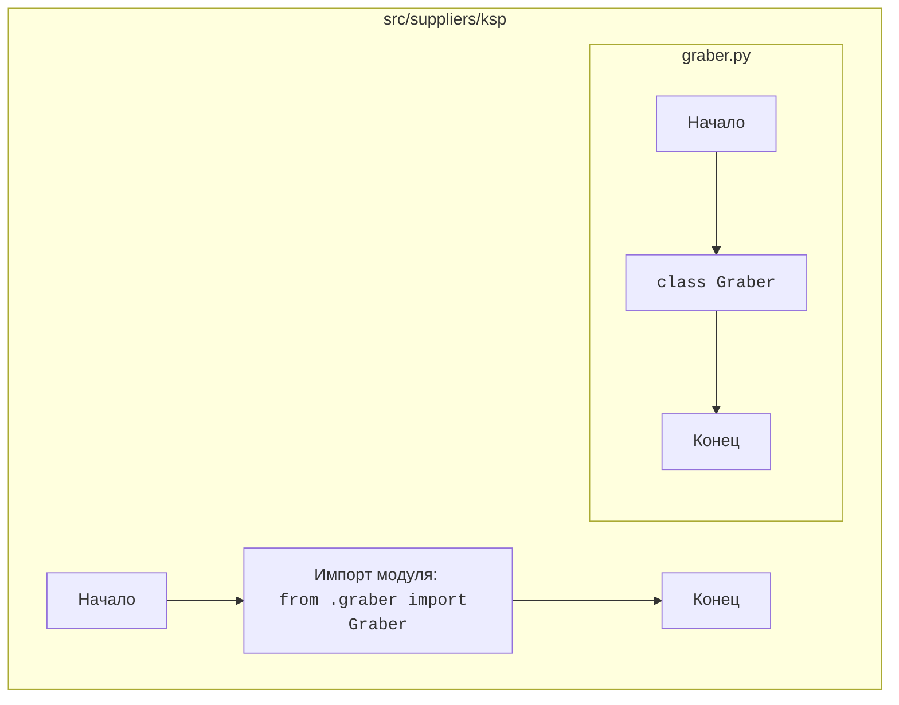

# Анализ кода `hypotez/src/suppliers/ksp/__init__.py`

## <алгоритм>

1. **Импорт модуля `graber`:**
   - Выполняется импорт модуля `Graber` из файла `graber.py`, расположенного в той же директории (`.`).
   - **Пример:** `from .graber import Graber`

## <mermaid>

**Объяснение зависимостей `mermaid`:**

- **`Start`**: Начало выполнения файла `__init__.py`.
- **`ImportGraber`**: Импорт класса `Graber` из модуля `graber.py`, который находится в той же директории (`.`)
- **`End`**: Конец выполнения файла `__init__.py`.
- **`GStart`**: Начало выполнения файла `graber.py`.
- **`GClass`**: Определение класса `Graber` в файле `graber.py`.
- **`GEnd`**: Конец выполнения файла `graber.py`.

Диаграмма показывает, что `__init__.py` импортирует `Graber` из модуля `graber.py`.

## <объяснение>

**Импорты:**

- `from .graber import Graber`: Этот импорт необходим для того, чтобы сделать класс `Graber`, определенный в `graber.py`, доступным для использования в других частях пакета `src.suppliers.ksp` и за его пределами.  `from .` означает, что импорт производится из файла `graber.py` который находится в текущей директории.

**Классы:**

- **`Graber`**: Это класс, который, вероятно, отвечает за получение (сбор) данных.  `__init__.py` делает этот класс доступным при импорте пакета `src.suppliers.ksp` (например `from src.suppliers.ksp import Graber`).

**Функции:**
- В данном файле нет функций, только импорт.

**Переменные:**
- В данном файле нет переменных, только импорт.

**Потенциальные ошибки и области для улучшения:**

- В текущем виде файл `__init__.py` просто импортирует класс `Graber`, что является стандартным подходом для инициализации пакета.
- Файл не содержит никаких ошибок, но может быть дополнен в дальнейшем для выполнения дополнительных действий при импорте пакета `src.suppliers.ksp`. Например, можно было бы инициализировать какие-либо глобальные переменные или выполнять настройки.

**Взаимосвязи с другими частями проекта:**

- Файл `__init__.py` является частью пакета `src.suppliers.ksp`, который, вероятно, отвечает за работу с поставщиками (`suppliers`) в контексте KSP (возможно, это сокращение от названия какого-то поставщика или программного обеспечения).
- Класс `Graber` используется для сбора или обработки данных, связанных с поставщиками KSP. Этот класс будет использоваться из других частей проекта, когда понадобится взаимодействовать с поставщиками KSP.
- Файл `__init__.py` делает `Graber` доступным для импорта.