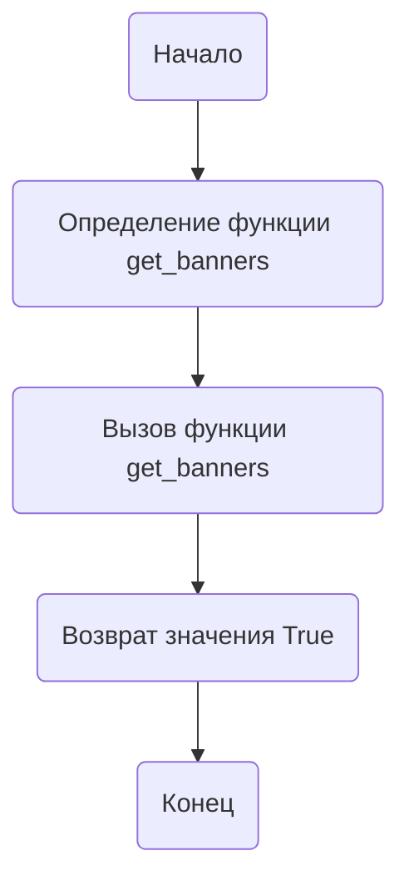

## <алгоритм>

1. **Начало:** Запускается скрипт `banners_grabber.py`.
2. **Определение функции `get_banners`:** В скрипте определена функция `get_banners` без аргументов.
3. **Выполнение функции `get_banners`:** Функция вызывается (в данном случае не явно, но могла бы вызываться из другой части программы).
4. **Возврат значения `True`:** Функция `get_banners` всегда возвращает логическое значение `True`.
5. **Конец:** Завершение работы скрипта.

**Пример:**
   - `get_banners()`: Возвращает `True`.

**Поток данных:**

   - **Нет входных данных.** Функция `get_banners` не принимает никаких аргументов.
   - **Выходные данные:** Функция `get_banners` возвращает логическое значение `True`.

## <mermaid>



**Объяснение зависимостей:**

Диаграмма `mermaid` показывает простой поток выполнения скрипта.

- `Start`:  Начальная точка скрипта.
- `DefineFunction`:  Определение функции `get_banners`.
- `CallFunction`: Вызов функции `get_banners`. В данном скрипте вызов функции не явный, но он подразумевается в контексте использования.
- `ReturnTrue`:  Возврат значения `True` функцией.
- `End`: Конечная точка скрипта.

## <объяснение>

**Импорты:**

- В данном коде нет явных импортов, что означает, что скрипт не использует внешние библиотеки или модули.

**Классы:**
- В данном коде нет определения классов.

**Функции:**

- **`get_banners()`**:
    -   **Аргументы:** Функция не принимает аргументов.
    -   **Возвращаемое значение:** Возвращает логическое значение `True`.
    -   **Назначение:** Согласно docstring, функция предназначена для сбора баннеров ksp. Однако, текущая реализация всегда возвращает `True` и не выполняет никаких действий по сбору баннеров. Это означает, что функция является "заглушкой" и требует дальнейшей доработки.
    -   **Пример:**
        ```python
        result = get_banners()  # result будет равен True
        ```

**Переменные:**

-   В данном коде нет переменных, кроме локальной переменной `result` в примере вызова, которая будет хранить возвращаемое значение функции `get_banners`.

**Потенциальные ошибки и области для улучшения:**

1.  **Отсутствие реализации сбора баннеров:** Функция `get_banners` в текущем виде не выполняет никаких действий по сбору баннеров. Это ключевой недостаток, который необходимо исправить.
2.  **Отсутствие импортов:** Для сбора баннеров, вероятно, потребуется импортировать библиотеки для работы с сетью (например, `requests` для HTTP запросов) и для разбора HTML (например, `BeautifulSoup4`).
3.  **Отсутствие обработки ошибок:** Функция должна обрабатывать ошибки, такие как проблемы с сетью, невалидный HTML, и т.д.
4.  **Недостаток документации:**  Документация к модулю  и функции должна быть расширена и более информативной.
5.  **Статический возврат значения**: Возвращение `True` без каких-либо действий по сбору баннеров делает функцию бесполезной в реальном сценарии.

**Цепочка взаимосвязей с другими частями проекта:**

-   Этот модуль `banners_grabber.py`, расположенный в `src/suppliers/ksp`, предположительно является частью более крупного проекта, занимающегося сбором данных о поставщиках.
-   Предполагается, что этот модуль будет использоваться другими частями проекта для получения информации о баннерах, связанных с поставщиком ksp.
-   Поток данных, скорее всего, будет следующим:
    1.  Другие модули проекта будут вызывать `get_banners()`.
    2.  `get_banners()`  будет запрашивать данные из сети, обрабатывать их и возвращать список или другой структурированный объект.
    3.  Возвращенные данные будут использоваться другими модулями для дальнейшей обработки и анализа.

**Взаимосвязь с другими частями проекта:**
- Модуль `banners_grabber.py`  является частью проекта по сбору данных о поставщиках. Потенциально, он может взаимодействовать с другими модулями, например, для хранения данных.