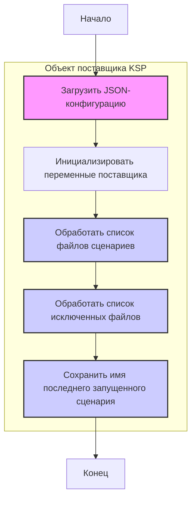

## <алгоритм>

1. **Начало**: Загрузка JSON-конфигурации для поставщика "KSP".
2. **Инициализация**:
   - Присваивание `supplier_id` значения "2787".
   - Присваивание `supplier` значения "KSP".
   - Присваивание `supplier_prefix` значения "ksp".
   - Присваивание `start_url` значения "https://www.ksp.co.il/".
   - Присваивание `price_rule` значения "+100" (вероятно, правило наценки).
3. **Обработка сценариев**:
   - Создание списка `scenario_files`, содержащего имена файлов сценариев для категорий товаров. 
     - Пример: `ksp_categories_aio_lenovo.json`, `ksp_categories_headphones_jbl.json`
4. **Обработка исключений**:
    - Создание списка `excluded`, содержащего имена файлов сценариев, которые нужно исключить из обработки.
    - Пример: `ksp_categories_phones_xiaomi.json`, `ksp_categories_phones_oneplus.json`
5. **Фиксация последнего сценария**:
    - Сохранение имени последнего запущенного сценария в переменную `last_runned_scenario`.
    - Пример: `ksp_categories_phones_apple.json`
6. **Конец**: Конфигурация поставщика "KSP" загружена и готова к использованию.

## <mermaid>

**Объяснение `mermaid`:**

Диаграмма `mermaid` представляет собой блок-схему, описывающую процесс обработки JSON-конфигурации для поставщика KSP. 

-   **`Start`**: Начальная точка процесса.
-   **`LoadConfig`**: Блок, представляющий загрузку JSON-конфигурации из файла.
-   **`Initialize`**: Блок, представляющий инициализацию переменных, таких как `supplier_id`, `supplier`, `supplier_prefix`, `start_url`, и `price_rule`.
-   **`ProcessScenarios`**: Блок, обрабатывающий список файлов сценариев, хранящихся в `scenario_files`.
-  **`ProcessExclusions`**: Блок, который обрабатывает список исключений, хранящихся в `excluded`
-   **`SaveLastScenario`**: Блок, сохраняющий имя последнего запущенного сценария из переменной `last_runned_scenario`.
-   **`End`**: Конечная точка процесса.
-   **`Объект поставщика KSP`**: Подграф, который группирует все блоки, относящиеся к обработке конфигурации поставщика KSP.

Диаграмма показывает последовательность операций: загрузка конфигурации, инициализация, обработка сценариев, обработка исключений, фиксация последнего сценария. Это позволяет визуализировать поток управления в процессе обработки конфигурации.

## <объяснение>

**Импорты**: В данном коде отсутствуют импорты, так как это JSON-файл конфигурации, а не Python-скрипт. JSON-файл используется для хранения структурированных данных, которые затем могут быть использованы Python-скриптами.

**Классы**: В предоставленном коде отсутствуют определения классов, так как это JSON-файл конфигурации, а не Python-скрипт.

**Функции**: В предоставленном коде отсутствуют определения функций, так как это JSON-файл конфигурации, а не Python-скрипт.

**Переменные**:

-   `supplier_id`:  `string` (хотя выглядит как число). Идентификатор поставщика. Значение: "2787".
-   `supplier`: `string`. Название поставщика. Значение: "KSP".
-   `supplier_prefix`: `string`. Префикс поставщика, используется для формирования имен файлов. Значение: "ksp".
-   `start_url`: `string`. URL начальной страницы поставщика. Значение: "https://www.ksp.co.il/".
-    `price_rule`: `string`. Правило наценки. Значение: "+100" (скорее всего, процент или фиксированная величина для наценки).
-   `scenario_files`: `list` из `string`. Список файлов сценариев для парсинга товаров. 
    -  Пример: `["ksp_categories_aio_lenovo.json", "ksp_categories_headphones_jbl.json", ...]`
-   `excluded`: `list` из `string`. Список файлов сценариев, которые должны быть исключены из обработки.
    - Пример: `["ksp_categories_phones_xiaomi.json", "ksp_categories_phones_oneplus.json", ...]`
-   `last_runned_scenario`: `string`. Имя последнего запущенного сценария. Значение: "ksp_categories_phones_apple.json".

**Объяснение и взаимосвязь с другими частями проекта:**

Этот JSON-файл является конфигурационным файлом для поставщика "KSP". Он определяет:

1.  **Идентификацию поставщика**: `supplier_id`, `supplier`, `supplier_prefix` позволяют однозначно идентифицировать этого поставщика в рамках системы.
2.  **URL поставщика**: `start_url` указывает на начальную страницу сайта поставщика, откуда можно начать парсинг данных.
3.  **Правило ценообразования**: `price_rule` определяет, как будут корректироваться цены товаров, полученных от этого поставщика.
4.  **Список сценариев**: `scenario_files` содержит список файлов, описывающих категории товаров, которые нужно парсить у этого поставщика. Каждый файл сценария, вероятно, содержит правила или настройки для парсинга конкретной категории.
5.  **Исключения из парсинга**: `excluded` содержит список файлов сценариев, которые не нужно обрабатывать. Это может использоваться для временного отключения парсинга определенных категорий или для предотвращения дублирования данных.
6.  **Последний запущенный сценарий**: `last_runned_scenario`  используется для отслеживания состояния процесса парсинга и позволяет возобновить работу с последнего успешно обработанного сценария.

**Цепочка взаимосвязей с другими частями проекта:**

1.  **Скрипты парсинга**:  JSON-файл `ksp.json` вероятно, будет считан и обработан Python-скриптами, которые занимаются парсингом веб-сайтов. Он используется для настройки процесса сбора данных с сайта `KSP`.
2.  **Файлы сценариев**:  `scenario_files` и `excluded` содержат ссылки на другие JSON-файлы, которые, вероятно, содержат детальные настройки парсинга для конкретных категорий товаров.
3.  **База данных**: После парсинга данные, вероятно, будут сохранены в базу данных, где их можно будет использовать для других целей.
4.  **Логирование**: Имя последнего запущенного сценария `last_runned_scenario`  позволяет отслеживать процесс парсинга.
5.  **Веб-интерфейс**: Информация из базы данных может быть использована для отображения данных в пользовательском интерфейсе.

**Потенциальные ошибки и области для улучшения:**

1.  **Непоследовательное исключение**: Список `excluded` содержит много дублирующихся записей. Это может быть вызвано ошибкой или небрежностью при ручной правке файла. Это следует исправить, удалив дубликаты.
2.  **Магические числа**: `price_rule` содержит "+100", что может быть непонятно без контекста. Было бы лучше, если бы использовалась более описательная переменная и в комментарии объяснялось, что именно означает "+100" (процент или абсолютная величина).
3.  **Расширение**: В настоящее время  неясно, как обрабатываются исключенные сценарии и ведется ли журнал исключений. Было бы полезно, если бы существовал механизм журналирования исключений.

В целом, данный файл обеспечивает основную конфигурацию для парсинга данных с сайта поставщика "KSP". Он настраивает процесс парсинга, указывая какие категории товаров парсить, какие исключить, и по какому правилу изменять цены. Улучшения могли бы включать более ясную организацию, комментарии, пояснения по правилу ценообразования, и устранение дубликатов.