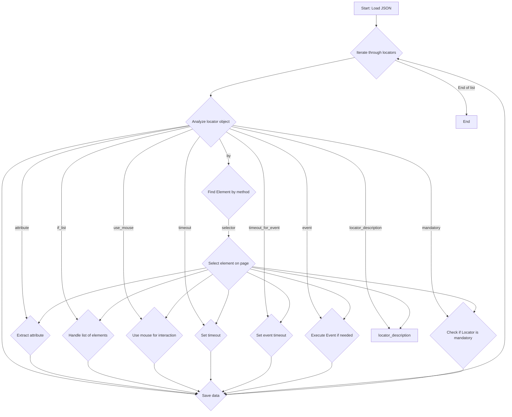

## АНАЛИЗ КОДА

### 1. <алгоритм>

Этот код представляет собой JSON-файл, описывающий локаторы для веб-страницы продукта. Каждый ключ верхнего уровня в JSON-объекте соответствует определенному полю данных о продукте (например, `id`, `name`, `description`, `price` и т. д.). Значение каждого ключа представляет собой объект, описывающий, как извлечь соответствующую информацию со страницы, используя селекторы, атрибуты, события и другие параметры.

**Блок-схема:**

1.  **Начало**: Загрузка JSON-файла.
2.  **Итерация по ключам**: Перебор ключей (полей продукта) в JSON. Например: `close_pop_up`, `id`, `id_manufacturer`, `id_supplier`, `id_product`, `default_image_url`,  и т.д..
3.  **Анализ объекта локатора**: Для каждого ключа, анализируется объект локатора:
    *   **`attribute`**: Определяет, какой атрибут элемента нужно извлечь. Пример: `"innerText"` (текст элемента), `"aria-label"` (атрибут aria-label), `"value"` (значение элемента), `null` (выбрать весь элемент или использовать другие методы).
    *   **`by`**: Указывает, каким методом искать элемент. Например: `"XPATH"` (XPath-селектор), `"VALUE"` (использовать значение), `null` (метод не задан, может использоваться как заглушка).
    *   **`selector`**: Строка, используемая для поиска элемента. Пример: `"//button[@class='close']"` (кнопка закрытия попапа), `"//span[@class = 'ltr sku-copy']"` (SKU производителя), `null` (селектор не требуется).
    *   **`if_list`**: Определяет, как обрабатывать список найденных элементов. Обычно `"first"` (взять первый элемент из списка).
    *   **`use_mouse`**: Булево значение, указывающее, требуется ли использовать мышь для взаимодействия с элементом.
    *   **`timeout`**: Время ожидания в секундах.
    *   **`timeout_for_event`**: Событие, которое будет ожидать, например, `"presence_of_element_located"` (присутствие элемента).
    *   **`event`**: Событие, которое должно быть выполнено, например, `"click()"` (клик по элементу), `"screenshot()"` (сделать скриншот элемента), `null` (событие не требуется).
    *   **`mandatory`**: Указывает, обязательно ли наличие данного локатора на странице.
    *    **`locator_description`**: Дополнительное текстовое описание локатора
    *   **`logic for action[AND|OR|XOR|VALUE|null]`**: логика для выполнения события
    *   **`logic for attribue[AND|OR|XOR|VALUE|null]`**: логика для извлечения атрибута
4.  **Извлечение данных**: На основе этих параметров, программа (не описана в коде, но предполагает использование этих данных), должна найти элемент на веб-странице и извлечь нужные данные (например, текст, значение атрибута или сделать скриншот).
5.  **Сохранение данных**: Извлеченные данные сохраняются в соответствующее поле объекта продукта.
6.  **Конец**: Завершение обработки всех локаторов.

### 2. <mermaid>

**Объяснение диаграммы:**

*   **`Start: Load JSON`**: Начальная точка процесса, где загружается JSON-файл с локаторами.
*   **`Iterate through locators`**: Цикл, проходящий по всем ключам (именам полей данных) в JSON-объекте.
*   **`Analyze locator object`**: Для каждого ключа, анализируется объект локатора.
*   **`Extract attribute`**: Извлечение требуемого атрибута элемента, если указано.
*   **`Find Element by method`**: Поиск элемента на странице, используя указанный метод `by`.
*   **`Select element on page`**: Выбор элемента на странице по селектору `selector`.
*   **`Handle list of elements`**: Обработка списка элементов в соответствии с `if_list`.
*   **`Use mouse for interaction`**: Использование мыши для взаимодействия с элементом (если `use_mouse` true).
*   **`Set timeout`**: Установка таймаута для ожидания элемента.
*  **`Set event timeout`**: Установка таймаута для ожидания события
*   **`Execute Event if needed`**: Выполнение события (клик, скриншот и т.д.), если указано в `event`.
*    **`Check if Locator is mandatory`**: Проверка обязательности локатора
*   **`Save data`**: Сохранение извлеченных данных.
*   **`locator_description`**: Дополнительное текстовое описание локатора
*   **`End`**: Конечная точка процесса.

Зависимости:
Диаграмма `mermaid` не импортирует внешние модули, а описывает процесс на основе данных из JSON файла.

### 3. <объяснение>

**Общая структура:**

Файл `product.json` представляет собой конфигурацию для парсинга веб-страницы продукта. Он содержит набор локаторов (селекторов) для поиска и извлечения данных о продукте на веб-сайте поставщика KSP, а также Amazon. Каждый локатор описывает, как найти элемент на странице и какое действие с ним выполнить, чтобы получить нужные данные.

**Импорты:**

В данном коде нет явных импортов. Это JSON-файл, а не код Python или другой язык программирования. Однако, подразумевается, что этот файл будет использоваться в Python коде, который будет импортировать этот json и обрабатывать его данные.

**Классы:**

В данном файле нет классов. Структура данных является JSON объектом, представляющим собой словарь словарей.

**Функции:**

В данном файле нет функций.  Файл представляет данные, а не функциональность.

**Переменные:**

Все "переменные" в данном случае это ключи JSON-объекта, который описывает поля продукта и их локаторы. Каждая из этих "переменных" имеет свою структуру, описанную в виде словаря:

*   `attribute`: Атрибут, который нужно извлечь у элемента.
    *   Примеры: `"innerText"` - текст внутри элемента, `"aria-label"` - значение атрибута aria-label, `"src"` - значение атрибута src,`null` - если атрибут не нужен.
*   `by`: Метод поиска элемента.
    *   Примеры: `"XPATH"` - использовать XPath, `"VALUE"` - использовать значение, `null` - если метод не используется.
*   `selector`: Селектор для поиска элемента.
    *   Примеры: `"//button[@class='close']"` - кнопка закрытия попапа, `"//span[@class='ltr sku-copy']"` - SKU производителя.
*   `if_list`: Как обрабатывать список элементов.
    *   `"first"` - взять первый элемент.
*   `use_mouse`: Использовать ли мышь.
    *   `false` - не использовать.
*   `timeout`: Время ожидания в секундах.
*   `timeout_for_event`: Событие, которое должно произойти для выполнения локатора
*   `event`: Событие, которое нужно выполнить с элементом.
    *   Примеры: `"click()"` - кликнуть, `"screenshot()"` - сделать скриншот, `null` - не выполнять.
*   `mandatory`: Обязательность наличия локатора.
    *   `true` - локатор обязателен.
*   `locator_description`: Описание локатора.
    *   Примеры:  `"Закрыти попап окна"`, `"SKU manufacturer"`
*    `logic for action[AND|OR|XOR|VALUE|null]`:  логика для выполнения события
*   `logic for attribue[AND|OR|XOR|VALUE|null]`: логика для извлечения атрибута

**Цепочка взаимосвязей:**

Этот файл является частью системы парсинга, вероятно, написанной на Python. Он предоставляет конфигурационные данные для модуля, который будет использовать Selenium, Beautiful Soup или аналогичные библиотеки для навигации по веб-странице и извлечения данных. Файл является частью системы для работы с сайтом KSP.

**Потенциальные ошибки и области для улучшения:**

1.  **Хрупкость XPath-селекторов:** Использование XPath-селекторов (например, `//button[@class='close']`) может привести к ошибкам, если структура HTML веб-страницы изменится. Рекомендуется использовать более устойчивые селекторы или атрибуты.
2.  **Отсутствие обработки ошибок:** В файле не описана логика обработки ошибок (например, если элемент не найден). Код, использующий этот файл, должен обрабатывать такие ситуации.
3.  **Множество локаторов с `null` значениями:** Многие поля имеют значения `null` для `attribute`, `by` и `selector`, что может указывать на неполную реализацию парсинга. Эти поля должны быть заполнены по мере необходимости.
4. **Сложная логика аффилиатных ссылок:** Вложенная логика для локаторов "affiliate short link" делает ее более сложной для понимания и отладки, стоит рассмотреть возможность упрощения.

**Дополнительно**:

*   Файл содержит локаторы для извлечения разнообразной информации, что делает его универсальным для парсинга веб-страниц продуктов.
*   В файле присутствуют не только локаторы для сайта KSP но и для Amazon, это стоит учитывать и придерживаться какой то одной логики, возможно стоит разделить их на разные конфиги.
*    Присутствует обилие локаторов для импорта в csv, при этом  не все из них имеют значения, стоит их заполнить или убрать неиспользуемые.

**В заключение:**

Этот файл `product.json` является ключевым компонентом системы парсинга.  Обеспечивает структурированное описание веб-страницы для парсинга, но требует тщательного контроля и поддержки, так как веб-сайты постоянно меняются.