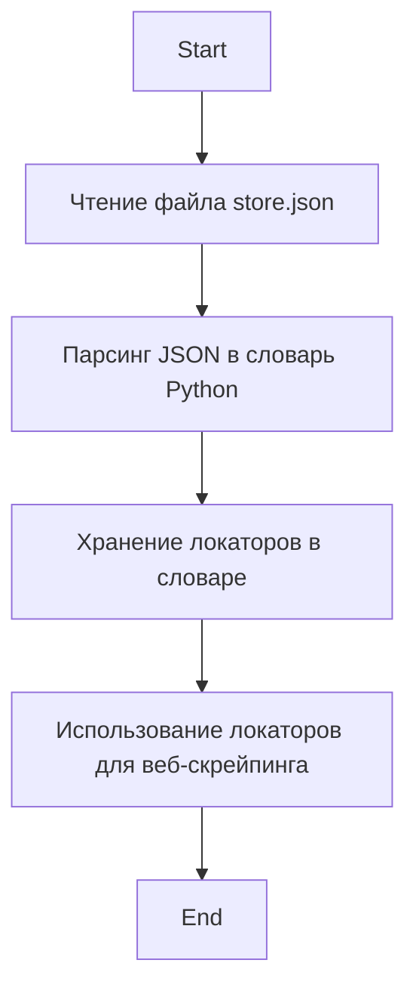

## Анализ кода `hypotez/src/suppliers/ksp/locators/store.json`

### <алгоритм>

1. **Чтение JSON файла:**
   -  Начало процесса: файл `store.json` читается.
   -  Пример: Если файл содержит `{"product_cards": ".card-item", "product_name": ".card-name"}`.
2. **Преобразование в словарь:**
   -  JSON данные парсятся и преобразуются в словарь Python.
   -  Пример: Данные из предыдущего примера будут преобразованы в `{"product_cards": ".card-item", "product_name": ".card-name"}`.
3. **Хранение локаторов:**
   - Полученный словарь используется для хранения локаторов элементов веб-страницы.
   -  Пример: Ключи словаря (`product_cards`, `product_name`) становятся именами локаторов, а значения (`.card-item`, `.card-name`) – их CSS-селекторами.
4. **Использование:**
   -  Этот словарь далее будет использоваться в коде для поиска соответствующих элементов на веб-странице KSP.
   -  Пример: При поиске карточек товара на странице, используется локатор `product_cards`,  который является CSS-селектором `.card-item`.

### <mermaid>



**Описание диаграммы:**

1. **Start**: Начало процесса.
2. **ReadFile**: Чтение JSON файла `store.json`.
3. **ParseJSON**: Парсинг JSON данных в словарь Python.
4. **StoreLocators**: Хранение локаторов элементов веб-страницы в словаре. Ключи словаря представляют собой имена локаторов, а значения - CSS-селекторы.
5. **UseLocators**: Использование словаря с локаторами для поиска элементов на веб-странице.
6. **End**: Конец процесса.

### <объяснение>

**Описание:**

Файл `store.json` представляет собой хранилище CSS-селекторов, используемых для поиска элементов на веб-страницах магазина KSP. Эти селекторы организованы в виде JSON-объекта, который при чтении преобразуется в словарь Python.

**Структура JSON:**

```json
{
  "product_cards": ".card-item",
  "product_name": ".card-name",
  "product_price": ".price",
    "product_link": "a",
    "product_image": "img",
     "product_brand": ".brand",
     "product_description": ".description"
}
```

**Поля и их назначение:**

*   `product_cards`: CSS-селектор для всех карточек товаров на странице. Используется для итерации по всем товарам.
*   `product_name`: CSS-селектор для названия товара внутри карточки.
*   `product_price`: CSS-селектор для цены товара внутри карточки.
*  `product_link`: CSS-селектор для ссылки на страницу товара внутри карточки.
*   `product_image`: CSS-селектор для изображения товара внутри карточки.
* `product_brand`: CSS-селектор для бренда товара внутри карточки.
* `product_description`: CSS-селектор для описания товара внутри карточки.

**Использование:**

1.  **Чтение:**  Файл `store.json` читается с помощью стандартных Python библиотек, таких как `json`.
2.  **Парсинг:** JSON данные парсятся в словарь Python.
3.  **Локаторы:**  Полученный словарь используется для доступа к селекторам. Например, `locators['product_cards']` вернет строку `.card-item`.
4.  **Веб-скрапинг:** Эти селекторы затем используются с инструментами веб-скрапинга, например, `BeautifulSoup` или `Selenium`, для поиска и извлечения данных со страниц веб-сайта KSP.
    -   Пример использования:  `driver.find_elements(By.CSS_SELECTOR, locators['product_cards'])` найдет все элементы, соответствующие  CSS-селектору `.card-item`.

**Преимущества:**

1.  **Гибкость:** Легко изменять селекторы, если структура HTML страницы сайта изменится, без изменения основного кода веб-скрапера.
2.  **Удобство сопровождения:** Централизованное место для хранения всех селекторов.
3. **Читаемость:** Упрощает код, делая его более понятным.
4.  **Многократное использование:**  Один и тот же набор селекторов можно использовать в разных частях проекта.

**Потенциальные улучшения:**

1.  **Валидация:** Можно добавить валидацию структуры JSON файла для отлова ошибок на ранних стадиях.
2. **Локализация:**  Возможность поддержки локализованных версий, если это потребуется в будущем.
3. **Соглашения именования:**  Возможно применение более последовательных именований для `product_...` для лучшей читаемости.

**Взаимосвязи с другими частями проекта:**

Файл `store.json` используется модулями веб-скрапинга в `src/suppliers/ksp/`, например,  в модулях, отвечающих за парсинг конкретных страниц магазина KSP. Словарь с локаторами используется совместно со скрапинг-инструментами для поиска элементов на веб-странице.

**Дополнительно:**

Такое разделение локаторов от кода скрапинга позволяет делать код более модульным, простым в обслуживании и устойчивым к изменениям веб-сайта.