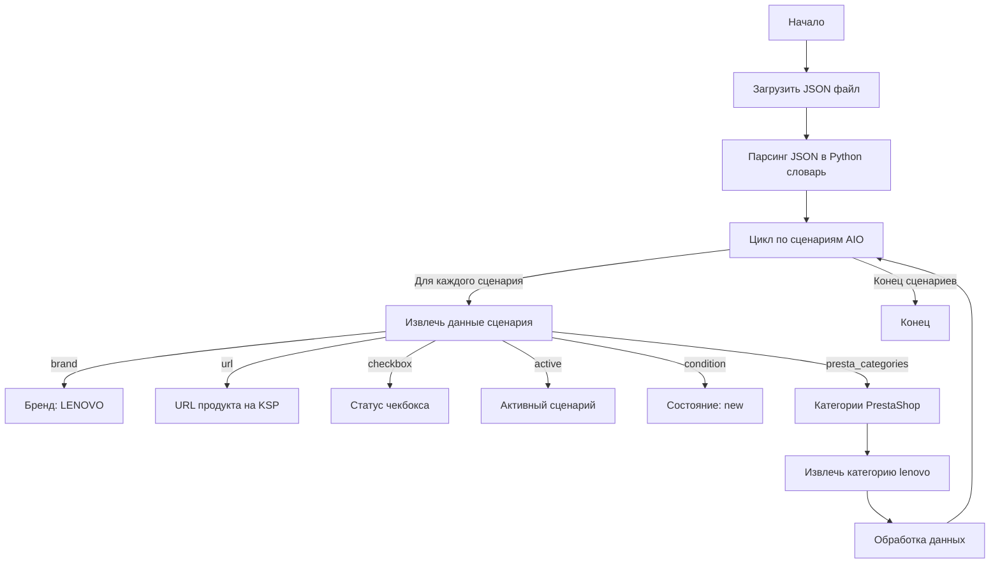

## АНАЛИЗ КОДА

### 1. <алгоритм>

**Общая схема обработки данных:**

1.  **Начало**: Загрузка JSON-файла.
2.  **Разбор JSON**: Преобразование JSON-данных в структуру Python (словарь).
3.  **Итерация по сценариям**: Проход по всем сценариям, представленным в ключе "scenarios". Каждый сценарий представляет собой модель AIO (All-In-One) компьютера Lenovo.
4.  **Извлечение данных для каждого сценария**: Для каждого сценария извлекаются данные, такие как:
    *   `brand` (строка): Бренд устройства ("LENOVO").
    *   `url` (строка): URL-адрес страницы продукта на сайте KSP.
    *   `checkbox` (логическое значение): Указывает, должен ли быть чекбокс выбран по умолчанию.
    *   `active` (логическое значение): Указывает, активен ли сценарий.
    *   `condition` (строка): Состояние продукта ("new").
    *  `presta_categories` (словарь): Категория продукта для использования в PrestaShop.
5.  **Преобразование данных**: Данные преобразуются, например, извлечение категории `lenovo` из  `presta_categories`.
6.  **Хранение данных**: Данные используются для конфигурации процесса импорта данных или других целей.
7. **Конец**: Данные обработаны.

**Примеры для каждого блока:**

*   **Начало**: JSON-файл `ksp_categories_aio_lenovo.json`.
*   **Разбор JSON**: Данные из файла преобразуются в словарь Python:
    ```python
    {
        "scenarios": {
            "IdeaCentre AIO 3-24ITL": {
                "brand": "LENOVO",
                "url": "https://ksp.co.il/web/cat/1513..159..28794",
                "checkbox": False,
                "active": True,
                "condition": "new",
                "presta_categories": {
                    "template": {"lenovo": "IdeaCentre 24"}
                }
            },
            # ... остальные сценарии ...
        }
    }
    ```
*   **Итерация по сценариям**: Цикл проходит по ключам словаря "scenarios": `"IdeaCentre AIO 3-24ITL"`, `"IdeaCentre AIO 3-24IAP7"`, и т.д.
*   **Извлечение данных для каждого сценария**: Для сценария `"IdeaCentre AIO 3-24ITL"` извлекаются:
    *   `brand = "LENOVO"`
    *   `url = "https://ksp.co.il/web/cat/1513..159..28794"`
    *   `checkbox = False`
    *   `active = True`
    *   `condition = "new"`
     *  `presta_categories = {"template": {"lenovo": "IdeaCentre 24"}}`
*   **Преобразование данных**: Из `presta_categories` извлекается значение `"IdeaCentre 24"` для ключа `"lenovo"`.
*  **Хранение данных**: Извлеченные данные могут использоваться для создания объектов, записей в базе данных и других задач.
*   **Конец**: Обработаны все сценарии.

### 2. <mermaid>



**Объяснение диаграммы:**

*   `Start`: Начало процесса.
*   `LoadJSON`: Загрузка JSON файла с данными о сценариях.
*   `ParseJSON`: Парсинг загруженного JSON файла в Python словарь для дальнейшей обработки.
*    `LoopScenarios`: Цикл по каждому сценарию AIO компьютера, описанному в JSON.
*   `ExtractData`: Извлечение данных каждого сценария.
    *   `Brand`: Переменная, хранящая бренд (всегда "LENOVO" в данном случае).
    *    `URL`: URL-адрес страницы продукта на сайте KSP.
    *   `CheckboxStatus`: Статус чекбокса (True/False).
    *   `ActiveStatus`: Статус активности сценария (True/False).
     * `Condition`: Состояние продукта (всегда "new").
    *   `PrestaCategories`: Словарь, содержащий категории для PrestaShop.
*  `ExtractCategory`: Извлечение категории, специфичной для lenovo из PrestaCategories.
*   `ProcessData`: Обработка данных для дальнейшего использования.
*  `LoopScenarios`: Возвращение к началу цикла для обработки следующего сценария, пока не будут обработаны все сценарии.
*   `End`: Конец процесса.

### 3. <объяснение>

**Импорты:**
В данном коде нет импортов, так как это JSON-файл, а не Python скрипт.

**Классы:**
В данном коде нет классов.

**Функции:**
В данном коде нет функций.

**Переменные:**
* `scenarios` (словарь): Ключ верхнего уровня, содержащий все сценарии.
*  `IdeaCentre AIO 3-24ITL`, `IdeaCentre AIO 3-24IAP7`, `IdeaCentre AIO 5-24IOB`, `IdeaCentre AIO 3-27ITL`, `IdeaCentre AIO 3-27IAP7`, `IdeaCentre AIO 5-27IOB`, `Yoga AIO 7 27ACH6` (ключи словаря): Представляют собой модели AIO компьютеров Lenovo.
* `brand` (строка): Бренд устройства (всегда "LENOVO").
* `url` (строка): URL-адрес страницы продукта на сайте KSP.
* `checkbox` (логическое значение): Указывает, должен ли быть чекбокс выбран по умолчанию.
* `active` (логическое значение): Указывает, активен ли сценарий.
* `condition` (строка): Состояние продукта ("new").
* `presta_categories` (словарь): Категории продукта для использования в PrestaShop.
*   `template` (словарь): Шаблон для определения категории.
*  `lenovo` (ключ): Категория lenovo в PrestaShop.

**Объяснение:**

Этот JSON-файл представляет собой конфигурационный файл, который содержит информацию о различных моделях AIO компьютеров Lenovo, которые нужно обработать. Он включает в себя:
*   **Бренд:** Все модели относятся к бренду "LENOVO".
*   **URL-адреса:** Каждая модель имеет уникальный URL-адрес на сайте KSP, что позволяет получить данные конкретного продукта.
*   **Параметры сценария:** Параметры `checkbox` и `active` позволяют контролировать состояние каждого сценария.
*   **Категории PrestaShop:** `presta_categories` используются для определения, в какую категорию PrestaShop поместить продукт.

**Цепочка взаимосвязей с другими частями проекта:**

Этот файл является частью конфигурации для процесса импорта данных. Он используется для:
1. **Идентификация продуктов:** Определяет, какие модели AIO компьютеров Lenovo необходимо обрабатывать.
2. **Получение данных:** URL-адреса используются для загрузки данных с сайта KSP.
3. **Настройка категорий:** Определяет, к какой категории PrestaShop отнести каждый продукт.
4. **Фильтрация продуктов:** Сценарии могут быть включены или отключены через параметр `active`.

**Потенциальные ошибки или области для улучшения:**

*   **Ограничение на бренд**: В текущем варианте все сценарии настроены только для бренда LENOVO.  Если понадобится добавить другие бренды, потребуется изменить структуру файла или добавить дополнительные сценарии.
*   **Жестко закодированные значения**: Все поля `condition` имеют значение "new". Возможно, в будущем потребуется поддерживать другие состояния, например, "used", "refurbished", и т.д.
*  **Зависимость от структуры сайта KSP**: Если структура сайта KSP изменится, потребуется корректировать URL-адреса.
*  **Отсутствие валидации данных**: Нет проверки на корректность данных, таких как URL, `checkbox`, `active` и `presta_categories`.
*  **Шаблон категорий**: На данный момент категория жестко задана `"template": { "lenovo": "IdeaCentre 24" }`. В дальнейшем может понадобится более сложная логика определения категорий.

**Дополнение**
Данный файл является частью большей системы, где он будет загружен и обработан программным кодом, вероятно, на Python. Этот код будет использовать эти данные для извлечения информации о товарах с сайта KSP и импорта их в PrestaShop.