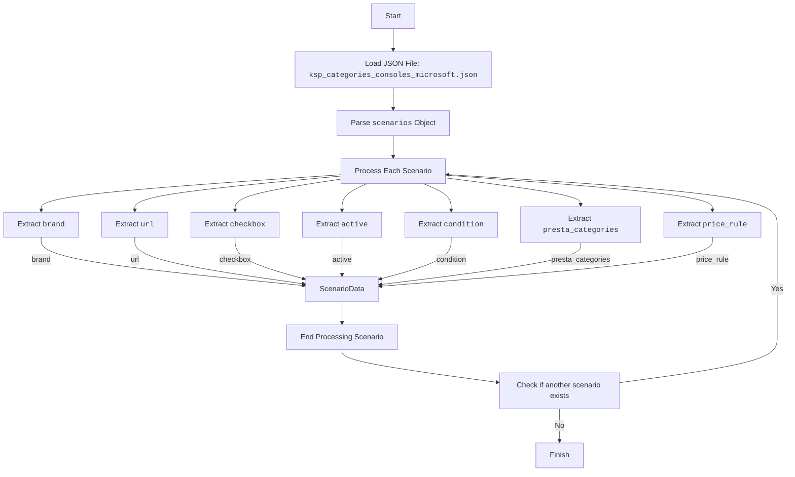

## АНАЛИЗ JSON КОДА

### 1. <алгоритм>

Данный JSON файл представляет собой конфигурационный файл для парсинга данных о консолях Microsoft с веб-сайта KSP. Он содержит раздел "scenarios", который определяет наборы параметров для парсинга отдельных товаров.

**Блок-схема:**

1. **Начало:**
   - JSON файл загружается.

2. **Разбор корневого объекта `scenarios`:**
    -   Итерируемся по ключам внутри объекта `scenarios`, где каждый ключ представляет собой название консоли (например, "Xbox Series X").

3. **Обработка каждого сценария:**
    - Для каждого ключа (названия консоли) из `scenarios`, извлекается соответствующий объект.
    - Объект содержит информацию о бренде (`brand`), URL (`url`), флаг `checkbox`, флаг `active`, условие (`condition`) категории для PrestaShop (`presta_categories`) и правило цены (`price_rule`).
        -  **Пример:**
            -   Для "Xbox Series X": `"brand": "MICROSOFT"`, `"url": "https://ksp.co.il/web/cat/219..255..15733..9335"`, `"checkbox": false`, `"active": true`, `"condition":"new"`, `"presta_categories": { "template": { "microsoft": "Xbox Series X" } }`, `"price_rule": 1`.
            -   Для "Xbox Series S": `"brand": "MICROSOFT"`, `"url": "https://ksp.co.il/web/cat/219..255..15734..9335"`, `"checkbox": false`, `"active": true`, `"condition":"new"`, `"presta_categories": { "template": { "microsoft": "Xbox Series S" } }`, `"price_rule": 1`.

4. **Значения параметров:**
   -   `brand`: Идентификатор бренда (в данном случае "MICROSOFT").
   -   `url`: URL-адрес страницы категории товара на сайте KSP.
   -   `checkbox`: Флаг для использования чекбокса (в данном случае всегда `false`).
   -   `active`: Флаг, указывающий, что сценарий активен (в данном случае всегда `true`).
   -  `condition`: Условие товара (в данном случае всегда "new").
   -   `presta_categories`:  Объект, определяющий соответствие категории на сайте KSP и в PrestaShop.
        - `"template"`: шаблон для маппинга категорий, в нашем случае - название бренда и модели консоли.
   -   `price_rule`: Идентификатор правила ценообразования.

5.  **Конец:** Обработка всех сценариев завершена.

### 2. <mermaid>

**Объяснение `mermaid` диаграммы:**

-   `Start`: Начало процесса разбора JSON файла.
-   `LoadJSON`: Загрузка JSON файла `ksp_categories_consoles_microsoft.json`.
-   `ParseScenarios`: Разбор объекта `scenarios`, являющегося корневым элементом JSON файла.
-   `ProcessScenario`: Блок, представляющий обработку каждого отдельного сценария (например, "Xbox Series X", "Xbox Series S").
-   `ExtractBrand`, `ExtractURL`, `ExtractCheckbox`, `ExtractActive`, `ExtractCondition`, `ExtractPrestaCategories`, `ExtractPriceRule`: Извлечение соответствующих полей из объекта сценария.
-   `ScenarioData`:  Сохранение извлеченных данных из каждого сценария.
-    `End`: Конец обработки текущего сценария.
-   `CheckNextScenario`: Проверка, есть ли еще сценарии для обработки.
-   `Finish`: Конец обработки JSON файла.

Диаграмма отражает последовательность операций разбора JSON файла и извлечения данных для каждого сценария.

### 3. <объяснение>

**Импорты:**

В данном файле нет импортов. Это конфигурационный файл, а не исполняемый код.

**Классы:**

В файле нет классов, это JSON-конфигурация.

**Функции:**

В файле нет функций. Это конфигурационный файл.

**Переменные:**

-   `scenarios`: Объект, содержащий набор сценариев для парсинга консолей Microsoft.
    -   Тип: `object` (словарь/ассоциативный массив).
    -   Использование: Ключи объекта — названия консолей (например, "Xbox Series X"). Значения — объекты, содержащие параметры парсинга.
-   `brand`: Строка, представляющая бренд товара.
    -   Тип: `string`.
    -   Использование: Значение "MICROSOFT".
-   `url`: Строка, содержащая URL-адрес страницы категории товара на сайте KSP.
    -   Тип: `string`.
    -   Использование: URL для парсинга товаров.
-   `checkbox`: Логическое значение, определяющее использование чекбокса.
    -   Тип: `boolean`.
    -   Использование: Всегда `false`.
-   `active`: Логическое значение, определяющее, активен ли сценарий.
    -   Тип: `boolean`.
    -   Использование: Всегда `true`.
-   `condition`:  Строка, представляющая условие товара
    -   Тип: `string`
    -   Использование: Всегда `"new"`
-   `presta_categories`: Объект, определяющий соответствие категории на сайте KSP и в PrestaShop.
    - Тип: `object`.
    - Использование: Маппинг категорий товаров.
    -   `template`:  Шаблон для сопоставления категорий
        -   Тип: `object`.
        -   Использование:  Сопоставление, например, `microsoft: "Xbox Series X"`.
-   `price_rule`: Целое число, представляющее правило ценообразования.
    -   Тип: `integer`.
    -   Использование: Идентификатор правила ценообразования.

**Объяснение:**

Этот JSON-файл является конфигурационным файлом, который описывает, как парсить данные с сайта KSP для консолей Microsoft. Каждый сценарий внутри объекта `scenarios` представляет собой конфигурацию для определенной консоли. Параметры, такие как `url`, `brand`, `presta_categories`, определяют логику парсинга и маппинг данных.

**Взаимосвязь с другими частями проекта:**

Данный файл предназначен для использования модулем парсинга (или другим компонентом, отвечающим за сбор данных) в проекте `hypotez`. Этот файл определяет URL-адреса, бренды, категории и другие настройки, необходимые для извлечения данных с сайта KSP, а затем эти данные, скорее всего, будут использоваться для добавления или обновления товаров в системе PrestaShop.

**Возможные улучшения:**

1.  **Универсализация:** Можно сделать более универсальным, добавив возможность задавать параметры парсинга (например, селекторы CSS) для каждого сценария, а не только URL и категории.
2.  **Валидация:** Можно добавить схему JSON Schema для валидации содержимого файла. Это позволит гарантировать, что файл соответствует ожидаемой структуре и типам данных.
3. **Поддержка различных условий**:  Можно добавить поддержку для товаров с различными условиями (например, "used", "refurbished").
4. **Добавление других параметров**: Можно добавить другие параметры в каждый сценарий, например, `discount_percent` для расчета скидок.
5. **Расширение категорий**:  Можно расширить шаблон для категорий, добавив дополнительные уровни вложенности для более точного определения категорий в PrestaShop.

Этот анализ предоставляет полное представление о функциональности и использовании данного JSON-файла.