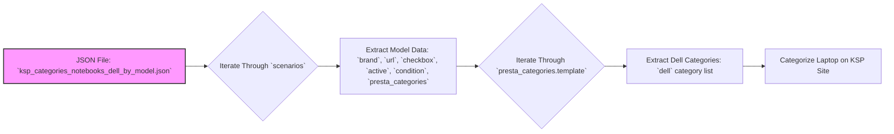
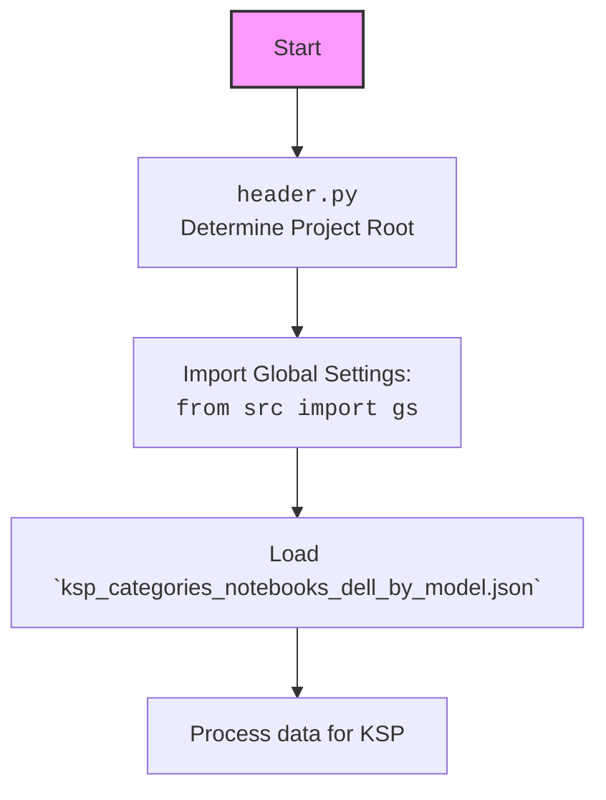

## Анализ кода `ksp_categories_notebooks_dell_by_model.json`

### 1. <алгоритм>

Файл `ksp_categories_notebooks_dell_by_model.json` представляет собой JSON-объект, содержащий конфигурационные данные для категоризации ноутбуков Dell на сайте KSP.  Он организован в виде словаря `scenarios`, где каждый ключ представляет собой модель ноутбука, а значение — словарь с информацией о данной модели.

**Блок-схема:**

```mermaid
graph LR
    A[Начало: Загрузка JSON] --> B{Для каждой модели ноутбука в `scenarios`}
    B -- Да --> C[Получение данных модели: `brand`, `url`, `checkbox`, `active`, `condition`, `presta_categories`]
    C --> D{Для каждой категории в `presta_categories.template`}
    D -- Да --> E[Получение списка категорий для бренда dell]
    E --> F[Использование списка категорий для категоризации на сайте KSP]
    D -- Нет --> B
    B -- Нет --> G[Конец]
    
    style A fill:#f9f,stroke:#333,stroke-width:2px
    style G fill:#ccf,stroke:#333,stroke-width:2px

    subgraph "Пример итерации для 'Vostro 13 5000 5301 Intel Core i5 - G'"
    C1[Данные модели:<br> `brand`: "DELL",<br> `url`: "https://ksp.co.il/web/cat/271..132..33047..5394", <br> ... ,<br>  `presta_categories`: { "template": { "dell": ["LAPTOPS INTEL I3", "13"]}}]
    C --> C1
    D1[Категория в `presta_categories.template`: `dell`]
    C1 --> D1
    E1[Список категорий: ["LAPTOPS INTEL I3", "13"]]
    D1 --> E1
    F1[Категоризация "Vostro 13 5000 5301 Intel Core i5 - G" как "LAPTOPS INTEL I3" и "13"]
    E1 --> F1
    end
```

**Пример:**

Для модели `"Vostro 13 5000 5301 Intel Core i5 - G"`:
1.  Извлекаются данные: `brand = "DELL"`, `url = "https://ksp.co.il/web/cat/271..132..33047..5394"`, `presta_categories` и т.д.
2.  Из `presta_categories.template` извлекается список категорий `["LAPTOPS INTEL I3", "13"]` для ключа `dell`.
3.  Эти категории используются для категоризации продукта на сайте KSP.

### 2. <mermaid>



**Объяснение зависимостей:**

*   **JSON File:** `ksp_categories_notebooks_dell_by_model.json` - это основной файл, из которого извлекаются все данные о моделях ноутбуков и их категориях. Он является отправной точкой процесса.
*   **Iterate Through `scenarios`**: Этот шаг представляет итерацию по ключам (моделям ноутбуков) внутри объекта `scenarios`.
*   **Extract Model Data**: На этом шаге извлекаются общие данные для каждой модели (бренд, URL, активность и т.д.)
*   **Iterate Through `presta_categories.template`**:  Происходит итерация по ключам внутри `presta_categories.template` (в данном случае всегда будет ключ `dell`).
*   **Extract Dell Categories**: Извлекается список категорий для бренда Dell (например, `["LAPTOPS INTEL I3", "13"]`).
*   **Categorize Laptop on KSP Site**:  Финальный шаг, где извлеченные категории используются для категоризации ноутбука на сайте KSP.

### 3. <объяснение>

**Импорты**:

В данном файле импортов нет, так как это JSON, а не Python файл. Он служит для хранения данных, которые будут использоваться в другом коде.

**Классы**:

В данном файле нет классов, так как это JSON, а не Python файл.

**Функции**:

В данном файле нет функций, так как это JSON, а не Python файл.

**Переменные**:

*   `scenarios` (словарь):  Содержит данные о каждой модели ноутбука. Ключи - это названия моделей (например, `"Vostro 13 5000 5301 Intel Core i5 - G"`), значения - словари с информацией о моделях.
    *   `brand` (строка): Бренд ноутбука, например `"DELL"`.
    *   `url` (строка): URL-адрес страницы ноутбука на сайте KSP.
    *   `checkbox` (логический тип): Указывает, должен ли быть чекбокс активен (всегда `false` в предоставленном фрагменте).
    *   `active` (логический тип):  Указывает, активна ли модель для обработки (всегда `true` в предоставленном фрагменте).
    *   `condition` (строка): Состояние товара, например, `"new"`.
    *   `presta_categories` (словарь): Содержит информацию о категориях.
        *   `template` (словарь):  Содержит шаблон категорий.
            *    `dell` (список строк):  Список категорий PrestaShop для модели ноутбука, например, `["LAPTOPS INTEL I3", "13"]`.

**Объяснение:**

JSON файл `ksp_categories_notebooks_dell_by_model.json` служит для хранения данных о моделях ноутбуков Dell, которые будут использоваться для автоматической категоризации товаров на сайте KSP. Каждая модель имеет связанный с ней URL, флаги активности и состояния, а также список категорий, в которые она должна быть помещена.

**Потенциальные ошибки и области для улучшения:**

1.  **Дублирование URL**: В файле несколько моделей имеют одинаковые URL. Это может быть ошибкой или, наоборот, это может быть несколько моделей с одинаковой страницей товара на сайте.
2.  **Статический шаблон**: Категории определены статически внутри файла.  В будущем потребуется более гибкий механизм (например, основанный на базе данных) для управления категориями, особенно если их структура может меняться.
3.  **Жесткая привязка к бренду**: Шаблон `dell` внутри `presta_categories` предполагает, что файл предназначен только для моделей Dell.  В будущем, если появится необходимость категоризировать ноутбуки других производителей, может потребоваться реструктуризация файла.
4. **Отсутствует валидация**: Отсутствует проверка корректности URL, наличия нужных полей.

**Взаимосвязи с другими частями проекта:**

Этот JSON файл будет использоваться в коде Python, который отвечает за обработку данных и отправку запросов на сайт KSP. Он может быть частью модуля `suppliers/ksp`, который отвечает за обработку данных с сайта KSP. Предполагается что при работе используется `src/header.py` и `src/gs.py` для глобальных настроек.



В коде `header.py` будет определен путь до корня проекта, далее будут импортированы глобальные настройки из `gs.py`. И затем на основе настроек будет загружен `ksp_categories_notebooks_dell_by_model.json`. Далее будет происходить обработка данных.