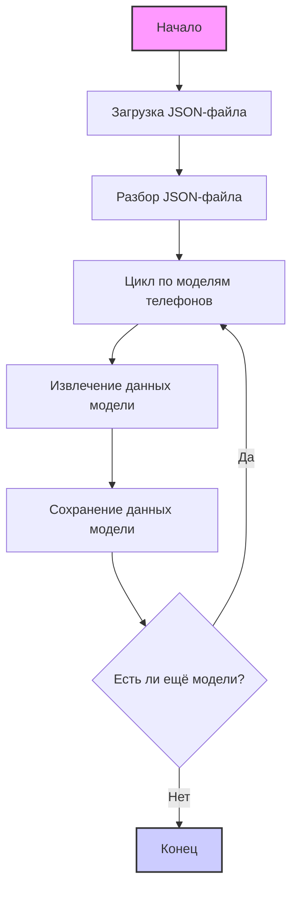

## <алгоритм>
1.  **Начало:** JSON-файл представляет собой структуру данных, содержащую конфигурации для различных моделей телефонов OPPO.

2.  **Объект `scenarios`:** Ключом является `scenarios`, который содержит в себе объект, где каждый ключ представляет собой название модели телефона OPPO (например, "Oppo A74", "Oppo A93").

3.  **Модель телефона (например, "Oppo A74"):** Каждая модель телефона содержит следующие атрибуты:
    *   `brand`: Строка, обозначающая бренд телефона, всегда "OPPO" в этом файле.
    *   `url`: Строка, представляющая URL-адрес страницы товара на сайте KSP.
    *   `checkbox`: Логическое значение, указывающее, выбран ли данный товар (всегда `false` в данном файле).
    *   `active`: Логическое значение, определяющее, активен ли данный товар для обработки (всегда `true` в этом файле).
    *   `condition`: Строка, указывающая состояние товара, всегда "new" в данном файле.
    *   `presta_categories`: Объект, содержащий шаблон категории для PrestaShop.
        *   `template`: Объект, который содержит связывание (mapping) бренда "oppo" с конкретным именем модели для PrestaShop.

4.  **Обход сценариев:** При обработке JSON-файла, система будет последовательно обходить каждый сценарий (каждую модель телефона) внутри объекта `scenarios`.

5.  **Извлечение данных:** Для каждой модели, программа будет извлекать значения атрибутов `brand`, `url`, `checkbox`, `active`, `condition` и `presta_categories`.

6.  **Использование данных:** Извлеченные данные могут быть использованы для:
    *   Сбора информации о товарах OPPO на сайте KSP.
    *   Автоматизации обновления каталога товаров в PrestaShop, связывая товары KSP с категориями PrestaShop.

## <mermaid>

**Зависимости:**
   - Диаграмма не имеет импортов, так как она описывает структуру JSON-файла, а не код.
   - В данном контексте подразумевается, что существует какой-то код, который читает этот JSON и обрабатывает данные.
   - Для анализа данных из JSON, потребуется библиотека для парсинга JSON (например, `json` в Python).

## <объяснение>
**Импорты:**
   - В данном файле нет импортов, так как это JSON-файл, а не Python или другой файл с кодом.

**Классы:**
   - В данном файле нет классов, так как это JSON-файл, а не Python или другой файл с кодом.

**Функции:**
   - В данном файле нет функций, так как это JSON-файл, а не Python или другой файл с кодом.

**Переменные:**

   - **`scenarios`**: Объект JSON, содержащий все сценарии (модели телефонов).
   - **`Oppo A74`, `Oppo A93`, ... , `Oppo Find X5 PRO`**: Ключи внутри `scenarios`, представляющие конкретные модели телефонов. Каждый из них содержит объект с данными модели.
       -   **`brand`**: Строка (тип `str`), представляющая бренд телефона ("OPPO").
       -   **`url`**: Строка (тип `str`), представляющая URL-адрес страницы товара на сайте KSP.
       -   **`checkbox`**: Логическое значение (тип `bool`), указывающее, выбран ли товар (всегда `false`).
       -   **`active`**: Логическое значение (тип `bool`), указывающее, активен ли товар (всегда `true`).
       -   **`condition`**: Строка (тип `str`), представляющая состояние товара ("new").
       -   **`presta_categories`**: Объект, содержащий шаблон категории для PrestaShop.
            -   **`template`**: Объект, содержащий связывание бренда "oppo" с именем модели для PrestaShop. Например: `"oppo": "OPPO A74"`.

**Объяснение:**

Данный JSON-файл служит для настройки сценариев обработки товаров бренда OPPO с сайта KSP. Он задает соответствия между конкретными моделями телефонов OPPO на сайте KSP и их категориями в PrestaShop.

*   **Назначение:** Файл предназначен для автоматизации процесса сбора данных о товарах с сайта KSP и их импорта или синхронизации с системой управления контентом PrestaShop. Это позволяет поддерживать актуальность каталога товаров, своевременно добавлять или обновлять информацию о телефонах OPPO.

*   **Пример использования:** Программа, читающая этот JSON-файл, могла бы:
    1.  Парсить JSON, получив объект `scenarios`.
    2.  Перебирать ключи объекта `scenarios` (например, `"Oppo A74"`).
    3.  Для каждого ключа извлекать `url` (для доступа к странице товара KSP) и `presta_categories.template.oppo` (для определения категории PrestaShop).
    4.  Использовать URL для сбора данных о товаре (например, название, цена, описание) и сопоставить эти данные с категорией PrestaShop, взятой из шаблона.
    5.  Импортировать или обновлять товары в PrestaShop.

**Потенциальные ошибки и области для улучшения:**
*   **Отсутствие обработки ошибок:** В коде, который использует этот JSON, нужно предусмотреть обработку ошибок, связанных, например, с некорректным URL или отсутствием нужных полей.
*   **Жесткое кодирование:** Всегда заданный `checkbox: false`, `active: true` и `condition: "new"` может быть изменен в будущем. Лучше предоставить возможность их динамического изменения.
*   **Масштабируемость:** Для большого количества моделей имеет смысл использовать более структурированное хранение категорий. Например, внешний файл или БД.
*  **Отсутствие динамической настройки**: Сейчас конфигурация жестко задана. Для более гибкого управления конфигурацией можно использовать внешние конфигурационные файлы или базу данных.

**Взаимосвязь с другими частями проекта:**
*   Файл является конфигурацией для модуля интеграции KSP и PrestaShop.
*   Он будет использоваться модулем, который читает HTML со страниц KSP (через URL), извлекает оттуда данные о товарах и затем импортирует их в PrestaShop, используя  `presta_categories`.
*   Этот файл будет читаться и парситься в соответствующем модуле на Python, возможно, с использованием библиотеки `json`.