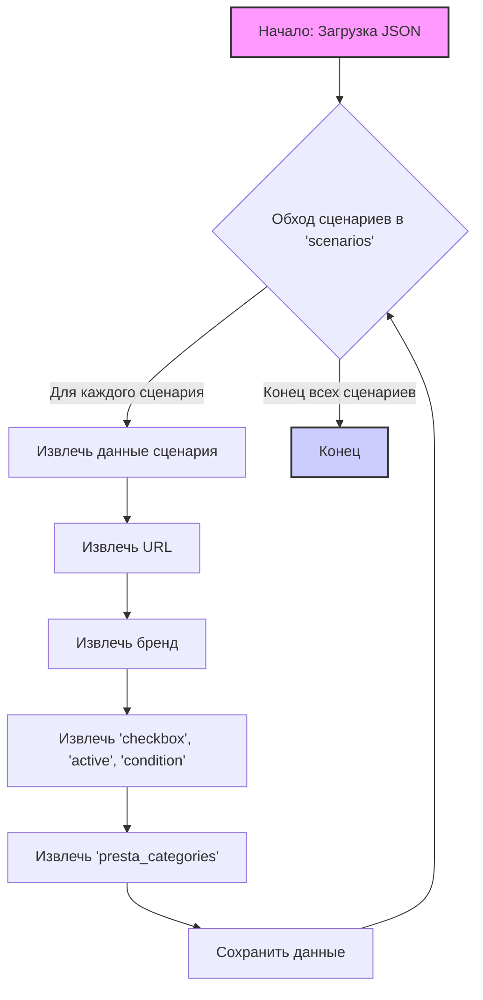

## ИНСТРУКЦИЯ:

Анализируй предоставленный код подробно и объясни его функциональность. Ответ должен включать три раздела:

1.  **<алгоритм>**: Опиши рабочий процесс в виде пошаговой блок-схемы, включая примеры для каждого логического блока, и проиллюстрируй поток данных между функциями, классами или методами.
2.  **<mermaid>**: Напиши код для диаграммы в формате `mermaid`, проанализируй и объясни все зависимости,
    которые импортируются при создании диаграммы.
    **ВАЖНО!** Убедитесь, что все имена переменных, используемые в диаграмме `mermaid`,
    имеют осмысленные и описательные имена. Имена переменных вроде `A`, `B`, `C`, и т.д., не допускаются!

    **Дополнительно**: Если в коде есть импорт `import header`, добавьте блок `mermaid` flowchart, объясняющий `header.py`:
    ```mermaid
    flowchart TD
        Start --> Header[<code>header.py</code><br> Determine Project Root]

        Header --> import[Import Global Settings: <br><code>from src import gs</code>]
    ```

3.  **<объяснение>**: Предоставьте подробные объяснения:
    -   **Импорты**: Их назначение и взаимосвязь с другими пакетами `src.`.
    -   **Классы**: Их роль, атрибуты, методы и взаимодействие с другими компонентами проекта.
    -   **Функции**: Их аргументы, возвращаемые значения, назначение и примеры.
    -   **Переменные**: Их типы и использование.
    -   Выделите потенциальные ошибки или области для улучшения.

Дополнительно, постройте цепочку взаимосвязей с другими частями проекта (если применимо).

Это обеспечивает всесторонний и структурированный анализ кода.
## Формат ответа: `.md` (markdown)
**КОНЕЦ ИНСТРУКЦИИ**

## <алгоритм>

1.  **Начало**: Загрузка JSON-файла. Этот JSON файл представляет собой структуру данных для категорий часов Garmin, содержащую различные сценарии (например, EPIX, Fenix 6, Fenix 7 и т.д.)
2.  **Обработка сценариев**: Проход по каждому сценарию в корневом объекте `scenarios`.
   * **Получение данных сценария:** На каждом шаге извлекаются данные конкретного сценария (например, для `EPIX` извлекаются значения для `brand`, `url`, `checkbox`, `active`, `condition` и `presta_categories`).
   * **Извлечение URL:** Извлекается URL-адрес. Пример: `https://ksp.co.il/web/cat/2085..2160..33807` для `EPIX`.
   * **Извлечение Бренда:** Извлекается бренд. Пример: `GARMIN` для всех сценариев.
   * **Извлечение настроек:** Извлекаются значения `checkbox`, `active` и `condition`.
      * `checkbox`: `false`
      * `active`: `true`
      * `condition`: `"new"`
  * **Извлечение категорий Presta:** Извлекается словарь `presta_categories`, который сопоставляет идентификаторы категорий с их именами.
   *   Пример:
      ```json
         "presta_categories": {
        "3405": "GOOGLE PIXEL PRO",
        "3198": "CONSUMER ELECTRONICS",
        "3202": "computer,smartphone,gaming console,smart device",
        "6471": "Smartphones",
        "3403": "GOOGLE"
         }
      ```
3.  **Хранение данных**: Все извлеченные данные сохраняются в структуру, которая используется в последующих этапах обработки (например, для скрапинга или для сопоставления категорий).
4.  **Конец**: После обработки всех сценариев, процесс завершается.

## <mermaid>


**Объяснение зависимостей в mermaid диаграмме:**

Диаграмма описывает поток обработки данных из JSON-файла.

*   **Начало: Загрузка JSON** `(A)`: Начальная точка процесса, подразумевает чтение данных из JSON-файла.
*   **Обход сценариев в 'scenarios'** `(B)`: Цикл, который проходит по каждому сценарию, определенному в корневом объекте `scenarios`.
*   **Извлечь данные сценария** `(C)`: Извлечение данных для текущего сценария (например, для EPIX).
*   **Извлечь URL** `(D)`: Извлекает URL адрес для текущего сценария.
*   **Извлечь бренд** `(E)`: Извлекает бренд для текущего сценария.
*   **Извлечь 'checkbox', 'active', 'condition'** `(F)`: Извлекает значения для ключей `checkbox`, `active` и `condition` для текущего сценария.
*   **Извлечь 'presta_categories'** `(G)`: Извлекает словарь `presta_categories` для текущего сценария.
*   **Сохранить данные** `(H)`: Сохранение извлеченных данных в некоторую структуру данных.
*   **Конец** `(I)`: Завершение процесса обработки после обработки всех сценариев.

## <объяснение>

**Общая структура:**

Этот JSON-файл содержит конфигурации для скрапинга и категоризации товаров Garmin. Структура включает в себя объект `scenarios`, который содержит несколько сценариев. Каждый сценарий описывает конкретную линейку товаров Garmin (например, EPIX, Fenix 6) и включает в себя:

*   `brand`: Бренд товара, в данном случае всегда "GARMIN".
*   `url`: URL-адрес страницы на сайте KSP, где расположены товары.
*   `checkbox`: Булево значение, указывающее на необходимость использования чекбокса (в данном случае всегда `false`).
*   `active`: Булево значение, указывающее, активен ли сценарий (в данном случае всегда `true`).
*   `condition`: Состояние товара, в данном случае всегда `"new"`.
*   `presta_categories`: Словарь, сопоставляющий ID категорий PrestaShop с их названиями. Эти категории, по всей видимости, нужны для дальнейшей категоризации товаров в системе PrestaShop.

**Импорты:**

В данном коде импорты отсутствуют, так как это JSON-файл.

**Классы:**

Этот код не содержит классов, это просто данные в формате JSON.

**Функции:**

Этот код не содержит функций.

**Переменные:**

Переменные в этом контексте - это ключи и значения в JSON-структуре.
* `"scenarios"`: корневой объект, содержащий все сценарии.
* `"EPIX"`, `"Fenix 6"`, `"Fenix 7"` и др.: Ключи объектов, представляющие конкретные сценарии сбора данных.
* `"brand"`: Строка, представляющая бренд товара.
* `"url"`: Строка, представляющая URL-адрес страницы с товарами.
* `"checkbox"`: Булево значение, указывающее, нужно ли использовать чекбокс.
* `"active"`: Булево значение, указывающее, активен ли сценарий.
* `"condition"`: Строка, представляющая состояние товара.
* `"presta_categories"`: Словарь, сопоставляющий идентификаторы категорий с их именами.

**Потенциальные ошибки и области для улучшения:**

*   **Повторение `presta_categories`:** Во всех сценариях `presta_categories` повторяется. Это может быть избыточно, если нет различий в категориях для разных линеек товаров. Можно вынести это в отдельный блок, если это применимо в контексте проекта.
*   **Жестко заданные условия:** Значения `checkbox`, `active` и `condition` для всех сценариев одинаковы. Возможно, следует рассмотреть возможность сделать их более динамическими.
*   **Отсутствие валидации URL:** Нет валидации URL-адресов, что может привести к проблемам при использовании некорректных URL.
*   **Отсутствие описания:** Нет описания в самом JSON, которое объясняло бы предназначение сценария, что затрудняет понимание его назначения при просмотре файла.

**Взаимосвязи с другими частями проекта:**

Этот JSON-файл, скорее всего, используется как конфигурационный файл для других частей проекта, таких как:

1.  **Веб-скрапер:** URL-адреса используются для скрапинга информации о товарах с сайта KSP.
2.  **Категоризатор:** `presta_categories` используется для сопоставления товаров с категориями PrestaShop.
3.  **Система управления товарами:** Полученные данные могут быть использованы для обновления базы данных товаров.

**Заключение:**

Этот JSON-файл предоставляет структурированные данные для автоматизации сбора данных и категоризации товаров Garmin. Он содержит необходимую информацию, но имеет ряд областей, которые можно улучшить для повышения гибкости и уменьшения избыточности.