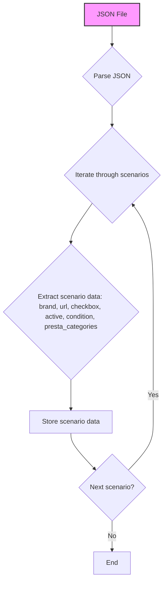

## АНАЛИЗ КОДА

### 1. <алгоритм>

Данный JSON-файл представляет собой конфигурационный файл, описывающий сценарии для парсинга товаров категории "умные часы" от бренда Xiaomi на сайте KSP.

**Блок-схема:**

```mermaid
graph LR
    A[Начало] --> B{Разбор JSON-файла};
    B --> C{Обход ключей "scenarios"};
    C --> D{Для каждого сценария};
    D --> E{Извлечение "brand"};
    E --> F{Извлечение "url"};
    F --> G{Извлечение "checkbox"};
    G --> H{Извлечение "active"};
    H --> I{Извлечение "condition"};
    I --> J{Извлечение "presta_categories"};
    J --> K{Сохранение данных сценария};
    K --> L{Следующий сценарий?};
    L -- Да --> D;
    L -- Нет --> M[Конец];
```

**Примеры:**

*   **Блок B (Разбор JSON-файла):**
    JSON-файл загружается и преобразуется в структуру данных, доступную для дальнейшей обработки.
*   **Блок D (Для каждого сценария):**
    Например, на первом шаге обрабатывается сценарий `"Xiaomi Redmi Watch"`.
*   **Блок E (Извлечение "brand"):**
    Для сценария `"Xiaomi Redmi Watch"` извлекается значение `"XIAOMI"`.
*   **Блок F (Извлечение "url"):**
    Для сценария `"Xiaomi Redmi Watch"` извлекается значение `"https://ksp.co.il/web/cat/2085..2202..34255"`.
*   **Блок J (Извлечение "presta_categories"):**
    Для сценария `"Xiaomi Redmi Watch"` извлекается словарь `{"3405": "GOOGLE PIXEL PRO", "3198": "CONSUMER ELECTRONICS", "3202": "computer,smartphone,gaming console,smart device", "6471": "Smartphones", "3403": "GOOGLE"}`.
*   **Блок K (Сохранение данных сценария):**
    Все извлеченные данные для сценария `"Xiaomi Redmi Watch"` сохраняются в некоторую структуру данных (например, в словаре Python).

### 2. <mermaid>



**Объяснение:**

*   `A[JSON File]`:  Представляет входной JSON-файл.
*   `B{Parse JSON}`:  Обозначает операцию разбора JSON-файла, преобразование его в структуру данных.
*   `C{Iterate through scenarios}`:  Представляет цикл обхода всех сценариев, представленных в JSON-файле.
*   `D{Extract scenario data: brand, url, checkbox, active, condition, presta_categories}`: Обозначает процесс извлечения данных для каждого конкретного сценария. Включает извлечение таких полей как `brand`, `url`, `checkbox`, `active`, `condition` и `presta_categories`.
*   `E[Store scenario data]`: Обозначает сохранение извлеченных данных сценария.
*   `F{Next scenario?}`: Условный оператор проверки, есть ли еще сценарии для обработки.
*   `G[End]`: Конец процесса.

**Зависимости:**
- Для работы необходима библиотека/механизм для разбора JSON, например, `json` в python.

### 3. <объяснение>

**Общая структура:**

Файл `ksp_categories_watches_xiaomi.json` представляет собой JSON-объект, содержащий один ключ `"scenarios"`. Значением этого ключа является JSON-объект, ключами которого являются названия сценариев парсинга (например, `"Xiaomi Redmi Watch"`, `"Xiaomi Mi Watch"`). Каждый сценарий содержит следующие поля:

*   `brand`: Бренд товара (например, `"XIAOMI"`).
*   `url`: URL-адрес страницы с товарами на сайте KSP.
*   `checkbox`: Логическое значение, указывающее на необходимость использования чекбокса при парсинге (здесь всегда `false`).
*   `active`: Логическое значение, указывающее, активен ли сценарий (здесь всегда `true`).
*   `condition`: Состояние товара (здесь всегда `"new"`).
*   `presta_categories`: Словарь, где ключами являются ID категорий PrestaShop, а значениями - их названия или описания.

**Использование:**

Этот файл используется как конфигурация для процесса парсинга товаров с сайта KSP. Скрипт, который обрабатывает этот файл, будет:

1.  Загружать содержимое JSON-файла.
2.  Перебирать сценарии.
3.  Для каждого сценария извлекать необходимую информацию, такую как URL и категории.
4.  Использовать эту информацию для запроса данных с сайта KSP и дальнейшего обновления данных в PrestaShop.

**Подробные объяснения полей:**

*   `"scenarios"`: Объект, который содержит все сценарии парсинга.
*   `"Xiaomi Redmi Watch"` и `"Xiaomi Mi Watch"`: Ключи, представляющие названия конкретных сценариев.
*   `"brand": "XIAOMI"`: Указывает, что товары в данном сценарии относятся к бренду XIAOMI.
*   `"url": "https://ksp.co.il/web/..."`: URL-адрес, который используется для парсинга товаров.
*   `"checkbox": false`: Указывает, что не нужно использовать чекбоксы при парсинге.
*   `"active": true`: Указывает, что сценарий активен и должен быть использован.
*   `"condition": "new"`: Указывает, что парсить нужно новые товары.
*   `"presta_categories"`: Словарь категорий PrestaShop, к которым могут быть отнесены спарсенные товары. Ключи словаря — ID категорий PrestaShop, значения — названия/описания.

**Потенциальные ошибки и улучшения:**

*   **Отсутствие валидации:**  В файле отсутствует какая-либо валидация данных. Например, необходимо убедиться, что URL-адреса валидны, а поля типа `active` и `checkbox` являются булевыми.
*   **Дублирование категорий:** Категории дублируются между сценариями, что может привести к избыточности.
*   **Жестко заданные категории:** Категории жестко закодированы внутри файла, что усложняет их изменение и обновление. Возможно, стоит вынести эти категории в отдельный файл или базу данных.
*   **Расширяемость:**  Файл легко расширяем для новых моделей, но необходимо будет добавить новую запись в объект `"scenarios"`.
*   **Обработка ошибок:** В скрипте, который обрабатывает этот файл, необходимо предусмотреть обработку ошибок, таких как некорректный URL или неправильный формат JSON.

**Взаимосвязи с другими частями проекта:**

Этот файл, вероятно, взаимодействует со скриптом, который отвечает за парсинг данных с сайта KSP и их последующее добавление или обновление в PrestaShop. Этот скрипт будет использовать данные из JSON, такие как URL, и `presta_categories` для правильного категоризирования товаров. Возможно, также будет связь с файлами конфигурации, хранящими данные о категориях PrestaShop, чтобы использовать правильные идентификаторы.