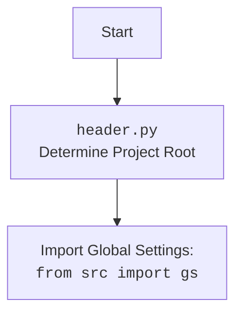

## <алгоритм>

1.  **`get_list_products_in_category(s: Supplier)`:**
    *   **Начало:** Принимает объект `Supplier` в качестве аргумента.
    *   **Инициализация:** Получает драйвер веб-браузера (`d`) и локаторы (`l`) для категории из объекта `Supplier`.
    *   **Ожидание и Закрытие Баннера:** Ждет 1 секунду и закрывает баннер (если такой есть) с помощью `d.execute_locator`.
    *   **Прокрутка Страницы:** Прокручивает страницу вниз для загрузки всех элементов.
    *   **Сбор Ссылок на Товары:** Выполняет поиск всех ссылок на товары с помощью `d.execute_locator` и сохраняет их в `list_products_in_category`.
        *   **Пример:** `list_products_in_category` может содержать `['https://example.com/product1', 'https://example.com/product2']`
    *   **Проверка на Пустой Список:** Если список ссылок пуст, то выводится предупреждение в лог и функция завершается.
    *   **Цикл Пагинации:**
        *   **Начало Цикла:** Пока текущий URL отличается от предыдущего (то есть, произошел переход по страницам).
        *   **Вызов `paginator()`:**  Вызывается функция `paginator()`, которая проверяет наличие кнопки пагинации, если таковая есть, производит смену страницы и возвращает `True` или `None`.
        *   **Добавление Ссылок:** Если `paginator()` возвращает `True`, то собирает новые ссылки на товары и добавляет в список.
        *   **Прерывание Цикла:** Если `paginator()` возвращает `None` (нет кнопки пагинации или переход не произошел), цикл завершается.
    *   **Преобразование в Список:** Если `list_products_in_category` является строкой, она преобразуется в список, если нет - ничего не происходит.
    *   **Логирование:** Выводит отладочное сообщение с количеством найденных товаров в категории.
    *   **Возврат:** Возвращает список ссылок на товары.
2.  **`paginator(d: Driver, locator: dict, list_products_in_category: list)`:**
    *   **Начало:** Принимает драйвер (`d`), локаторы (`locator`) и список товаров (`list_products_in_category`) в качестве аргументов.
    *   **Поиск Кнопки Пагинации:** Выполняет поиск кнопки "предыдущая страница" с помощью `d.execute_locator`.
        *   **Пример:** `locator['pagination']['<-']` может содержать css-селектор для кнопки пагинации
    *   **Проверка Наличия:** Если кнопка не найдена или список пуст, функция завершает работу и возвращает `None`.
    *   **Возврат `True`:** Если кнопка найдена, функция возвращает `True`, что говорит о том, что пагинация прошла успешно.
3.  **`get_list_categories_from_site(s: Supplier)`:**
    *   **Начало:** Принимает объект `Supplier` в качестве аргумента.
    *   **(Не реализовано):** Логика сбора категорий отсутствует в представленном коде, указано `...`.

## <mermaid>

```mermaid
flowchart TD
    subgraph get_list_products_in_category
        A[Start: Получение Supplier] --> B{Инициализация: Driver, Locators};
        B --> C{Ожидание 1 сек. Закрытие баннера};
        C --> D{Прокрутка страницы};
        D --> E{Поиск ссылок на товары};
        E -- Нет ссылок --> F[Лог. предупреждение. Return];
        E -- Есть ссылки --> G{Цикл пагинации: Current_URL != Previous_URL?};
        G -- Да --> H{Вызов paginator()};
        H -- True --> I{Добавление ссылок};
        I --> G
        H -- False --> J{Преобразование в список};
        G -- Нет --> J
        J --> K[Лог. инфо о количестве товаров]
        K --> L[Return: list_products_in_category]
    end
    subgraph paginator
        M[Start: Получение Driver, Locators, List] --> N{Поиск кнопки "назад"};
        N -- Нет кнопки --> O[Return: None]
        N -- Кнопка найдена --> P[Return: True]
    end
    subgraph get_list_categories_from_site
        Q[Start: Получение Supplier] --> R[Сбор категорий. ...]
    end
    
    L --> end1[End get_list_products_in_category]
    O --> end2[End paginator]
    P --> end2
    R --> end3[End get_list_categories_from_site]
    
    
    
    
```



## <объяснение>

**Импорты:**

*   `from typing import Dict, List`: Импортирует типы `Dict` и `List` для аннотации типов, что улучшает читаемость и помогает в отладке.
*   `from pathlib import Path`: Импортирует класс `Path` для работы с путями к файлам и директориям. (Не используется напрямую в предоставленном коде, но может использоваться в других частях модуля).
*   `from src import gs`: Импортирует глобальные настройки проекта из `src/gs.py`. Позволяет использовать общие переменные и параметры конфигурации.
*   `from src.logger.logger import logger`: Импортирует объект `logger` для ведения логов. Используется для отслеживания работы программы, записи ошибок и предупреждений.
*   `from src.webdriver.driver import Driver`: Импортирует класс `Driver`, который отвечает за управление браузером. Предоставляет методы для взаимодействия с веб-страницами.
*   `from src.suppliers import Supplier`: Импортирует класс `Supplier`, который представляет собой поставщика товаров. Содержит общую информацию о поставщике, а так же общие для этого класса локаторы и прочее.

**Функции:**

1.  **`get_list_products_in_category(s: Supplier) -> list[str, str, None]`:**
    *   **Аргументы:**
        *   `s`: Объект типа `Supplier`, содержащий всю необходимую информацию о поставщике, включая драйвер веб-браузера и локаторы элементов на странице.
    *   **Возвращаемое значение:** Список URL-адресов товаров в категории (`list[str, str, None]`) или `None`, если не найдено ни одного товара.
    *   **Назначение:** Функция отвечает за сбор ссылок на товары со страницы категории. Она использует драйвер веб-браузера для навигации по странице, поиска нужных элементов и извлечения URL-адресов. Если есть пагинация на странице, то она пролистывает все страницы и собирает все ссылки на товары.
    *   **Пример:**
        ```python
        supplier = Supplier(...)  # Создание объекта Supplier
        product_urls = get_list_products_in_category(supplier) # Получение списка товаров
        if product_urls:
            for url in product_urls:
                print(url)
        ```
2.  **`paginator(d: Driver, locator: dict, list_products_in_category: list)`:**
    *   **Аргументы:**
        *   `d`: Объект типа `Driver`, предоставляющий доступ к методам управления браузером.
        *   `locator`: Словарь, содержащий локаторы для элементов пагинации на странице.
        *    `list_products_in_category`:  Список строк, где содержатся ссылки на товары.
    *   **Возвращаемое значение:** `True`, если пагинация прошла успешно, или `None`, если нет кнопки пагинации или переход не произошел.
    *   **Назначение:** Функция отвечает за выполнение перехода на следующую страницу категории, если на странице есть кнопка пагинации.
    *   **Пример:**
        ```python
        driver = Driver(...)  # Создание объекта Driver
        locators = {'pagination': {'<-': 'css_selector_for_prev_page_button'}}
        products = ['url1','url2']
        if paginator(driver, locators, products):
          print('переход на след. страницу')
        ```
3.  **`get_list_categories_from_site(s)`:**
    *   **Аргументы:**
        *   `s`: Объект типа `Supplier`.
    *   **Возвращаемое значение:** На данный момент отсутствует конкретное возвращаемое значение, так как реализация не представлена.
    *   **Назначение:** Функция должна собирать список категорий товаров с сайта поставщика.

**Переменные:**

*   `d: Driver`: Объект драйвера веб-браузера для управления браузером, используется в `get_list_products_in_category` и `paginator`.
*   `l: dict`: Словарь с локаторами элементов на странице категории, используется в `get_list_products_in_category`.
*   `list_products_in_category: List`: Список, содержащий URL-адреса товаров, найденных на странице категории.
*   `response`:  Результат выполенения функции `execute_locator` объекта `driver`, обычно это список элементов webElement. Используется в функции `paginator`.
*   `s`: Объект класса Supplier. Содержит информацию о конкретном поставщике.

**Потенциальные ошибки и области для улучшения:**

*   **Отсутствие реализации `get_list_categories_from_site()`:**  Функция объявлена, но не имеет реализации. Необходимо добавить логику для сбора категорий.
*   **Обработка ошибок:** Недостаточно обработки ошибок при работе с веб-драйвером. Например, если элемент не найден, то программа может завершиться с ошибкой. Нужно добавить try/except блоки.
*   **Проверка на изменение категорий:** В комментариях к коду указано, что нужно сделать проверку на изменение категорий. Это необходимо реализовать, чтобы поддерживать актуальность данных о категориях.
*   **Улучшение читаемости:** Можно добавить более подробные комментарии к коду.
*   **Возможное дублирование элементов в `list_products_in_category`:** В цикле пагинации происходит добавление всего списка в `list_products_in_category` через `append()`. Наверное надо  `extend()` или как то вытаскивать из списка каждую ссылку.

**Взаимосвязи с другими частями проекта:**

*   **`src.gs`:** Модуль глобальных настроек позволяет настроить различные параметры, используемые в коде (например, настройки веб-драйвера, пути к файлам и т.д.).
*   **`src.logger.logger`:** Модуль логирования позволяет отслеживать работу программы, записывать ошибки и предупреждения, что облегчает отладку и поддержку.
*   **`src.webdriver.driver`:** Модуль предоставляет функциональность для работы с веб-браузером, включая открытие страниц, поиск элементов, ввод данных и т.д.
*   **`src.suppliers.Supplier`:**  Класс поставщика содержит общую информацию и настройки, необходимые для сбора данных с сайтов.

В целом, код представляет собой основу для сбора данных с сайтов поставщиков, но требует доработки и улучшения.