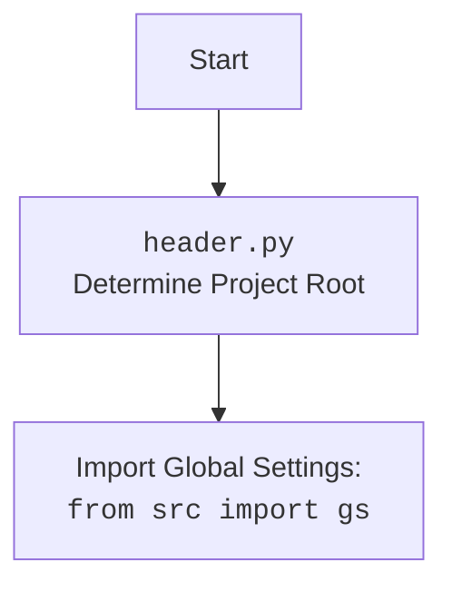

## <алгоритм>

1.  **`set_project_root(marker_files)`**:
    *   **Начало**: Функция вызывается с `marker_files` (по умолчанию `('__root__', '.git')`).
        *   *Пример*: `marker_files` = `('__root__', '.git')`
    *   Определение текущего пути файла: `current_path` устанавливается в путь к директории, где находится текущий файл (`header.py`).
        *   *Пример*: `current_path` = `/path/to/hypotez/src/suppliers/kualastyle`
    *   Инициализация `__root__` текущим путем: `__root__` присваивается значение `current_path`.
        *   *Пример*: `__root__` = `/path/to/hypotez/src/suppliers/kualastyle`
    *   **Поиск корневой директории**: Итерация по текущей директории и ее родительским директориям.
        *   Для каждой `parent` в списке `[current_path] + list(current_path.parents)`:
            *   Проверка наличия хотя бы одного из `marker_files` в `parent`.
            *   Если хотя бы один из `marker_files` существует в текущей `parent`, то `__root__` устанавливается в эту `parent`, и цикл прерывается.
                *   *Пример*: Если `/path/to/hypotez/.git` существует, то `__root__` = `/path/to/hypotez`
    *   **Обновление `sys.path`**: Если `__root__` нет в `sys.path`, добавляем его.
    *   **Возврат**: Возвращает `__root__`.
        *   *Пример*: Возвращается `/path/to/hypotez`

2.  **Инициализация `__root__`**: Вызывается `set_project_root()`, и результат сохраняется в `__root__`.
    *   *Пример*: `__root__` = `/path/to/hypotez`

3.  **Импорт `gs`**: Импортируется модуль `gs` из пакета `src`.

4.  **Загрузка настроек**:
    *   Пытаемся открыть и загрузить `settings.json` из `src` директории.
        *   *Пример*: Пытаемся открыть `/path/to/hypotez/src/settings.json`.
    *   Если возникает `FileNotFoundError` или `json.JSONDecodeError`, то `settings` остается `None`.

5.  **Загрузка документации**:
    *   Пытаемся открыть и прочитать содержимое файла `README.MD` из `src` директории.
        *   *Пример*: Пытаемся открыть `/path/to/hypotez/src/README.MD`.
    *   Если возникает `FileNotFoundError` или `json.JSONDecodeError`, то `doc_str` остается `None`.

6.  **Инициализация глобальных переменных**:
    *   `__project_name__`: Если `settings` загружены, берется значение из ключа `project_name`, иначе `'hypotez'`.
    *   `__version__`: Если `settings` загружены, берется значение из ключа `version`, иначе `''`.
    *   `__doc__`: Если `doc_str` загружен, присваивается его значение, иначе `''`.
    *   `__details__`: Инициализируется пустой строкой.
    *   `__author__`: Если `settings` загружены, берется значение из ключа `author`, иначе `''`.
    *   `__copyright__`: Если `settings` загружены, берется значение из ключа `copyrihgnt`, иначе `''`.
    *   `__cofee__`: Если `settings` загружены, берется значение из ключа `cofee`, иначе строка по умолчанию.

## <mermaid>

```mermaid
flowchart TD
    Start[Start: <code>header.py</code>] --> FindProjectRoot[<code>set_project_root()</code><br> Find Project Root]
    
    FindProjectRoot --> CheckMarkerFiles[Check for marker files <br> in current and parent directories]
    
    CheckMarkerFiles -- Marker file found --> SetRootDirectory[Set Project Root Directory: <br> <code>__root__ = parent</code>]

    CheckMarkerFiles -- No marker file found --> SetRootToCurrent[Set Project Root Directory <br> to current directory]
    SetRootToCurrent --> UpdateSysPath
    SetRootDirectory --> UpdateSysPath
    
    UpdateSysPath[Update <code>sys.path</code>: <br> Insert <code>__root__</code> if not exists] --> ImportGS[Import Global Settings:<br><code>from src import gs</code>]

    ImportGS --> LoadSettings[Load <code>settings.json</code>: <br> from <code>gs.path.root / 'src' /  'settings.json'</code>]
    
    LoadSettings -- Success --> LoadDocStr[Load <code>README.MD</code>: <br> from <code>gs.path.root / 'src' /  'README.MD'</code>]
    LoadSettings -- Failure --> LoadDocStr

    LoadDocStr -- Success --> InitializeGlobalVariables[Initialize global variables <br> (<code>__project_name__</code>,<code>__version__</code>, <br><code>__doc__</code>,<code>__details__</code>, ...)]
    
    LoadDocStr -- Failure --> InitializeGlobalVariables
    
    InitializeGlobalVariables --> End[End]
```



**Объяснение диаграммы `mermaid`:**

*   **`Start`**: Начало выполнения скрипта `header.py`.
*   **`FindProjectRoot`**: Вызов функции `set_project_root()`, предназначенной для определения корневой директории проекта.
*   **`CheckMarkerFiles`**: Проверка наличия маркерных файлов (`__root__`, `.git`) в текущей и родительских директориях.
*   **`SetRootDirectory`**: Если маркерный файл найден, то корневая директория устанавливается в найденную родительскую директорию.
*   **`SetRootToCurrent`**: Если маркерный файл не найден, то корневая директория устанавливается в текущую директорию.
*   **`UpdateSysPath`**: Обновление `sys.path` путем добавления корневой директории проекта, если ее там нет.
*   **`ImportGS`**: Импорт глобальных настроек `gs` из пакета `src`.
*   **`LoadSettings`**: Попытка загрузить `settings.json` из корневой директории проекта. В случае успеха `settings` становятся словарем, иначе остаются `None`.
*   **`LoadDocStr`**: Попытка загрузить `README.MD` из корневой директории проекта. В случае успеха `doc_str` становятся строкой, иначе остаются `None`.
*   **`InitializeGlobalVariables`**: Инициализация глобальных переменных: `__project_name__`, `__version__`, `__doc__`, `__details__`, `__author__`, `__copyright__`, `__cofee__` на основе данных из `settings` и `doc_str`.
*   **`End`**: Завершение выполнения скрипта.

## <объяснение>

**Импорты:**

*   **`import sys`**: Модуль `sys` предоставляет доступ к системным переменным и функциям. Используется для изменения `sys.path`, чтобы добавить путь к корневой директории проекта.
*   **`import json`**: Модуль `json` используется для работы с JSON-файлами, в частности, для загрузки настроек из `settings.json`.
*   **`from packaging.version import Version`**:  Импортирует класс `Version` для управления версиями. **В коде не используется, возможно, остался от старой версии**.
*   **`from pathlib import Path`**:  Импортирует класс `Path` из модуля `pathlib`, который предоставляет способ работы с файловыми путями в более объектно-ориентированном стиле.
*    **`from src import gs`**: Импортирует модуль `gs` (глобальные настройки) из пакета `src`. `gs` предположительно содержит общие настройки и пути проекта, используемые в разных частях приложения.

**Функции:**

*   **`set_project_root(marker_files)`**:
    *   **Аргументы**: `marker_files` - кортеж строк, представляющих имена файлов или каталогов, которые определяют корень проекта. По умолчанию `('__root__', '.git')`.
    *   **Возвращает**: Объект `Path`, представляющий корневую директорию проекта. Если корень не найден, возвращает путь, где расположен файл `header.py`.
    *   **Назначение**: Функция пытается определить корневую директорию проекта, начиная с текущей директории и переходя выше по иерархии, пока не найдет один из указанных маркерных файлов. Она также добавляет найденную корневую директорию в `sys.path` для того, чтобы можно было импортировать модули из нее.
    *   **Пример**:
        *   `set_project_root()`: Если `header.py` находится в `/path/to/hypotez/src/suppliers/kualastyle` и `/path/to/hypotez/.git` существует, вернет `/path/to/hypotez`.
        *   `set_project_root(marker_files=('custom_marker',))`: Если `header.py` находится в `/path/to/hypotez/src/suppliers/kualastyle` и `/path/to/hypotez/custom_marker` существует, вернет `/path/to/hypotez`.

**Переменные:**

*   **`__root__`**:
    *   **Тип**: `pathlib.Path`
    *   **Использование**: Содержит путь к корневой директории проекта, определенный функцией `set_project_root()`.
*   **`settings`**:
    *   **Тип**: `dict` или `None`
    *   **Использование**: Содержит словарь настроек, загруженных из `settings.json`, или `None`, если файл не найден или не может быть прочитан.
*   **`doc_str`**:
    *   **Тип**: `str` или `None`
    *   **Использование**: Содержит строку с текстом из файла `README.MD`, или `None`, если файл не найден или не может быть прочитан.
*  **`__project_name__`**:
    *   **Тип**: `str`
    *   **Использование**: Название проекта, взятое из `settings.json` (если есть), либо `'hypotez'` по умолчанию.
*   **`__version__`**:
    *   **Тип**: `str`
    *   **Использование**: Версия проекта, взятая из `settings.json` (если есть), либо `''` по умолчанию.
*   **`__doc__`**:
    *   **Тип**: `str`
    *   **Использование**: Содержит документацию проекта из `README.MD` (если есть), иначе пустую строку.
*    **`__details__`**:
    *   **Тип**: `str`
    *   **Использование**: Пока пустая строка. Предназначается, возможно, для добавления подробностей о проекте.
*   **`__author__`**:
    *   **Тип**: `str`
    *   **Использование**: Автор проекта, взятый из `settings.json` (если есть), либо `''` по умолчанию.
*   **`__copyright__`**:
    *   **Тип**: `str`
    *   **Использование**: Копирайт проекта, взятый из `settings.json` (если есть), либо `''` по умолчанию.
*   **`__cofee__`**:
    *   **Тип**: `str`
    *   **Использование**: Строка, содержащая текст о поддержке проекта, взятая из `settings.json` (если есть), либо сообщение по умолчанию.

**Потенциальные ошибки и улучшения:**

1.  **Обработка ошибок при загрузке `settings.json` и `README.MD`**: Сейчас ошибки `FileNotFoundError` и `json.JSONDecodeError` игнорируются с помощью `...` (эллипсиса), что не позволяет понять, почему данные не загружены. Лучше логировать ошибки или использовать значения по умолчанию.
2.  **`packaging.version`**:  Модуль импортирован, но не используется.  Нужно удалить импорт или начать его использовать, чтобы не вводить в заблуждение.
3. **Использование `__details__`**: Переменная инициализируется, но не используется. Необходимо добавить функциональность для ее использования.
4. **Проверка ключей в `settings`**:  При получении значений из словаря `settings` используется `settings.get("key", default)`, что обеспечивает дефолтное значение в случае отсутствия ключа. Однако, если ожидается определенный тип данных, можно добавить проверку типов.
5.  **Обновление `sys.path`**: Функция добавляет `__root__` в начало `sys.path`, что может быть причиной конфликтов, если другие модули также изменяют этот путь. Возможно, стоит проверить, не добавляет ли уже какой-нибудь другой модуль эту директорию и добавить условный импорт, если пути еще нет.

**Взаимосвязь с другими частями проекта:**

*   Этот файл `header.py` является общим файлом для всего проекта, так как он определяет корень проекта и загружает общие настройки. Он используется другими модулями через импорт `from src import gs`, который, в свою очередь, использует `__root__`.
*   Файл `settings.json` содержит общие настройки, используемые в других частях проекта.
*   Файл `README.MD` используется для загрузки основной документации проекта.
*   Импорт `gs` указывает, что данный файл зависит от конфигурации глобальных настроек.

В целом, код выполняет важную роль в инициализации проекта, определяя его корневую директорию и загружая настройки. Потенциальные улучшения связаны с более аккуратной обработкой ошибок и более активным использованием всех переменных, которые объявляются.