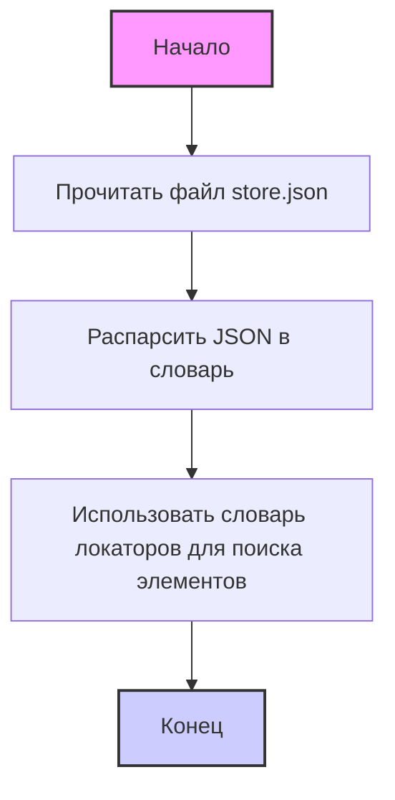
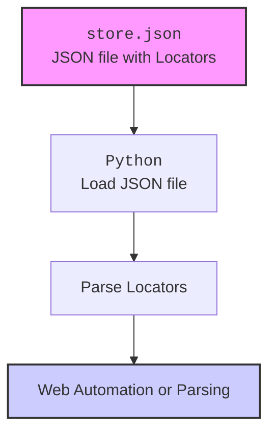

## АНАЛИЗ КОДА: `hypotez/src/suppliers/kualastyle/locators/store.json`

### <алгоритм>
1. **Чтение JSON файла:** Программа начинает с чтения JSON-файла `store.json`. Этот файл, предположительно, содержит JSON-объект, который описывает локаторы элементов на веб-странице.
    ```
    Пример:
    {
      "product_card": {
        "xpath": "//div[@class='product-card']"
      },
      "add_to_cart_button": {
        "css": ".add-to-cart-button"
      }
    }
    ```
2. **Парсинг JSON:** Программа парсит JSON-содержимое файла в словарь (или другой удобный для работы формат данных).

3. **Использование словаря локаторов:** Полученный словарь локаторов используется для поиска элементов на веб-странице в процессе автоматизации тестов или парсинга данных.
    ```
    Пример использования (псевдокод):
    element = find_element(locator_dict["product_card"]["xpath"])
    button = find_element(locator_dict["add_to_cart_button"]["css"])
    ```

### <mermaid>


### <объяснение>
**Импорты:**
- В предоставленном коде отсутствуют явные импорты Python. Это связано с тем, что `store.json` - это файл данных в формате JSON, а не файл с исполняемым кодом Python. Операции чтения и парсинга JSON будут выполняться кодом на Python, который будет импортировать соответствующие библиотеки (например, `json`). Обычно импорт для работы с JSON выглядит так: `import json`.

**Классы:**
- В данном файле нет классов, так как это JSON-файл, предназначенный для хранения данных.

**Функции:**
- В данном файле нет функций, так как это JSON-файл.

**Переменные:**
- Данные в `store.json` представляют собой словарь, где ключами являются имена элементов (например, `product_card`, `add_to_cart_button`), а значениями являются словари с информацией об их локаторах (например, `xpath` и `css`). Это переменные в том смысле, что значения для каждого элемента могут меняться, но они определены как статические значения в данном JSON файле.

   - **`product_card`**: Ключ, представляющий локатор для карточки продукта.  
    - `"xpath"`: XPath селектор для элемента (например, `//div[@class='product-card']`).

    - **`add_to_cart_button`**: Ключ, представляющий локатор кнопки "Добавить в корзину".
        - `"css"`: CSS-селектор для элемента (например, `.add-to-cart-button`).

**Потенциальные ошибки и области для улучшения:**

1. **Отсутствие валидации**: Нет гарантии, что структура JSON всегда будет соответствовать ожидаемой. Необходимо добавить проверку структуры при загрузке.
2. **Жесткое кодирование локаторов**: Жесткое кодирование локаторов может привести к проблемам при изменении разметки веб-страницы. Желательно использовать более гибкие подходы, такие как хранение локаторов в переменных или использование их фабрики.
3. **Отсутствие документации**: Файл не самодокументируемый, нужно прокомментировать что конкретно означает каждый ключ, например `product_card: Локатор для карточки продукта`
4. **Ошибки в селекторах**: Неправильно составленные селекторы могут привести к тому, что элементы не будут найдены.

**Цепочка взаимосвязей с другими частями проекта:**

1. **Чтение из Python:** JSON-файл `store.json` используется в коде Python (например, в тестах или парсерах) через модули `json` для загрузки данных.  
2. **Использование в тестах**: Локаторы, хранящиеся в файле, используются в Selenium или других фреймворках автоматизации тестирования для поиска элементов на веб-страницах.
3. **Использование в парсинге**: Локаторы могут использоваться в парсерах для извлечения данных из веб-страниц.

Пример использования в Python:
```python
import json

def load_locators(file_path):
    with open(file_path, 'r') as f:
        return json.load(f)

locators = load_locators('hypotez/src/suppliers/kualastyle/locators/store.json')
print(locators["product_card"]["xpath"]) # печатает "//div[@class='product-card']"
```

```mermaid
flowchart TD
    Start --> Header[<code>header.py</code><br> Determine Project Root]

    Header --> import[Import Global Settings: <br><code>from src import gs</code>]