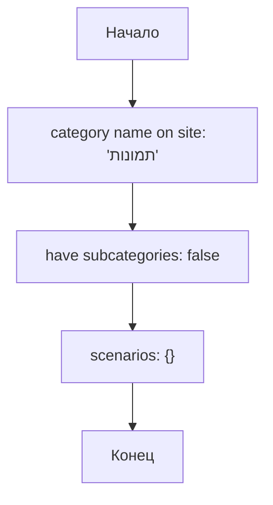

## Анализ JSON файла `kualastyle_categories_photos.json`

### 1. <алгоритм>

Этот JSON-файл представляет собой конфигурацию для категории товаров "תמונות" (Фотографии) поставщика Kualastyle. Вот пошаговое описание его структуры:

1.  **Начало**: Файл начинается с объекта JSON.
2.  **`category name on site`**:  Ключ `category name on site` имеет строковое значение `"תמונות"`, что означает название категории на веб-сайте поставщика. Это значение представляет собой название категории на иврите.
    *   _Пример:_ `"תמונות"`
3.  **`have subcategories`**:  Ключ `have subcategories` имеет булево значение `false`. Это указывает, что у данной категории нет подкатегорий.
    *   _Пример:_ `false`
4.  **`scenarios`**:  Ключ `scenarios` имеет значение в виде пустого объекта `{}`. Этот объект предназначен для хранения сценариев, специфичных для этой категории, но на данный момент он пуст. Это может означать, что на данный момент не определены сценарии для обработки фотографий.
    *   _Пример:_ `{}`
5.  **Конец**: Завершение JSON объекта.

### 2. <mermaid>

**Объяснение зависимостей:**

Диаграмма представляет собой простой поток данных, описывающий структуру JSON. Нет импортируемых модулей, поэтому зависимости внутри кода не отображаются. Диаграмма показывает последовательность проверки элементов в JSON-объекте.

### 3. <объяснение>

**Структура файла:**

Этот JSON-файл представляет собой конфигурационный файл, предназначенный для описания категории "Фотографии" у поставщика Kualastyle. Его структура проста:

-   **`category name on site`**:
    -   **Тип**: String
    -   **Использование**: Содержит название категории на сайте, в данном случае, на иврите.
    -   **Пример**: `"תמונות"`
-   **`have subcategories`**:
    -   **Тип**: Boolean
    -   **Использование**: Указывает, есть ли у категории подкатегории. `false` означает, что их нет.
    -   **Пример**: `false`
-   **`scenarios`**:
    -   **Тип**: Object
    -   **Использование**: Предназначен для хранения настроек сценариев для данной категории. Пока пуст, что говорит об отсутствии настроек или сценариев для категории "Фотографии" на данный момент.
    -   **Пример**: `{}`

**Импорты:**

В данном коде нет импортов, так как это JSON-файл, а не Python-код. Он не зависит от других частей проекта на уровне импорта. Однако, предполагается, что другие модули, обрабатывающие информацию о поставщиках, будут считывать и интерпретировать данные из этого файла.

**Цепочка взаимосвязей:**

Этот JSON файл, скорее всего, является частью системы, которая обрабатывает данные о товарах разных поставщиков. Вероятно, существует Python-код, который будет:
1.  Загружать этот JSON-файл.
2.  Использовать `category name on site` для идентификации категории.
3.  Использовать `have subcategories` для определения структуры.
4.  Анализировать `scenarios` (когда он не пуст) для дальнейшей обработки данных о товарах.

**Потенциальные ошибки и области для улучшения:**

-   **Отсутствие сценариев**: Пустой объект `scenarios` может указывать на отсутствие стратегии по обработке фотографий. Возможно, в будущем понадобится добавить в этот раздел настройки для обработки изображений, их загрузки или классификации.
-   **Жестко заданное имя категории**: Зависимость от имени категории, написанного на иврите, может вызвать проблемы при локализации или интеграции с другими системами. Было бы лучше использовать идентификатор категории, и хранить название категории в локализации.
-   **Отсутствие комментариев**: Было бы хорошо добавить комментарии к JSON-файлу для лучшего понимания его назначения и структуры.

**Заключение:**

Этот JSON файл представляет собой простую конфигурацию для категории "Фотографии" поставщика Kualastyle. Он указывает, что у категории нет подкатегорий и на данный момент отсутствуют специфические сценарии для обработки товаров этой категории. В дальнейшем, при расширении функциональности системы, необходимо будет добавить сценарии и более гибкую структуру для работы с данными поставщика.