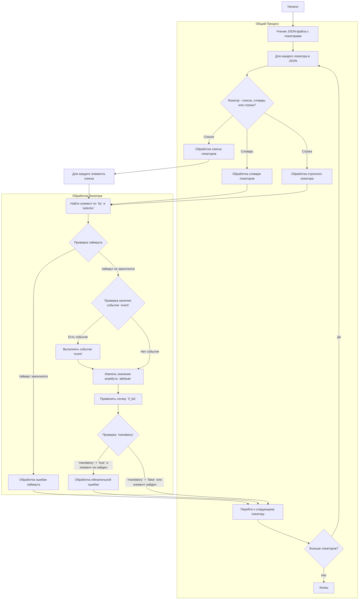

## АНАЛИЗ КОДА

### <алгоритм>

1.  **Чтение JSON:** Код представляет собой структуру данных, описанную в формате JSON, которая предназначена для определения локаторов элементов на веб-странице. Эти локаторы используются для автоматизации сбора информации с веб-сайтов.
2.  **Инициализация:** Каждая запись в JSON представляет собой локатор для определенного элемента на странице, например, кнопки закрытия баннера, списка дополнительных изображений, ID поставщика и основного изображения. Каждый локатор имеет набор параметров.
3.  **Параметры локатора:**
    *   **`attribute`**: Определяет, какой атрибут элемента необходимо извлечь (например, `innerText`, `src`, `href`). Если `null` или `false`, возвращается сам веб-элемент.
    *   **`by`**: Определяет стратегию поиска элемента (`XPATH`, `ID`, `CLASS_NAME`, и т.д.).
    *   **`selector`**: Строка-селектор для поиска элемента (XPath или CSS-селектор).
    *   **`if_list`**: Определяет, как обрабатывать список элементов (первый, все, последний, четные/нечетные, конкретные номера).
    *   **`use_mouse`**: Флаг, определяющий необходимость использования мыши для взаимодействия.
    *   **`timeout`**: Время ожидания поиска элемента (в секундах).
    *   **`timeout_for_event`**: Время ожидания перед выполнением события.
    *   **`event`**: Действие, которое нужно выполнить с элементом (например, `click()`, `screenshot()`).
    *   **`mandatory`**: Флаг, указывающий, является ли локатор обязательным.
    *   **`locator_description`**: Описание локатора.
4.  **Сложные локаторы:** Локаторы могут быть сложными, поддерживая списки, кортежи или словари. При использовании списков каждый элемент списка соответствует действию, атрибуту или селектору.
5.  **Действие -> Атрибут:** Если указано `event`, то сначала выполняется действие, а потом извлекается атрибут.
6. **Примеры:**
   *   **Пример простого локатора:**
    *   **Вход:** Локатор `"close_banner"`.
    *   **Процесс:** Ищется элемент по XPath `//button[@id = 'closeXButton']`.
    *   **Действие:** Выполняется событие `click()` (если элемент найден).
    *   **Выход:** Никакой атрибут не извлекается (`attribute` = null), но если `mandatory` = `true`, то отсутствие элемента вызовет ошибку.
    *  **Пример списка локаторов:**
        *  **Вход:** Локатор `"sample_locator"`.
        *  **Процесс 1:** Ищется элемент по XPath `//a[contains(@href, '#tab-description')]`.
        *   **Действие 1:** Выполняется событие `click()`.
        *   **Процесс 2:** Ищется элемент по XPath `//div[@id = 'tab-description']//p`.
        *  **Действие 2:**  Не выполняются никакие действия (`null`).
        *  **Выход:** Извлекается значение атрибута `href` из элемента, найденного в  `Процессе 2`  (`attribute` = `href`). Если `mandatory` = `true`, то отсутствие элемента вызовет ошибку на любом из этапов.
7.  **Адаптивность:** Упоминается, что разметка может меняться (например, десктопная и мобильная версии). Для этого рекомендуется использовать отдельные файлы локаторов (например, `product.json`, `product_mobile_site.json`).
8.  **Пример изменения локаторов в коде Python:**
    *   **Вход:** URL страницы.
    *   **Процесс:** Проверяется, содержит ли URL строку `ksp.co.il/mob`.
    *   **Выход:** Если URL содержит строку, загружается файл локаторов `product_mobile_site.json`, иначе используется `product.json`.

### <mermaid>

### <объяснение>

1.  **Импорты:**
    *   В предоставленном коде нет явных импортов, но в описании указано, что локаторы читаются из JSON-файлов. Обычно для работы с JSON в Python используется стандартная библиотека `json` (или `orjson` для ускорения), и это не является частью этого файла. Также есть упоминание о `gs.path.src`, который, вероятно, является частью глобальных настроек (`src.gs`), и `j_loads_ns` - это, вероятно, функция для загрузки json. Они также не являются частью этого файла.

2.  **Локаторы:**
    *   Локаторы определены как словарь, где каждый ключ является именем поля (например, `close_banner`, `additional_images_urls`), и каждое значение — это словарь параметров локатора.
    *   **Атрибуты словаря локатора:**
        *   `attribute`: Атрибут для извлечения из элемента (например, `innerText`, `src`). Если `null`, возвращается сам элемент.
        *   `by`: Стратегия поиска элемента (например, `XPATH`, `ID`).
        *   `selector`: Селектор элемента (например, XPath выражение или CSS селектор).
        *   `if_list`: Как обрабатывать список элементов (например, `first`, `all`, `last`).
        *   `use_mouse`: Нужно ли использовать мышь для взаимодействия.
        *   `timeout`: Время ожидания для поиска элемента.
        *   `timeout_for_event`: Время ожидания перед выполнением события.
        *   `event`: Событие для выполнения с элементом (например, `click()`, `screenshot()`).
        *   `mandatory`: Является ли локатор обязательным.
        *   `locator_description`: Описание локатора.
    *  **Сложные локаторы**: Локаторы могут содержать в качестве значений списки, кортежи и словари. Это позволяет задавать последовательность действий, атрибутов и селекторов.

3. **Функциональность:**
  *  Основная функциональность заключается в структурированном описании локаторов элементов на веб-странице, используемых в автоматизированном тестировании или веб-скрапинге. Локаторы позволяют найти, взаимодействовать и извлекать данные из веб-элементов.
   *   Данные локаторы используются WebDriver для определения, как найти конкретные элементы на странице, какие действия с ними выполнять (например, кликнуть, сделать скриншот) и какие данные из них извлекать (например, текст, URL).
   *   Ключ `event` позволяет WebDriver выполнять действие с элементом до получения атрибута (принцип "действие -> атрибут").
   *   Обработка списков элементов позволяет извлекать несколько элементов, или работать с конкретными элементами из списка.
   *   Локаторы могут быть обязательными (`mandatory: true`) или необязательными (`mandatory: false`). Если обязательный локатор не найден, скрипт должен выбросить ошибку.

4.  **Переменные:**
    *   Переменные представляют собой ключи и значения словаря, описывающего локатор, как описано выше.
    *   Типы переменных включают в себя:
        *   `str`: для `by`, `selector`, `if_list`, `event`, `locator_description`.
        *   `int`: для `timeout`.
        *   `bool`: для `use_mouse`, `mandatory`.
        *   `NoneType`: для `attribute` в случае если нужно получить `WebElement`.
        *   `list`, `dict`: для сложных локаторов.

5.  **Потенциальные ошибки и области для улучшения:**
    *   **Обработка ошибок:** Код предполагает, что если `mandatory: true`, то при ошибке скрипт должен выбросить ошибку. Требуется добавить явную обработку ошибок (например, try/except блоки) для устойчивости работы.
    *   **Таймауты:** Нужно добавить явную обработку таймаутов, когда поиск элемента превышает `timeout`.
    *   **Использование словарей:** Словари в локаторах могут быть гибким решением, но их структура требует документации.
    *   **Логика обработки `if_list`:** Необходимо проверить и улучшить обработку различных вариантов `if_list`, особенно при использовании индексов.
   *  **Адаптация:** Рекомендуется использовать `product.json` и `product_mobile_site.json` для мобильной и десктопной версий.
   *  **Валидация:** Валидация  формата локаторов (соответствие типов данных, корректность селекторов, допустимость событий) важна для избежания ошибок при работе.

6. **Цепочка взаимосвязей:**
    *   Данный код напрямую связан с парсером, который использует эти локаторы для сбора данных со страницы поставщика.
    *   Локаторы используются внутри системы автоматизации веб-скрапинга или тестирования, где они играют ключевую роль в поиске и взаимодействии с элементами.
    *   Код `python`, который читает локаторы (`j_loads_ns(gs.path.src / 'suppliers' / 'ksp' / 'locators' / 'product_mobile_site.json')`),  является частью системы сбора данных.
    *  `ProductFields` используется для представления данных о продукте.

Этот анализ предоставляет подробное понимание структуры и функциональности кода, что позволяет эффективно использовать и поддерживать систему веб-скрапинга или тестирования.