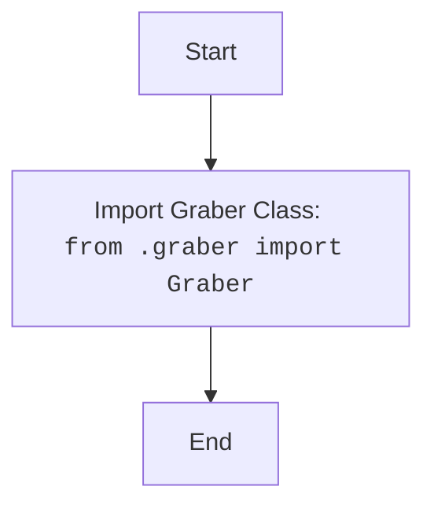

## Анализ кода `hypotez/src/suppliers/morlevi/__init__.py`

### <алгоритм>

1. **Импорт `Graber`**: Импортируется класс `Graber` из модуля `graber.py`, находящегося в той же директории (`src/suppliers/morlevi`). Этот класс, предположительно, отвечает за сбор данных.
    *   _Пример:_ `from .graber import Graber`  импортирует класс, который в дальнейшем может быть использован для создания объектов-парсеров.

### <mermaid>

### <объяснение>

**Импорты:**

*   `from .graber import Graber`:  Этот импорт означает, что из модуля `graber.py`, который находится в той же директории, что и `__init__.py`, импортируется класс `Graber`.
    *   `.` указывает на текущую директорию (в данном случае `src/suppliers/morlevi`).
    *   `graber` это название файла модуля.
    *   `Graber` это класс который импортируется.
    *   Назначение: Класс `Graber` вероятно отвечает за парсинг данных из какого-то источника и его последующую обработку. Его импорт в `__init__.py` делает этот класс доступным для использования вне модуля `morlevi`, когда модуль импортируется.

**Классы:**

*   В данном файле классов нет. Класс `Graber` импортируется из другого модуля.

**Функции:**

*   В файле нет функций.

**Переменные:**

*   В файле нет переменных.

**Общее:**

*   Файл `__init__.py` в Python служит для того, чтобы сделать директорию пакетом, что позволяет импортировать модули и классы внутри него.
*   В данном случае, файл делает класс `Graber` доступным при импорте пакета `src.suppliers.morlevi`.
*   **Потенциальные улучшения**: Пока не видно недостатков, код выполняет свою роль. Однако, хорошо было бы добавить документацию к модулю `graber.py`.
*   **Цепочка взаимосвязей**: Этот файл является частью пакета `src.suppliers`, и он используется для импорта класса `Graber`. Предположительно, модуль `morlevi` будет использоваться в других частях проекта, где необходим парсер для поставщика "morlevi".