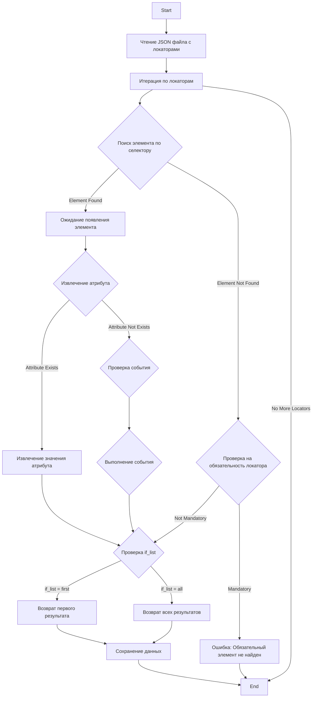

## АНАЛИЗ JSON ФАЙЛА

### 1. <алгоритм>

JSON файл представляет собой набор локаторов для сбора данных о товарах с веб-сайта поставщика Morlevi.  Каждый локатор представляет собой объект JSON со следующими атрибутами:

-   `attribute`: Атрибут элемента DOM, значение которого нужно извлечь (например, `innerText`, `value`, `src` , `alt`).
-   `by`:  Метод поиска элемента DOM (`XPATH`, `VALUE`).
-   `selector`: Строка селектора для поиска элемента DOM.
-   `if_list`:  Определяет, как обрабатывать список элементов:  `first` - брать первый элемент, `all` - брать все элементы.
-   `use_mouse`: Логическое значение, указывающее, нужно ли использовать мышь для взаимодействия с элементом.
-    `timeout`: Время ожидания (в секундах).
-   `timeout_for_event`: Событие ожидания `presence_of_element_located` (ожидания появления элемента).
-   `event`: Событие, которое нужно выполнить (например, `click()`, `screenshot()`).
-   `mandatory`: Логическое значение, указывающее, является ли локатор обязательным для выполнения.
-  `locator_description`: описание для локатора

Процесс работы с файлом можно представить следующим образом:

1.  **Чтение JSON файла:** Загружаем JSON файл в программу.
    *   *Пример:* `{ "id": { ... }, "name": { ... } }`
2.  **Обход каждого локатора:** Проходимся по каждому ключу (названию локатора) и его значению (объекту локатора) в JSON.
    *   *Пример:* Переходим от ключа `id` к ключу `name` и так далее.
3.  **Извлечение данных:** Для каждого локатора:
    *   Определяем метод поиска элемента (`by`).
    *   Используем селектор (`selector`) для поиска элемента на странице.
    *   Ожидаем появления элемента с помощью `timeout_for_event`.
    *   Если указан атрибут (`attribute`), извлекаем значение атрибута. Если атрибут `{src:alt}` извлекаем значение атрибута `src` и `alt` в виде `{src: значение_src, alt: значение_alt}`
    *   Если указано событие (`event`), выполняем его.
    *   Если `if_list` равен `first`, возвращаем первый найденный элемент (значение атрибута или результат события); если `if_list` равен `all` , возвращаем список найденных элементов (значений атрибутов или результатов событий)
    *   Если локатор обязательный, то при отсутствии результата, выбрасываем ошибку.
    *   *Пример:* Для локатора `"id_manufacturer"`, получаем текст из элемента, найденного по XPATH `//span[@class = 'ltr sku-copy']`.
    *   *Пример:* Для локатора `"default_image_url"`, делаем скриншот элемента, найденного по XPATH `//a[@id = 'mainpic']//img` и возвращаем результат в виде байтов.
4.  **Сохранение данных:** Сохраняем собранные данные, в  виде словаря, где ключи - названия локаторов, а значения - результат извлечения данных.
    *   *Пример:* `{"id": "значение_id", "name": "значение_name", ...}`

### 2. <mermaid>

**Объяснение:**

-   `ReadJsonFile`:  Блок, представляющий чтение JSON файла, содержащего локаторы.
-   `IterateLocators`: Блок, который последовательно перебирает каждый локатор из JSON файла.
-   `FindElement`: Блок, который пытается найти элемент DOM на веб-странице, используя селектор и метод поиска (`by`).
-    `WaitForElement`: Блок, который ожидает появления элемента на странице.
-   `ExtractAttribute`: Блок, который проверяет, нужно ли извлекать какой-либо атрибут элемента.
-   `ExtractAttributeValue`: Блок, который извлекает значение атрибута из найденного элемента.
-    `CheckEvent`: Блок, проверяющий наличие события для данного локатора
-    `PerformEvent`: Блок, выполняющий событие, указанное в локаторе (например, `click()`, `screenshot()`).
-   `CheckIfList`:  Блок, который проверяет значение `if_list` для определения, нужно ли возвращать только первый найденный элемент или все.
-   `ReturnFirst`: Блок, возвращающий первый найденный элемент или значение его атрибута.
-   `ReturnAll`: Блок, возвращающий все найденные элементы или значения их атрибутов.
-   `SaveData`: Блок, сохраняющий извлеченные данные.
-  `CheckMandatory`: Блок, проверяющий является ли локатор обязательным
 - `Error`: Блок, информирующий об ошибке, когда не найден обязательный элемент.
-   `Start`: Начало процесса.
-    `End`: Окончание процесса.

### 3. <объяснение>

**Импорты:**

Файл не содержит явных импортов. Этот файл является конфигурационным JSON файлом, а не кодом python.

**Классы:**

В данном файле нет классов. Файл представляет собой структуру данных в формате JSON.

**Функции:**

В данном файле нет функций. Файл содержит только JSON объекты.

**Переменные:**

-   JSON-объект содержит множество ключей, представляющих названия локаторов, и их значения, являющиеся объектами, содержащими информацию о локаторах:
    - `close_pop_up` - локатор для закрытия всплывающего окна.
    -   `id`, `id_manufacturer`, `id_supplier`, `id_product`, `id_category_default`, `id_default_image`, `id_default_combination`, `id_tax`, `id_shop_default` - локаторы для идентификаторов.
    - `name` - локатор для имени товара.
    -   `description_short` - локатор для краткого описания товара.
    -   `description` - локатор для полного описания товара.
    -   `specification` - локатор для характеристик товара.
    -  `default_image_url` - локатор для изображения товара
    -   `price`  - локатор для цены.
   -   `Summary` - локатор для summary
   -   `Description` - локатор для описания
    -   `affiliate_short_link`, `affiliate_text`, `affiliate_summary`, `affiliate_summary_2` - локаторы для партнерской информации.
     -   `ASIN`,  `Name*`, `Categories (x,y,z...)`, `Price tax excluded`,  `Price tax included`, `Tax rule ID`, `Cost price`, `On sale (0/1)`, `Discount amount`, `Discount percent`, `Discount from (yyyy-mm-dd)`, `Discount to (yyyy-mm-dd)`,  `reference #`, `Supplier reference #`, `Supplier`, `Brand`, `EAN13`, `UPC`, `MPN`, `Ecotax`, `Width`, `Height`, `Depth`, `Weight`, `Delivery time of in-stock products:`, `Delivery time of out-of-stock products with allowed orders:`, `Quantity`, `Minimal quantity`, `Low stock level`, `Send me an email when the quantity is under this level`, `Visibility`, `Additional shipping cost`, `Unit for base price`, `Base price`,  `Tags (x,y,z...)`, `Meta title`, `Meta keywords`, `Meta description`, `Rewritten URL`, `Label when in stock`, `Label when backorder allowed`, `Available for order (0 = No, 1 = Yes)`, `Product availability date`, `Product creation date`, `Show price (0 = No, 1 = Yes)`,  `images_urls`, `additional_images_urls`, `additional_images_alts`, `Delete existing images (0 = No, 1 = Yes)`, `Feature (Name:Value:Position:Customized)`, `Available online only (0 = No, 1 = Yes)`, `Condition`, `Customizable (0 = No, 1 = Yes)`, `Uploadable files (0 = No, 1 = Yes)`, `Text fields (0 = No, 1 = Yes)`, `Action when out of stock`, `Virtual product (0 = No, 1 = Yes)`, `File URL`, `Number of allowed downloads`, `Expiration date (yyyy-mm-dd)`, `Number of days`,  `ID / Name of shop`, `Advanced Stock Management`, `Depends on stock`, `Warehouse`, `Accessories (x,y,z...)`, `affiliate short link`, `affiliate text`, `affiliate summary`, `affiliate summary 2`, `Open AI Product Description`, `Byer protection`, `Specification`, `Refirbished product description`, `Additional shipping details`, `Screenshot`-  набор локаторов для сбора различных данных о товаре
      -  `logic for attribue[AND|OR|XOR|VALUE|null]`,  `logic for action[AND|OR|XOR|VALUE|null]` -  дополнительная логика для локатора.
     - `new`,  `cache_default_attribute`,   `position_in_category`, `type`, `reference`, `supplier_reference`, `location`, `width`, `height`, `depth`, `weight`, `quantity_discount`, `ean13`, `isbn`, `upc`, `mpn`, `cache_is_pack`, `cache_has_attachments`, `is_virtual`, `state`, `additional_delivery_times`, `delivery_in_stock`, `delivery_out_stock`, `product_type`, `on_sale`,  `online_only`, `ecotax`, `minimal_quantity`, `low_stock_threshold`, `low_stock_alert`, `wholesale_price`, `unity`, `unit_price_ratio`, `additional_shipping_cost`, `customizable`, `text_fields`, `uploadable_files`, `active`, `redirect_type`, `id_type_redirected`, `available_for_order`, `available_date`, `show_condition`, `condition`, `show_price`, `indexed`, `visibility`,  `advanced_stock_management`, `date_add`, `date_upd`, `pack_stock_type`, `meta_description`, `meta_keywords`, `meta_title`, `link_rewrite`  -  локаторы для других параметров товара

    -  `attribute` (string or array) -  атрибут элемента, который нужно извлечь. Если нужно извлечь несколько атрибутов, нужно передавать массив  атрибутов.  Если указано `{src:alt}` извлекаем значение атрибута `src` и `alt` в виде `{src: значение_src, alt: значение_alt}`
    - `by` (string or array) -  способ поиска элемента на странице
    -   `selector` (string or array) -  строка поиска элемента на странице
    - `if_list` (string) - правило извлечения. `first`  - брать первый элемент , `all` - брать все.
    -   `use_mouse` (boolean or array) - нужно ли использовать мышь
     -  `timeout` (int) - время ожидания
   -  `timeout_for_event` (string) - тип ожидания (`presence_of_element_located`)
   -   `event` (string or array) - событие которое надо выполнить
     - `mandatory` (boolean) -  обязательный или нет
    - `locator_description` (string) - описание локатора

**Потенциальные ошибки и области для улучшения:**

-   **Жестко заданные селекторы:**  `XPATH` селекторы могут сломаться, если структура HTML-страницы изменится. Стоит рассмотреть добавление более гибких селекторов.
-   **Отсутствие обработки ошибок:**  Отсутствует обработка ситуаций, когда элемент не найден. Нужно добавить обработку ошибок для `FindElement`.
-   **Неоднородность локаторов:** Некоторые локаторы используют `XPATH`, другие используют `VALUE` или `null` для `by`.  Нужно привести к одному стилю.
-   **Дублирование локаторов:** Некоторые локаторы могут быть избыточными (например  `id_product` и  `id_manufacturer`).
-   **Отсутствие комментариев:** Код мог бы быть более читаемым, если бы были добавлены более подробные комментарии, особенно для сложных  `XPATH` селекторов.
-   **Отсутствие универсальности:**  Код нацелен только на сайт Morlevi.  Следует рассмотреть возможность создания более универсального инструмента.
-   **Отсутствие проверок:** Код не проверяет, что извлекаемые данные соответствуют ожидаемым типам. Нужно добавить проверки типов.
-  **Логика для атрибута и действия:** Присутствуют поля logic for attribue[AND|OR|XOR|VALUE|null] и logic for action[AND|OR|XOR|VALUE|null], необходимо добавить поддержку этой логики
- **Совместимость с различными сайтами:** Некоторые локаторы специфичны для конкретных сайтов. Необходимо сделать так, чтобы локаторы не были привязаны к определенному сайту

**Взаимосвязь с другими частями проекта:**

-  Этот JSON файл используется другими модулями  `src` для извлечения данных с сайта Morlevi.
-   Данные, собранные с помощью локаторов, используются для создания CSV файла, загрузки в БД и т.д.

Этот анализ JSON файла предоставляет четкое представление о его структуре и функциональном назначении в проекте.