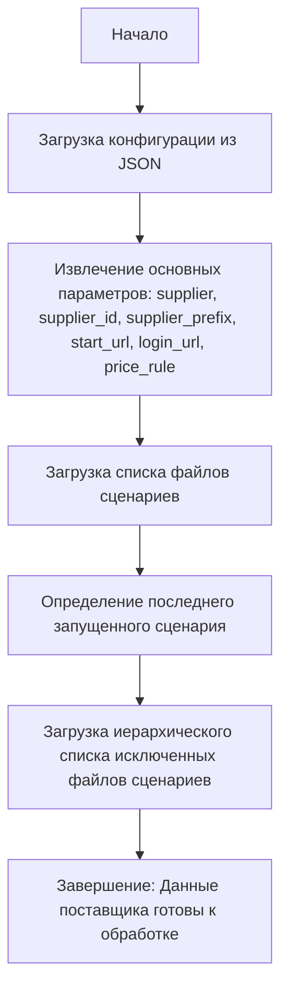

## <алгоритм>

1.  **Начало**: Инициализация процесса обработки данных поставщика "morlevi". Загрузка конфигурации из JSON.
    *   **Пример**: JSON объект содержит метаданные о поставщике, URL-адреса, правила ценообразования и список сценариев для сбора данных.
2.  **Определение основных параметров**: Извлечение основных параметров: `supplier`, `supplier_id`, `supplier_prefix`, `start_url`, `login_url`, `price_rule`.
    *   **Пример**: `supplier` = "morlevi", `price_rule` = "*1.43".
3.  **Обработка сценариев**: Загрузка списка файлов сценариев.
    *   **Пример**: `"scenario_files"` = `["morlevi_categories_cases_antec.json#", "morlevi_categories_storage_samsung.json", ...]`.
4.  **Выбор последнего запущенного сценария**: Определение последнего запущенного сценария.
    *   **Пример**: `"last_runned_scenario"` = `"morlevi_categories_mb_gigabyte.json"`.
5.  **Обработка исключений**: Загрузка иерархического списка исключенных файлов сценариев. Исключенные сценарии группируются по категориям.
    *   **Пример**: `excluded` = `[[...], ["morlevi_categories_minipc_gigabyte.json", "morlevi_categories_minipc_intel.json"], [...]]`.
6.  **Завершение**: Данные поставщика подготовлены для дальнейшей обработки (сбора данных).

## <mermaid>

## <объяснение>

**Импорты**:

*   В данном коде нет явных импортов. Код представлен в формате JSON, который является форматом данных, а не исполняемым кодом Python. Этот JSON файл используется как конфигурация для другого Python скрипта.

**Классы**:

*   В данном коде нет классов. Это файл конфигурации, а не класс или программа.

**Функции**:

*   В данном коде нет функций. Это файл конфигурации, а не класс или программа.

**Переменные**:

*   `supplier` (string): Название поставщика ("morlevi").
*   `supplier_id` (string): Идентификатор поставщика ("2784").
*   `supplier_prefix` (string): Префикс для товаров поставщика ("mlv").
*   `start_url` (string): URL главной страницы сайта поставщика ("https://www.morlevi.co.il/").
*   `login_url` (string): URL страницы входа на сайт поставщика ("https://www.morlevi.co.il/").
*   `price_rule` (string): Правило ценообразования для товаров поставщика ("*1.43").
*   `collect_products_from_categorypage` (boolean): Флаг, указывающий, нужно ли собирать товары со страниц категорий (false).
*   `scenario_files` (list of strings): Список файлов сценариев для сбора данных.
*   `last_runned_scenario` (string): Имя последнего запущенного файла сценария.
*   `excluded` (list of lists of strings): Список исключений по группам категорий. Исключенные сценарии не участвуют в процессе сбора данных.

**Объяснение**:

Этот JSON-файл представляет собой конфигурацию для поставщика "morlevi". Он содержит информацию о том, как парсить сайт поставщика, какие категории товаров собирать и какие сценарии использовать.

1.  **Основные параметры**: `supplier`, `supplier_id`, `supplier_prefix`, `start_url`, `login_url`, `price_rule` определяют основные данные поставщика и правила обработки цен.
2.  **Сценарии сбора данных**: `scenario_files` содержит список файлов, определяющих, какие данные и как собирать.
3.  **Последний запущенный сценарий**: `last_runned_scenario` позволяет отслеживать и восстанавливать состояние процесса сбора данных.
4.  **Исключения**: `excluded` позволяет исключать определенные сценарии сбора данных. Это полезно, если нужно игнорировать определенные категории товаров. Исключенные сценарии сгруппированы по категориям, что позволяет более гибко управлять сбором данных.

**Взаимосвязь с другими частями проекта**:

Этот JSON файл используется как конфигурационный файл. Другие части проекта, такие как скрипты, отвечающие за сбор данных (вероятно, Python), будут читать этот файл для определения параметров работы, например, `price_rule`, `start_url` и т.д., а также списка файлов сценариев `scenario_files` для загрузки и обработки данных.

**Потенциальные ошибки или области для улучшения**:

*   **Отсутствие проверок**: В JSON нет валидации, например, типов данных и формата URL.
*   **Жестко заданные пути**: Пути к сценариям жёстко заданы и могут сломаться при изменении файловой структуры проекта.
*   **Сложная структура исключений**: Структура `excluded` может быть сложной для понимания и поддержки. Можно рассмотреть использование более простых структур данных или возможность комментирования исключений.
*   **Дублирование**:  В `scenario_files` и `excluded` есть повторения, например, "morlevi_categories_cases_antec.json".
*   **Магические значения**:  Использование "*" в `price_rule` может быть неинтуитивным.

В целом, этот JSON файл хорошо структурирован для использования в качестве конфигурации, но его можно улучшить, добавив валидацию и более гибкую структуру.