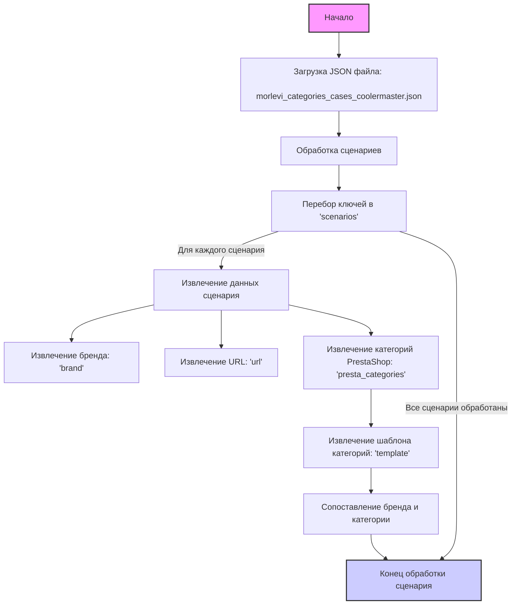

# Анализ JSON-файла `morlevi_categories_cases_coolermaster.json`

## 1. <алгоритм>
JSON-файл представляет собой словарь, содержащий сценарии для категорий товаров, связанных с корпусами Cooler Master.

**Блок-схема:**

1.  **Начало**: Файл загружается.
2.  **Обработка словаря "scenarios"**:
    *   Перебираются ключи (названия сценариев) словаря `scenarios`.
    *   Для каждого ключа (например, "COOLERMASTER MID TOWER"):
        *   Извлекается значение (словарь с описанием сценария).
        *   Значение содержит:
            *   `brand` (строка): Бренд продукта.
            *   `template` (строка): Шаблон (в данном случае пустая строка).
            *   `url` (строка): URL страницы на сайте Morlevi.
            *   `checkbox` (логическое значение): Флаг для использования чекбокса (всегда `false`).
            *   `active` (логическое значение): Флаг активности сценария (всегда `true`).
             *   `condition` (строка): Состояние товара (всегда `new`).
             *   `presta_categories` (словарь): Содержит информацию о категориях PrestaShop:
                 *   `template` (словарь): Сопоставление бренда "cooler master" с категорией корпуса (например, "MID TOWER").
3.  **Конец**: Обработка всех сценариев завершена.

**Примеры:**

*   **Сценарий "COOLERMASTER MID TOWER":**
    *   `brand` = "COOLER MASTER"
    *   `url` = "https://www.morlevi.co.il/Cat/285?p_315=74&p_124=540&sort=datafloat2%2Cprice&keyword="
    *   `presta_categories` -> `template` -> {"cooler master": "MID TOWER"}

*   **Сценарий "COOLERMASTER full tower":**
    *   `brand` = "COOLER MASTER"
    *   `url` = "https://www.morlevi.co.il/Cat/285?p_315=74&p_124=541&sort=datafloat2%2Cprice&keyword="
    *   `presta_categories` -> `template` -> {"cooler master": "FULL TOWER"}

## 2. <mermaid>

**Объяснение `mermaid` диаграммы:**

*   **Start**: Начало процесса.
*   **LoadJSON**: Загрузка JSON-файла `morlevi_categories_cases_coolermaster.json`.
*   **ProcessScenarios**: Основной этап, где происходит обработка данных о сценариях.
*   **LoopThroughScenarios**: Цикл, который перебирает все ключи (названия сценариев) в словаре `scenarios`.
*   **ExtractScenarioData**: Извлечение данных для текущего сценария.
*  **ExtractBrand**: Извлечение значения ключа `brand`.
*   **ExtractUrl**: Извлечение значения ключа `url`.
*   **ExtractPrestaCategories**: Извлечение словаря `presta_categories`.
*   **ExtractTemplate**: Извлечение словаря `template` из `presta_categories`.
*   **MapBrandToCategory**: Сопоставление бренда с категорией товара.
*   **End**: Конец обработки текущего сценария. После обработки всех сценариев, выполнение диаграммы завершается.

## 3. <объяснение>

**Импорты:**
В данном коде нет импортов, поскольку это JSON-файл, а не Python-скрипт.

**Классы:**
В данном коде классы не используются, так как это JSON-файл.

**Функции:**
В данном коде нет функций, так как это JSON-файл.

**Переменные:**

*   `scenarios`: Словарь, где ключи — это названия сценариев (например, "COOLERMASTER MID TOWER"), а значения — это словари с описаниями сценариев.
*   `brand` (строка): Название бренда (всегда "COOLER MASTER").
*   `template` (строка): Шаблон (в данном случае пустая строка).
*   `url` (строка): URL-адрес страницы с товарами на сайте Morlevi.
*    `checkbox` (логическое значение): Флаг, указывающий на использование чекбокса (всегда `false`).
*   `active` (логическое значение): Флаг, указывающий на активность сценария (всегда `true`).
*   `condition` (строка): Условие товара (всегда `new`).
*   `presta_categories` (словарь): Словарь, содержащий информацию о категориях в PrestaShop.
    *   `template` (словарь): Словарь, где ключ "cooler master" сопоставляется с категорией корпуса (например, "MID TOWER").

**Потенциальные ошибки и области для улучшения:**

*   **Повторение кода:** Много повторений в структуре каждого сценария (особенно с `checkbox`, `active`, `condition`). Это можно было бы вынести в общие настройки, если бы это был скрипт.
*   **Отсутствие гибкости:** Если нужно добавить новый бренд, придется добавлять отдельные сценарии. Было бы лучше использовать общие правила для сопоставления.
*   **Жесткая привязка к URL:** URL привязаны к конкретным значениям фильтров (`p_315`, `p_124`). Любое изменение в параметрах фильтров на сайте Morlevi может сломать эту интеграцию.
*    **Не все url корректны**: В сценарии `COOLERMASTER gaming full tower` значение `url` не является валидным url.
*   **Отсутствие обработки ошибок:** В случае, если JSON-файл не загрузится или будет иметь неверную структуру, программа, использующая этот файл, должна иметь соответствующую обработку ошибок.

**Цепочка взаимосвязей с другими частями проекта:**

Этот JSON-файл, скорее всего, используется в проекте для автоматизации сбора данных о товарах с сайта Morlevi. Данные из этого файла могут использоваться для:

1.  **Парсинга:** Автоматизированный парсинг страниц по указанным URL и извлечение информации о товарах.
2.  **Категоризации:** Сопоставление товаров с категориями в PrestaShop (или другой e-commerce платформе) на основе данных из `presta_categories`.
3.  **Обновления данных:** Автоматическое обновление цен, наличия и прочей информации о товарах.

В целом, JSON-файл является конфигурационным файлом, который определяет сценарии для парсинга данных с сайта Morlevi, в частности для бренда "COOLER MASTER".