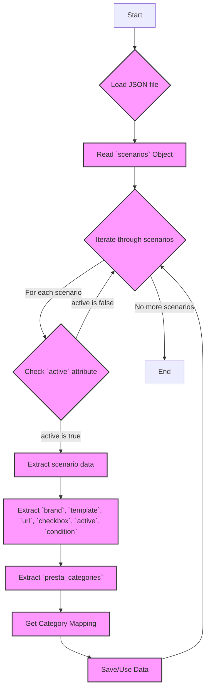

## АНАЛИЗ JSON-КОДА

### 1. <алгоритм>

**Описание:**
Данный JSON-файл описывает сценарии для обработки категорий товаров бренда CORSAIR.
Каждый сценарий представлен в виде JSON-объекта, где ключ - это название сценария,
а значение - объект, содержащий детали о сценарии, такие как бренд, URL,
активность, условие, а также соответствие категориям PrestaShop.

**Пошаговая блок-схема:**

1.  **Начало**: Загрузка JSON файла.
2.  **Чтение объекта `scenarios`**:  
   - **Пример:**  Объект содержит наборы данных для различных корпусов CORSAIR.
3.  **Итерация по сценариям**: Для каждого ключа-названия сценария (например, "CORSAIR MID TOWER", "CORSAIR full tower"):
   -   **Пример:** Начинаем с "CORSAIR MID TOWER".
4. **Проверка атрибута `active`**: Проверяем, является ли сценарий активным. Если `true` - продолжаем, иначе пропускаем и переходим к следующему сценарию.
    - **Пример:** Для "CORSAIR MID TOWER" значение `active` = `true`, продолжаем.
5.  **Извлечение данных сценария**: Извлекаем значения атрибутов:
   - `brand` (строка): Бренд товара.
       -   **Пример:** `brand` = "CORSAIR".
   - `template` (строка): Шаблон (пустая строка в примере).
   - `url` (строка или null): URL для получения списка товаров (может быть null).
       - **Пример:** `url` = "https://www.morlevi.co.il/Cat/99?p_315=20&p_124=540&sort=datafloat2%2Cprice&keyword=" или `null`
   - `checkbox` (логическое значение): Используется ли флажок в сценарии.
       - **Пример:** `checkbox` = `false`.
   - `active` (логическое значение): Активен ли сценарий.
        - **Пример:** `active` = `true`.
   - `condition` (строка): Условие товара.
        - **Пример:** `condition` = "new".
   - `presta_categories` (объект): Сопоставления с категориями PrestaShop.
       -   **Пример:** `presta_categories`: `{ "template": { "corsair": "MINI ITX" } }`
6. **Обработка `presta_categories`**: Извлекаем соответствие категории `corsair` в рамках `template`.
    - **Пример:** Из `presta_categories` извлекаем, что для "CORSAIR MID TOWER" категория `corsair` соответствует "MINI ITX".
7.  **Сохранение/использование данных**: Сохранение извлеченных данных или передача их в другие функции.
8. **Конец итерации**: Переходим к следующему сценарию, если он есть, иначе завершаем.
    - **Пример:** Переходим к "CORSAIR full tower".
9.  **Завершение**: Конец обработки JSON.

### 2. <mermaid>

**Объяснение:**

-   **`A` [Start]**: Начало процесса обработки JSON файла.
-   **`B` {Load JSON file}**: Загрузка JSON файла в память для обработки.
-   **`C` [Read `scenarios` Object]**: Чтение объекта `scenarios`, содержащего все сценарии.
-   **`D` {Iterate through scenarios}**: Начало цикла перебора каждого сценария в объекте `scenarios`.
-    **`E` {Check `active` attribute}**: Проверка, является ли сценарий активным (значение атрибута `active` равно `true`).
-   **`F` [Extract scenario data]**: Если сценарий активен, извлекаются его данные.
-    **`G` [Extract `brand`, `template`, `url`, `checkbox`, `active`, `condition`]**: Извлечение основных атрибутов из данных сценария.
-   **`H` [Extract `presta_categories`]**: Извлечение объекта `presta_categories` для сопоставления категорий.
-  **`I` [Get Category Mapping]**: Извлекаем соответствие категории `corsair` в рамках `template` из `presta_categories`.
-   **`J` [Save/Use Data]**: Сохранение или использование извлеченных данных.
-   **`D`**: Возврат к циклу и переходу к следующему сценарию.
-   **`K` [End]**: Завершение процесса обработки JSON файла.

### 3. <объяснение>

**Импорты:**

В данном коде нет импортов, так как это просто JSON-файл.

**Классы:**

В данном коде нет классов. JSON-файл представляет собой структуру данных.

**Функции:**

В данном коде нет функций. Это JSON-файл с данными, а не программный код.

**Переменные:**

-   `scenarios`:  Объект (словарь), содержащий различные сценарии.
    -   Тип: `object` (в JavaScript, аналог словаря или ассоциативного массива в Python).
    -   Использование: Главный контейнер для всех сценариев.
-   `scenarios[scenario_name]`:  Объект, представляющий конкретный сценарий.
    -   Тип: `object`.
    -   Использование: Содержит информацию о конкретном сценарии.
-   `brand`: Строка, представляющая бренд.
    -   Тип: `string`.
    -   Использование: Идентификатор бренда товара (например, "CORSAIR").
-   `template`: Строка, представляющая шаблон (пустая в примере).
    -   Тип: `string`.
    -   Использование: Указывает шаблон, который может использоваться для обработки данных (в данном случае, пустая строка).
-   `url`: Строка или null, представляющая URL для получения данных.
    -   Тип: `string` или `null`.
    -   Использование: URL, по которому можно получить список товаров, если применимо.
-   `checkbox`: Логическое значение, указывающее на использование флажка.
    -   Тип: `boolean`.
    -   Использование: Флаг, который может использоваться для пользовательского интерфейса.
-    `active`: Логическое значение, указывающее на активность сценария.
    -   Тип: `boolean`.
    -   Использование: Флаг, указывающий, что сценарий должен быть обработан.
-   `condition`: Строка, представляющая условие товара.
    -   Тип: `string`.
    -   Использование: Указывает на состояние товара (например, "new").
-   `presta_categories`: Объект, содержащий сопоставление категорий PrestaShop.
    -   Тип: `object`.
    -   Использование: Содержит настройки для маппинга категорий.
-   `presta_categories.template`: Объект с соответствиями категорий.
     - Тип: `object`.
     - Использование: Содержит настройки маппинга категорий в рамках шаблона.
-   `presta_categories.template.corsair`: Строка, категория corsair
    - Тип: `string`.
    - Использование: Категория corsair, которая будет привязана к категории prestashop

**Объяснения:**

- Данный JSON-файл является конфигурационным файлом, который содержит сценарии обработки товаров для бренда CORSAIR. Каждый сценарий описывает определенный тип товара (например, "CORSAIR MID TOWER") и содержит информацию о том, как этот товар должен быть обработан (например, по какому URL спарсить данные и к какой категории PrestaShop отнести).
- Поля `url` могут содержать URL-адреса для парсинга, а поля `presta_categories` определяют соответствия категорий.
- Структура данных предполагает, что каждый сценарий может иметь свой уникальный URL, но сопоставление категорий происходит через шаблон.
- Флаг `active` позволяет включать или отключать сценарии, что полезно для управления обработкой данных.

**Потенциальные ошибки или области для улучшения:**

-   **Отсутствие проверок типов**: При чтении данных из JSON файла, следует добавить проверки типов данных для избежания ошибок.
-   **Обработка `null` URL**: Необходимо предусмотреть логику обработки `null` значений в поле `url`.
-   **Расширяемость `presta_categories`**: В настоящее время `presta_categories` содержит только один шаблон, но в будущем может потребоваться более гибкая структура для добавления дополнительных полей.

**Цепочка взаимосвязей с другими частями проекта:**

Этот файл, скорее всего, используется в скриптах или программах, которые занимаются парсингом данных с сайта morlevi.co.il и импортом их в базу данных PrestaShop.  
Связь будет заключаться в чтении этого файла, извлечении данных из него и использовании этой информации для обработки товаров.  
Следовательно, этот JSON файл служит как конфигурация для парсинга и импорта.