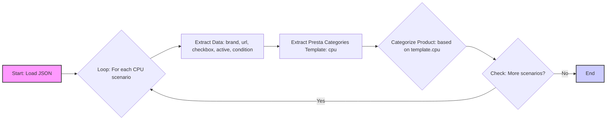

## <алгоритм>

Этот JSON-файл описывает сценарии для категоризации процессоров (CPU) Intel, полученных с веб-сайта поставщика Morlevi. Каждый сценарий соответствует определенной модели процессора и содержит информацию, необходимую для ее категоризации в PrestaShop (вероятно, платформа электронной коммерции).

**Пошаговая блок-схема:**

1.  **Начало:** Чтение JSON-файла.
    *   **Пример:** Файл `morlevi_categories_cpu.json` загружается в программу.
2.  **Обход сценариев:** Перебирается каждый ключ (название модели процессора) в разделе "scenarios".
    *   **Пример:** Начинается обработка сценария для `"Intel CELERON LGA1200 Gen 10"`.
3.  **Извлечение данных о сценарии:** Для каждого сценария извлекаются следующие данные:
    *   `brand`: Бренд процессора (всегда "INTEL" в данном файле).
        *   **Пример:** `"brand": "INTEL"`
    *   `url`: URL-адрес страницы с процессорами на сайте поставщика.
        *    **Пример:** `"url": "https://www.morlevi.co.il/Cat/337?p_134=584&sort=datafloat2%2Cprice&keyword="`
    *   `checkbox`: Флаг для использования. (всегда false в данном файле).
        *   **Пример:** `"checkbox": false`
    *   `active`: Флаг активности сценария. (всегда true в данном файле).
        *   **Пример:** `"active": true`
    *   `condition`: Состояние продукта (всегда "new" в данном файле).
        *   **Пример:** `"condition":"new"`
    *   `presta_categories`: Информация для категоризации в PrestaShop.
        *   `template`: Объект, содержащий шаблон для CPU.
            *   `cpu`: Шаблон названия CPU.
                *   **Пример:** `"cpu": "INTEL CELERON LGA1200"`
4. **Категоризация:** Используя извлеченные данные, особенно поле `presta_categories.template.cpu`, товар сопоставляется с определенной категорией в PrestaShop.
    *   **Пример:** Процессор с URL-адреса `"https://www.morlevi.co.il/Cat/337?p_134=584&sort=datafloat2%2Cprice&keyword="` и названием `"Intel  CELERON LGA1200 Gen 10"` будет отнесен к категории `INTEL CELERON LGA1200`.
5.  **Повторение:** Шаги 2-4 повторяются для каждого сценария.
6.  **Завершение:** Обработка всех сценариев закончена.

## <mermaid>

**Объяснение `mermaid` диаграммы:**

*   **Start: Load JSON**: Начало процесса, загрузка JSON файла с конфигурациями.
*   **Loop: For each CPU scenario**: Цикл, который проходит по всем сценариям процессоров, представленным в JSON-файле.
*   **Extract Data: brand, url, checkbox, active, condition**:  Извлечение основных данных для текущего сценария, таких как бренд, URL, флаги и состояние продукта.
*   **Extract Presta Categories Template: cpu**: Извлечение шаблона категории процессора, который будет использоваться для категоризации в PrestaShop.
*   **Categorize Product: based on template.cpu**:  Категоризация продукта на основе извлеченного шаблона.
*   **Check: More scenarios?**: Проверка, остались ли еще сценарии для обработки.
*   **End**: Завершение процесса.

**Зависимости:**

Диаграмма не показывает явных импортов, так как файл JSON - это данные, а не код. Однако, при использовании этого JSON в Python, будут применяться библиотеки для работы с JSON (например, `json`).

## <объяснение>

**Общее назначение:**

Этот JSON-файл служит конфигурацией для автоматизации категоризации процессоров Intel с сайта Morlevi в систему PrestaShop. Он определяет соответствие между конкретными моделями процессоров, их URL на сайте Morlevi и шаблонами категорий PrestaShop.

**Разбор структуры JSON:**

*   **`scenarios`**: Корневой объект, содержащий все сценарии категоризации. Ключами этого объекта являются названия моделей процессоров.
*   **Сценарий (например, `Intel CELERON LGA1200 Gen 10`)**: Каждый сценарий представляет собой объект со следующими полями:
    *   **`brand`**: Строка, представляющая бренд процессора (в данном случае всегда "INTEL").
    *   **`url`**: Строка, содержащая URL-адрес страницы с процессором на сайте Morlevi. URL содержит параметры для фильтрации и сортировки, специфичные для каждой категории процессора.
    *   **`checkbox`**: Логическое значение (всегда `false` в данном файле), которое, вероятно, указывает, нужно ли использовать данный сценарий.
    *   **`active`**: Логическое значение (всегда `true` в данном файле), которое, вероятно, указывает, активен ли сценарий.
    *   **`condition`**: Строка, указывающая состояние товара (всегда `"new"` в данном файле).
    *   **`presta_categories`**: Объект, содержащий информацию о категориях PrestaShop:
        *   **`template`**: Объект, содержащий шаблон для определения категории процессора.
            *   **`cpu`**: Строка, представляющая шаблон названия CPU, который будет использоваться при категоризации в PrestaShop.

**Использование в контексте проекта:**

Этот JSON-файл, скорее всего, используется в скрипте Python, который:

1.  Загружает данные из этого JSON-файла.
2.  Проходит циклом по всем сценариям в объекте `scenarios`.
3.  Для каждого сценария извлекает данные о процессоре (название, URL, бренд и т.д.) и шаблон категории (`presta_categories.template.cpu`).
4.  Использует эти данные для сопоставления продуктов на сайте Morlevi с категориями PrestaShop.
5.  Автоматически обновляет или создает соответствующие категории в PrestaShop.

**Потенциальные ошибки и улучшения:**

*   **Повторение данных:** Поля `checkbox`, `active` и `condition` имеют одинаковые значения для всех сценариев. Можно сделать их общими для всех сценариев, чтобы уменьшить дублирование данных.
*   **Неявное предположение:** Предполагается, что каждое название категории PrestaShop соответствует значению `cpu`. Это может быть не всегда верно и требует явной проверки.
*   **Отсутствие проверок:** Нет проверки корректности URL-адресов и других данных. Необходимо добавить валидацию данных.
*   **Жестко заданные значения:** Значения `brand` и `condition` всегда одинаковы. Возможно, они должны определятся вне json файла.
*   **Дублирование URL**: Есть несколько одинаковых URL, например: "https://www.morlevi.co.il/Cat/399".  Надо изучить сайт поставщика и возможно, добавить больше параметров для точной фильтрации товаров.
*   **Устаревшие данные**: Этот файл является статической конфигурацией, поэтому потребуется обновление по мере изменения каталога продуктов и структуры категорий Morlevi и PrestaShop.

**Взаимосвязь с другими частями проекта:**

Этот JSON-файл является частью системы, которая автоматически импортирует и категоризирует продукты с сайта Morlevi в PrestaShop. Он может взаимодействовать с:

*   **Скриптами Python:** Которые загружают и обрабатывают JSON-данные, и выполняют запросы к сайту Morlevi и PrestaShop.
*   **Модулями PrestaShop:** Которые отвечают за создание и управление категориями и продуктами.
*   **Другими JSON-файлами:** Которые могут содержать другие конфигурации, например, настройки для других поставщиков или типы продуктов.

В целом, этот JSON-файл представляет собой важный компонент для автоматизации процесса загрузки и категоризации продуктов. Его подробный разбор помогает понять его структуру, назначение и взаимосвязь с другими частями системы.