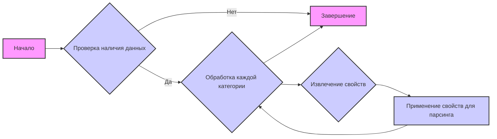

## АНАЛИЗ JSON-КОДА

### 1. <алгоритм>

Файл `morlevi_categories_keyboards.json` содержит структуру данных в формате JSON, описывающую различные категории клавиатур и мышей от бренда "COOLER MASTER", предназначенные для парсинга сайта поставщика "Morlevi". Каждая категория представлена в виде объекта с набором характеристик.

**Блок-схема:**



**Примеры для каждого блока:**

*   **Начало:** Загрузка JSON файла `morlevi_categories_keyboards.json`.
*   **Проверка наличия данных:** Проверяется наличие ключа `"scenarios"` в загруженном JSON.
*   **Обработка каждой категории:** Если ключ `"scenarios"` существует, перебираются все объекты внутри него, которые представляют собой отдельные категории товаров (например, `"COOLER MASTER USB KEYBOARD"`).
*   **Извлечение свойств:** Для каждой категории извлекаются следующие свойства:
    *   `brand` (например, `"COOLER MASTER"`).
    *   `template` (например, `"COOLER MASTER KEYBOARD"`).
    *   `url` (например, `"https://www.morlevi.co.il/Cat/113?p_315=74&sort=datafloat2%2Cprice&keyword="`).
    *   `checkbox` (например, `false`).
    *   `active` (например, `true`).
	*	`condition` (например,`"new"`)
    *   `presta_categories` (например, `{"template": {"computer accessories": "WIRED KB"}}` или `"203,204,315"`).
*   **Применение свойств для парсинга:** Извлеченные свойства используются для формирования запросов к сайту `morlevi.co.il` и последующей обработки полученных данных, таких как название продукта, цена, наличие и прочие параметры.
*   **Завершение:** После обработки всех категорий, скрипт завершает свою работу.

### 2. <mermaid>

```mermaid
graph LR
    subgraph JSON Data
        A[scenarios]
            subgraph "COOLER MASTER USB KEYBOARD"
                B[brand: "COOLER MASTER"]
                C[template: "COOLER MASTER KEYBOARD"]
                D[url: "..."]
                E[checkbox: false]
                F[active: true]
                G[condition: "new"]
                H[presta_categories: {template: {computer accessories: "WIRED KB"}}]

            end
            subgraph "GENIUS USB KEYBOARD"
                I[brand: "COOLER MASTER"]
                J[template: "COOLER MASTER USB KEYBOARD"]
                K[url: "..."]
                L[checkbox: false]
                M[active: true]
                N[condition: "new"]
                O[presta_categories: "203,204,315"]
            end
            subgraph "COOLER MASTER USB MOUSE"
                P[brand: "COOLER MASTER"]
                Q[template: "COOLER MASTER USB MOUSE"]
                R[url: "..."]
                S[checkbox: false]
                T[active: true]
                U[condition: "new"]
				V[presta_categories: "203,206,317"]
           end
            subgraph "COOLER MASTER WIRELESS MOUSE"
                W[brand: "COOLER MASTER"]
                X[template: "COOLER MASTER WIRELESS MOUSE"]
                Y[url: "..."]
                Z[checkbox: false]
                AA[active: true]
                AB[condition: "new"]
				AC[presta_categories: "203,206,318"]
            end
            subgraph "COOLER MASTER USB KEYBOARD-MOUSE SET"
                AD[brand: "COOLER MASTER"]
                AE[template: "COOLER MASTER USB KEYBOARD-MOUSE SET"]
                AF[url: "..."]
                AG[checkbox: false]
                AH[active: true]
                AI[condition: "new"]
				AJ[presta_categories: "203,207,208"]
            end
            subgraph "COOLER MASTER WIRELESS  KEYBOARD-MOUSE SET"
                AK[brand: "COOLER MASTER"]
                AL[template: "COOLER MASTER WIRELESS KEYBOARD-MOUSE SET"]
                AM[url: "..."]
                AN[checkbox: false]
                AO[active: true]
                AP[condition: "new"]
				AQ[presta_categories: "203,207,334"]
            end
            subgraph "COOLER MASTER GAMING  KEYBOARD"
                AR[brand: "COOLER MASTER"]
                AS[template: "COOLER MASTER GAMING  KEYBOARD"]
                AT[url: "..."]
                AU[checkbox: false]
                AV[active: true]
                AW[condition: "new"]
				AX[presta_categories: "203,205"]
            end
            subgraph "COOLER MASTER GAMING  MOUSE"
                AY[brand: "COOLER MASTER"]
                AZ[template: "COOLER MASTER GAMING  MOUSE"]
                BA[url: "..."]
                BB[checkbox: false]
                BC[active: true]
                BD[condition: "new"]
				BE[presta_categories: "203,206,343"]
            end
    end

    A --> B
    A --> I
    A --> P
    A --> W
    A --> AD
    A --> AK
    A --> AR
    A --> AY
```

**Объяснение:**

*   Диаграмма представляет структуру JSON-данных, содержащихся в файле.
*   `scenarios` - это корневой узел, представляющий собой словарь, где ключами являются названия категорий товаров, а значениями -  свойства этих категорий.
*   Внутри каждого `subgraph` (категории) показаны пары ключ-значение, где ключи соответствуют названиям полей в JSON (например, `brand`, `template`, `url`), а значения - их содержимому.
*   Стрелки показывают принадлежность свойств к соответствующим категориям и категориям к корневому узлу `scenarios`.

### 3. <объяснение>

**Общая структура:**
JSON файл `morlevi_categories_keyboards.json` представляет собой словарь, где ключ `"scenarios"` содержит другой словарь. Этот вложенный словарь содержит информацию о различных категориях товаров (клавиатуры и мыши) от бренда "COOLER MASTER" , с указанием их наименований, URL-адресов для парсинга, и связей с категориями `PrestaShop`.

**Импорты:**

В данном коде импорты не используются, так как это JSON файл, содержащий данные, а не исполняемый код.  Однако этот JSON файл используется в других частях проекта, где данные загружаются и обрабатываются.

**Классы:**
JSON не содержит классов. Этот файл служит для хранения данных, которые используются классами в других частях проекта.
**Функции:**

В данном коде функции не используются, так как это JSON файл. Функции будут использовать данные из JSON файла в других частях проекта.

**Переменные:**
Внутри JSON файла, переменные представляют собой ключи и значения, определяющие структуру данных.
*   `scenarios` (тип: `dict`): Словарь, содержащий все категории товаров.
*   `brand` (тип: `str`): Название бренда (всегда "COOLER MASTER" в данном случае).
*   `template` (тип: `str`): Шаблон названия категории (например, `"COOLER MASTER KEYBOARD"`).
*   `url` (тип: `str`): URL-адрес страницы с товарами данной категории на сайте `morlevi.co.il`.
*   `checkbox` (тип: `bool`): Флаг, указывающий, используется ли чекбокс (в данном случае всегда `false`).
*   `active` (тип: `bool`): Флаг, указывающий, является ли категория активной (в данном случае всегда `true`).
*	`condition` (тип:`str`): Строка, указывающая состояние товара (`new`).
*   `presta_categories` (тип: `str` или `dict`): Строка или словарь, содержащий идентификаторы категорий в `PrestaShop`, к которым относится товар.

**Потенциальные ошибки и области для улучшения:**

1.  **Дублирование бренда**: Все записи имеют `brand: "COOLER MASTER"`. Если в будущем потребуется парсить товары других брендов, этот файл нужно будет расширять и пересматривать структуру.
2.  **Неоднородность `presta_categories`**:  Свойство `presta_categories` имеет два типа: строка с перечислением ID, или словарь вида `{"template": {"computer accessories": "WIRED KB"}}`. Это может вызвать проблемы при парсинге. Лучше использовать один формат, предпочтительнее использовать массив или список с ID.
3.  **Жестко закодированные URL**: URL-адреса жестко закодированы. Если структура сайта поставщика изменится, придется вручную обновлять URL.  Может быть, следует рассмотреть возможность параметризации URL на основе более общих критериев.
4. **Отсутствие обработки ошибок:** Не показано, как обрабатываются ошибки при загрузке или разборе этого JSON.

**Взаимосвязь с другими частями проекта:**

Этот JSON-файл используется как конфигурационный файл для парсера. Данные из него загружаются и используются для:

*   Формирования URL-адресов для запросов к сайту `morlevi.co.il`.
*   Определения шаблонов наименований товаров.
*   Определения категорий, к которым нужно отнести товары в `PrestaShop`.

Таким образом, этот файл является важной частью процесса парсинга, определяющей, какие товары и как будут обрабатываться.